# Class: BaseFeatureProperties 


_Abstract base for all GeoJSON feature properties classes. Provides shared attributes inherited by every concrete properties type._


* __NOTE__: this is an abstract class and should not be instantiated directly


URI: [debrief:class/BaseFeatureProperties](https://debrief.info/schemas/class/BaseFeatureProperties)

```mermaid
 classDiagram
    class BaseFeatureProperties
    click BaseFeatureProperties href "../../classes/BaseFeatureProperties/"
      BaseFeatureProperties <|-- TrackProperties
        click TrackProperties href "../../classes/TrackProperties/"
      BaseFeatureProperties <|-- ReferenceLocationProperties
        click ReferenceLocationProperties href "../../classes/ReferenceLocationProperties/"
      BaseFeatureProperties <|-- MultiPointFeatureProperties
        click MultiPointFeatureProperties href "../../classes/MultiPointFeatureProperties/"
      BaseFeatureProperties <|-- MultiPolygonFeatureProperties
        click MultiPolygonFeatureProperties href "../../classes/MultiPolygonFeatureProperties/"
      BaseFeatureProperties <|-- NarrativeEntryProperties
        click NarrativeEntryProperties href "../../classes/NarrativeEntryProperties/"
      BaseFeatureProperties <|-- CircleAnnotationProperties
        click CircleAnnotationProperties href "../../classes/CircleAnnotationProperties/"
      BaseFeatureProperties <|-- RectangleAnnotationProperties
        click RectangleAnnotationProperties href "../../classes/RectangleAnnotationProperties/"
      BaseFeatureProperties <|-- LineAnnotationProperties
        click LineAnnotationProperties href "../../classes/LineAnnotationProperties/"
      BaseFeatureProperties <|-- TextAnnotationProperties
        click TextAnnotationProperties href "../../classes/TextAnnotationProperties/"
      BaseFeatureProperties <|-- VectorAnnotationProperties
        click VectorAnnotationProperties href "../../classes/VectorAnnotationProperties/"
      BaseFeatureProperties <|-- PolyAnnotationProperties
        click PolyAnnotationProperties href "../../classes/PolyAnnotationProperties/"
      BaseFeatureProperties <|-- StoryboardProperties
        click StoryboardProperties href "../../classes/StoryboardProperties/"
      BaseFeatureProperties <|-- SceneProperties
        click SceneProperties href "../../classes/SceneProperties/"
      
      BaseFeatureProperties : kind
        
          
    
        
        
        BaseFeatureProperties --> "1" FeatureKindEnum : kind
        click FeatureKindEnum href "../../enums/FeatureKindEnum/"
    

        
      BaseFeatureProperties : provenance
        
          
    
        
        
        BaseFeatureProperties --> "*" LogEntry : provenance
        click LogEntry href "../../classes/LogEntry/"
    

        
      BaseFeatureProperties : tags
        
      BaseFeatureProperties : vertex_metadata
        
          
    
        
        
        BaseFeatureProperties --> "*" VertexMetadata : vertex_metadata
        click VertexMetadata href "../../classes/VertexMetadata/"
    

        
      BaseFeatureProperties : visible
        
      
```





## Inheritance
* **BaseFeatureProperties**
    * [TrackProperties](../classes/TrackProperties.md)
    * [ReferenceLocationProperties](../classes/ReferenceLocationProperties.md)
    * [MultiPointFeatureProperties](../classes/MultiPointFeatureProperties.md)
    * [MultiPolygonFeatureProperties](../classes/MultiPolygonFeatureProperties.md)
    * [NarrativeEntryProperties](../classes/NarrativeEntryProperties.md)
    * [CircleAnnotationProperties](../classes/CircleAnnotationProperties.md)
    * [RectangleAnnotationProperties](../classes/RectangleAnnotationProperties.md)
    * [LineAnnotationProperties](../classes/LineAnnotationProperties.md)
    * [TextAnnotationProperties](../classes/TextAnnotationProperties.md)
    * [VectorAnnotationProperties](../classes/VectorAnnotationProperties.md)
    * [PolyAnnotationProperties](../classes/PolyAnnotationProperties.md)
    * [StoryboardProperties](../classes/StoryboardProperties.md)
    * [SceneProperties](../classes/SceneProperties.md)


## Slots

| Name | Cardinality and Range | Description | Inheritance |
| ---  | --- | --- | --- |
| [kind](../slots/kind.md) | 1 <br/> [FeatureKindEnum](../enums/FeatureKindEnum.md) | Feature type discriminator | direct |
| [tags](../slots/tags.md) | * <br/> [String](../types/String.md) | Free-text labels assigned to this feature by the analyst | direct |
| [visible](../slots/visible.md) | 0..1 <br/> [Boolean](../types/Boolean.md) | Whether this feature is shown on the map | direct |
| [provenance](../slots/provenance.md) | * <br/> [LogEntry](../classes/LogEntry.md) | PROV-aligned provenance records (append-only log of tool operations) | direct |
| [vertex_metadata](../slots/vertex_metadata.md) | * <br/> [VertexMetadata](../classes/VertexMetadata.md) | Sparse list of per-vertex metadata, keyed by `path` | direct |


## Identifier and Mapping Information


### Schema Source


* from schema: https://debrief.info/schemas/debrief


## Mappings

| Mapping Type | Mapped Value |
| ---  | ---  |
| self | debrief:BaseFeatureProperties |
| native | debrief:BaseFeatureProperties |


## LinkML Source

<!-- TODO: investigate https://stackoverflow.com/questions/37606292/how-to-create-tabbed-code-blocks-in-mkdocs-or-sphinx -->

### Direct

<details>
```yaml
name: BaseFeatureProperties
description: Abstract base for all GeoJSON feature properties classes. Provides shared
  attributes inherited by every concrete properties type.
from_schema: https://debrief.info/schemas/debrief
abstract: true
attributes:
  kind:
    name: kind
    description: Feature type discriminator
    from_schema: https://debrief.info/schemas/common
    rank: 1000
    domain_of:
    - BaseFeatureProperties
    - TrackProperties
    - ReferenceLocationProperties
    - SystemStateProperties
    - MultiPointFeatureProperties
    - MultiPolygonFeatureProperties
    - NarrativeEntryProperties
    - CircleAnnotationProperties
    - RectangleAnnotationProperties
    - LineAnnotationProperties
    - TextAnnotationProperties
    - VectorAnnotationProperties
    - PolyAnnotationProperties
    - SelectionRequirement
    - SystemRecordProperties
    - StoryboardProperties
    - SceneProperties
    - MCPSelectionRequirement
    range: FeatureKindEnum
    required: true
  tags:
    name: tags
    description: Free-text labels assigned to this feature by the analyst
    from_schema: https://debrief.info/schemas/common
    rank: 1000
    domain_of:
    - BaseFeatureProperties
    - VertexMetadata
    - StacExtensionProperties
    - StacItemSummary
    range: string
    required: false
    multivalued: true
  visible:
    name: visible
    description: Whether this feature is shown on the map. Absent or true means visible;
      false means hidden. Replaces the session sidecar's hiddenFeatureIds denylist
      (feature 261). Per-feature visibility travels with the feature inside features.geojson.
    from_schema: https://debrief.info/schemas/common
    rank: 1000
    domain_of:
    - BaseFeatureProperties
    - SensorContact
    - SensorData
    range: boolean
    required: false
  provenance:
    name: provenance
    description: PROV-aligned provenance records (append-only log of tool operations)
    from_schema: https://debrief.info/schemas/common
    rank: 1000
    domain_of:
    - BaseFeatureProperties
    - SystemStateProperties
    - SystemRecordProperties
    range: LogEntry
    multivalued: true
    inlined: true
    inlined_as_list: true
  vertex_metadata:
    name: vertex_metadata
    description: 'Sparse list of per-vertex metadata, keyed by `path`. Empty arrays
      MUST be omitted from the serialised feature (FR-010). Duplicate `path` values
      MUST be rejected by validators (contract §Cross-cutting #3). Every concrete
      subclass of `BaseFeatureProperties` gains this slot by inheritance — see spec
      #192, contracts/vertex-metadata-slot.md.'
    from_schema: https://debrief.info/schemas/common
    rank: 1000
    domain_of:
    - BaseFeatureProperties
    range: VertexMetadata
    required: false
    multivalued: true
    inlined: true
    inlined_as_list: true

```
</details>

### Induced

<details>
```yaml
name: BaseFeatureProperties
description: Abstract base for all GeoJSON feature properties classes. Provides shared
  attributes inherited by every concrete properties type.
from_schema: https://debrief.info/schemas/debrief
abstract: true
attributes:
  kind:
    name: kind
    description: Feature type discriminator
    from_schema: https://debrief.info/schemas/common
    rank: 1000
    alias: kind
    owner: BaseFeatureProperties
    domain_of:
    - BaseFeatureProperties
    - TrackProperties
    - ReferenceLocationProperties
    - SystemStateProperties
    - MultiPointFeatureProperties
    - MultiPolygonFeatureProperties
    - NarrativeEntryProperties
    - CircleAnnotationProperties
    - RectangleAnnotationProperties
    - LineAnnotationProperties
    - TextAnnotationProperties
    - VectorAnnotationProperties
    - PolyAnnotationProperties
    - SelectionRequirement
    - SystemRecordProperties
    - StoryboardProperties
    - SceneProperties
    - MCPSelectionRequirement
    range: FeatureKindEnum
    required: true
  tags:
    name: tags
    description: Free-text labels assigned to this feature by the analyst
    from_schema: https://debrief.info/schemas/common
    rank: 1000
    alias: tags
    owner: BaseFeatureProperties
    domain_of:
    - BaseFeatureProperties
    - VertexMetadata
    - StacExtensionProperties
    - StacItemSummary
    range: string
    required: false
    multivalued: true
  visible:
    name: visible
    description: Whether this feature is shown on the map. Absent or true means visible;
      false means hidden. Replaces the session sidecar's hiddenFeatureIds denylist
      (feature 261). Per-feature visibility travels with the feature inside features.geojson.
    from_schema: https://debrief.info/schemas/common
    rank: 1000
    alias: visible
    owner: BaseFeatureProperties
    domain_of:
    - BaseFeatureProperties
    - SensorContact
    - SensorData
    range: boolean
    required: false
  provenance:
    name: provenance
    description: PROV-aligned provenance records (append-only log of tool operations)
    from_schema: https://debrief.info/schemas/common
    rank: 1000
    alias: provenance
    owner: BaseFeatureProperties
    domain_of:
    - BaseFeatureProperties
    - SystemStateProperties
    - SystemRecordProperties
    range: LogEntry
    multivalued: true
    inlined: true
    inlined_as_list: true
  vertex_metadata:
    name: vertex_metadata
    description: 'Sparse list of per-vertex metadata, keyed by `path`. Empty arrays
      MUST be omitted from the serialised feature (FR-010). Duplicate `path` values
      MUST be rejected by validators (contract §Cross-cutting #3). Every concrete
      subclass of `BaseFeatureProperties` gains this slot by inheritance — see spec
      #192, contracts/vertex-metadata-slot.md.'
    from_schema: https://debrief.info/schemas/common
    rank: 1000
    alias: vertex_metadata
    owner: BaseFeatureProperties
    domain_of:
    - BaseFeatureProperties
    range: VertexMetadata
    required: false
    multivalued: true
    inlined: true
    inlined_as_list: true

```
</details>