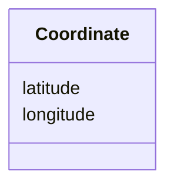

# Class: Coordinate 


_A geographic coordinate [longitude, latitude]_


URI: [debrief:class/Coordinate](https://debrief.info/schemas/class/Coordinate)





<!-- no inheritance hierarchy -->


## Slots

| Name | Cardinality and Range | Description | Inheritance |
| ---  | --- | --- | --- |
| [longitude](../slots/longitude.md) | 1 <br/> [Float](../types/Float.md) | Longitude in degrees (-180 to 180) | direct |
| [latitude](../slots/latitude.md) | 1 <br/> [Float](../types/Float.md) | Latitude in degrees (-90 to 90) | direct |


## Usages

| used by | used in | type | used |
| ---  | --- | --- | --- |
| [ViewportPolygon](../classes/ViewportPolygon.md) | [coordinates](../slots/coordinates.md) | range | [Coordinate](../classes/Coordinate.md) |


## Identifier and Mapping Information


### Schema Source


* from schema: https://debrief.info/schemas/debrief


## Mappings

| Mapping Type | Mapped Value |
| ---  | ---  |
| self | debrief:Coordinate |
| native | debrief:Coordinate |


## LinkML Source

<!-- TODO: investigate https://stackoverflow.com/questions/37606292/how-to-create-tabbed-code-blocks-in-mkdocs-or-sphinx -->

### Direct

<details>
```yaml
name: Coordinate
description: A geographic coordinate [longitude, latitude]
from_schema: https://debrief.info/schemas/debrief
attributes:
  longitude:
    name: longitude
    description: Longitude in degrees (-180 to 180)
    from_schema: https://debrief.info/schemas/common
    rank: 1000
    domain_of:
    - Coordinate
    range: float
    required: true
    minimum_value: -180
    maximum_value: 180
  latitude:
    name: latitude
    description: Latitude in degrees (-90 to 90)
    from_schema: https://debrief.info/schemas/common
    rank: 1000
    domain_of:
    - Coordinate
    range: float
    required: true
    minimum_value: -90
    maximum_value: 90

```
</details>

### Induced

<details>
```yaml
name: Coordinate
description: A geographic coordinate [longitude, latitude]
from_schema: https://debrief.info/schemas/debrief
attributes:
  longitude:
    name: longitude
    description: Longitude in degrees (-180 to 180)
    from_schema: https://debrief.info/schemas/common
    rank: 1000
    alias: longitude
    owner: Coordinate
    domain_of:
    - Coordinate
    range: float
    required: true
    minimum_value: -180
    maximum_value: 180
  latitude:
    name: latitude
    description: Latitude in degrees (-90 to 90)
    from_schema: https://debrief.info/schemas/common
    rank: 1000
    alias: latitude
    owner: Coordinate
    domain_of:
    - Coordinate
    range: float
    required: true
    minimum_value: -90
    maximum_value: 90

```
</details>