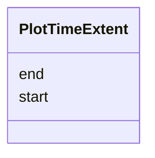

# Class: PlotTimeExtent 


_Temporal extent of a plot expressed as ISO 8601 strings. Used within PlotSummary and StacItemSummary for lightweight display without the full epoch+iso dual representation of TimeInstant._

__


URI: [debrief:class/PlotTimeExtent](https://debrief.info/schemas/class/PlotTimeExtent)





<!-- no inheritance hierarchy -->


## Slots

| Name | Cardinality and Range | Description | Inheritance |
| ---  | --- | --- | --- |
| [start](../slots/start.md) | 1 <br/> [String](../types/String.md) | Start of time extent (ISO 8601) | direct |
| [end](../slots/end.md) | 1 <br/> [String](../types/String.md) | End of time extent (ISO 8601) | direct |


## Usages

| used by | used in | type | used |
| ---  | --- | --- | --- |
| [PlotSummary](../classes/PlotSummary.md) | [time_extent](../slots/time_extent.md) | range | [PlotTimeExtent](../classes/PlotTimeExtent.md) |


## Identifier and Mapping Information


### Schema Source


* from schema: https://debrief.info/schemas/debrief


## Mappings

| Mapping Type | Mapped Value |
| ---  | ---  |
| self | debrief:PlotTimeExtent |
| native | debrief:PlotTimeExtent |


## LinkML Source

<!-- TODO: investigate https://stackoverflow.com/questions/37606292/how-to-create-tabbed-code-blocks-in-mkdocs-or-sphinx -->

### Direct

<details>
```yaml
name: PlotTimeExtent
description: 'Temporal extent of a plot expressed as ISO 8601 strings. Used within
  PlotSummary and StacItemSummary for lightweight display without the full epoch+iso
  dual representation of TimeInstant.

  '
from_schema: https://debrief.info/schemas/debrief
attributes:
  start:
    name: start
    description: Start of time extent (ISO 8601)
    from_schema: https://debrief.info/schemas/stac-extension
    domain_of:
    - TimeRange
    - TimeFilter
    - PlotTimeExtent
    range: string
    required: true
  end:
    name: end
    description: End of time extent (ISO 8601)
    from_schema: https://debrief.info/schemas/stac-extension
    domain_of:
    - TimeRange
    - TimeFilter
    - PlotTimeExtent
    range: string
    required: true

```
</details>

### Induced

<details>
```yaml
name: PlotTimeExtent
description: 'Temporal extent of a plot expressed as ISO 8601 strings. Used within
  PlotSummary and StacItemSummary for lightweight display without the full epoch+iso
  dual representation of TimeInstant.

  '
from_schema: https://debrief.info/schemas/debrief
attributes:
  start:
    name: start
    description: Start of time extent (ISO 8601)
    from_schema: https://debrief.info/schemas/stac-extension
    alias: start
    owner: PlotTimeExtent
    domain_of:
    - TimeRange
    - TimeFilter
    - PlotTimeExtent
    range: string
    required: true
  end:
    name: end
    description: End of time extent (ISO 8601)
    from_schema: https://debrief.info/schemas/stac-extension
    alias: end
    owner: PlotTimeExtent
    domain_of:
    - TimeRange
    - TimeFilter
    - PlotTimeExtent
    range: string
    required: true

```
</details>