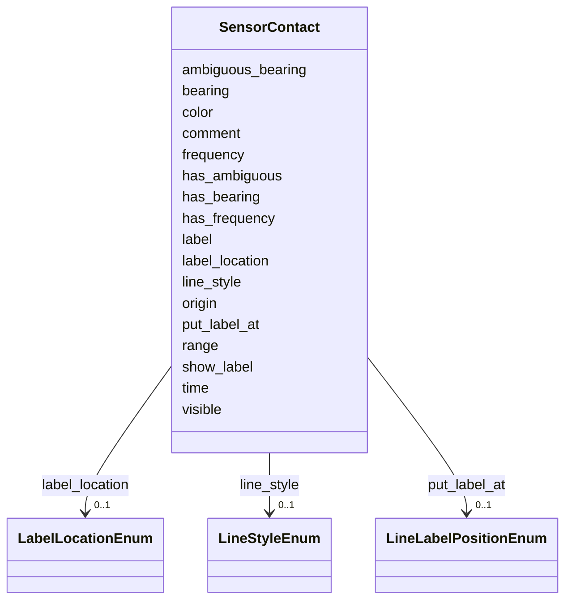

# Class: SensorContact 


_Single sensor measurement record. Represents one bearing/range observation at a point in time._


URI: [debrief:class/SensorContact](https://debrief.info/schemas/class/SensorContact)





<!-- no inheritance hierarchy -->


## Slots

| Name | Cardinality and Range | Description | Inheritance |
| ---  | --- | --- | --- |
| [time](../slots/time.md) | 1 <br/> [datetime](../slots/datetime.md) | Contact measurement timestamp (ISO8601) | direct |
| [bearing](../slots/bearing.md) | 1 <br/> [Float](../types/Float.md) | Bearing to contact in degrees (0-360) | direct |
| [has_bearing](../slots/has_bearing.md) | 0..1 <br/> [Boolean](../types/Boolean.md) | Controls bearing line display (true=show, false=hide) | direct |
| [ambiguous_bearing](../slots/ambiguous_bearing.md) | 0..1 <br/> [Float](../types/Float.md) | Ambiguous bearing (second solution) in degrees | direct |
| [has_ambiguous](../slots/has_ambiguous.md) | 0..1 <br/> [Boolean](../types/Boolean.md) | Controls ambiguous bearing display | direct |
| [range](../slots/range.md) | 0..1 <br/> [Float](../types/Float.md) | Range to contact in metres | direct |
| [frequency](../slots/frequency.md) | 0..1 <br/> [Float](../types/Float.md) | Measured frequency in Hz | direct |
| [has_frequency](../slots/has_frequency.md) | 0..1 <br/> [Boolean](../types/Boolean.md) | Controls frequency data display | direct |
| [label](../slots/label.md) | 0..1 <br/> [String](../types/String.md) | Display label | direct |
| [comment](../slots/comment.md) | 0..1 <br/> [String](../types/String.md) | Operator note | direct |
| [color](../slots/color.md) | 0..1 <br/> [CSSColor](../types/CSSColor.md) | Contact color override (null = inherit from parent SensorData) | direct |
| [visible](../slots/visible.md) | 0..1 <br/> [Boolean](../types/Boolean.md) | Contact visibility | direct |
| [show_label](../slots/show_label.md) | 0..1 <br/> [Boolean](../types/Boolean.md) | Label visibility | direct |
| [line_style](../slots/line_style.md) | 0..1 <br/> [LineStyleEnum](../enums/LineStyleEnum.md) | Bearing line visual style | direct |
| [label_location](../slots/label_location.md) | 0..1 <br/> [LabelLocationEnum](../enums/LabelLocationEnum.md) | Label horizontal alignment | direct |
| [put_label_at](../slots/put_label_at.md) | 0..1 <br/> [LineLabelPositionEnum](../enums/LineLabelPositionEnum.md) | Label position along bearing line | direct |
| [origin](../slots/origin.md) | 2..* <br/> [Float](../types/Float.md) | Explicit sensor location override [longitude, latitude] | direct |


## Usages

| used by | used in | type | used |
| ---  | --- | --- | --- |
| [SensorData](../classes/SensorData.md) | [contacts](../slots/contacts.md) | range | [SensorContact](../classes/SensorContact.md) |


## Identifier and Mapping Information


### Schema Source


* from schema: https://debrief.info/schemas/debrief


## Mappings

| Mapping Type | Mapped Value |
| ---  | ---  |
| self | debrief:SensorContact |
| native | debrief:SensorContact |


## LinkML Source

<!-- TODO: investigate https://stackoverflow.com/questions/37606292/how-to-create-tabbed-code-blocks-in-mkdocs-or-sphinx -->

### Direct

<details>
```yaml
name: SensorContact
description: Single sensor measurement record. Represents one bearing/range observation
  at a point in time.
from_schema: https://debrief.info/schemas/debrief
attributes:
  time:
    name: time
    description: Contact measurement timestamp (ISO8601)
    from_schema: https://debrief.info/schemas/geojson
    domain_of:
    - TimestampedPosition
    - MeasuredArrayPosition
    - SensorContact
    - TUASolution
    - NarrativeEntryProperties
    range: datetime
    required: true
  bearing:
    name: bearing
    description: Bearing to contact in degrees (0-360)
    from_schema: https://debrief.info/schemas/geojson
    rank: 1000
    domain_of:
    - SensorContact
    - TUASolution
    - VectorAnnotationProperties
    - Viewport
    range: float
    required: true
    minimum_value: 0
    maximum_value: 360
  has_bearing:
    name: has_bearing
    description: Controls bearing line display (true=show, false=hide). Data stored
      regardless.
    from_schema: https://debrief.info/schemas/geojson
    rank: 1000
    domain_of:
    - SensorContact
    range: boolean
  ambiguous_bearing:
    name: ambiguous_bearing
    description: Ambiguous bearing (second solution) in degrees
    from_schema: https://debrief.info/schemas/geojson
    rank: 1000
    domain_of:
    - SensorContact
    range: float
    minimum_value: 0
    maximum_value: 360
  has_ambiguous:
    name: has_ambiguous
    description: Controls ambiguous bearing display
    from_schema: https://debrief.info/schemas/geojson
    rank: 1000
    domain_of:
    - SensorContact
    range: boolean
  range:
    name: range
    description: Range to contact in metres
    from_schema: https://debrief.info/schemas/geojson
    rank: 1000
    domain_of:
    - SensorContact
    - TUASolution
    - VectorAnnotationProperties
    range: float
    minimum_value: 0
  frequency:
    name: frequency
    description: Measured frequency in Hz
    from_schema: https://debrief.info/schemas/geojson
    rank: 1000
    domain_of:
    - SensorContact
    range: float
  has_frequency:
    name: has_frequency
    description: Controls frequency data display
    from_schema: https://debrief.info/schemas/geojson
    rank: 1000
    domain_of:
    - SensorContact
    range: boolean
  label:
    name: label
    description: Display label
    from_schema: https://debrief.info/schemas/geojson
    domain_of:
    - VertexMetadata
    - PositionStyleOverride
    - SensorContact
    - TUASolution
    - MultiPointFeatureProperties
    - MultiPolygonFeatureProperties
    - CircleAnnotationProperties
    - RectangleAnnotationProperties
    - LineAnnotationProperties
    - VectorAnnotationProperties
    - PolyAnnotationProperties
    - ToolResultAnnotations
    - DatasetAxisMetadata
  comment:
    name: comment
    description: Operator note
    from_schema: https://debrief.info/schemas/geojson
    rank: 1000
    domain_of:
    - SensorContact
  color:
    name: color
    description: Contact color override (null = inherit from parent SensorData)
    from_schema: https://debrief.info/schemas/geojson
    domain_of:
    - PointProperties
    - LineProperties
    - PolygonProperties
    - SensorContact
    - SensorData
    range: CSSColor
  visible:
    name: visible
    description: Contact visibility
    from_schema: https://debrief.info/schemas/geojson
    domain_of:
    - BaseFeatureProperties
    - SensorContact
    - SensorData
    range: boolean
  show_label:
    name: show_label
    description: Label visibility
    from_schema: https://debrief.info/schemas/geojson
    domain_of:
    - PositionStyle
    - PositionStyleOverride
    - SensorContact
    range: boolean
  line_style:
    name: line_style
    description: Bearing line visual style
    from_schema: https://debrief.info/schemas/geojson
    rank: 1000
    domain_of:
    - SensorContact
    range: LineStyleEnum
  label_location:
    name: label_location
    description: Label horizontal alignment
    from_schema: https://debrief.info/schemas/geojson
    rank: 1000
    domain_of:
    - SensorContact
    range: LabelLocationEnum
  put_label_at:
    name: put_label_at
    description: Label position along bearing line
    from_schema: https://debrief.info/schemas/geojson
    rank: 1000
    domain_of:
    - SensorContact
    range: LineLabelPositionEnum
  origin:
    name: origin
    description: Explicit sensor location override [longitude, latitude]
    from_schema: https://debrief.info/schemas/geojson
    rank: 1000
    domain_of:
    - SensorContact
    - VectorAnnotationProperties
    range: float
    multivalued: true
    minimum_cardinality: 2
    maximum_cardinality: 2

```
</details>

### Induced

<details>
```yaml
name: SensorContact
description: Single sensor measurement record. Represents one bearing/range observation
  at a point in time.
from_schema: https://debrief.info/schemas/debrief
attributes:
  time:
    name: time
    description: Contact measurement timestamp (ISO8601)
    from_schema: https://debrief.info/schemas/geojson
    alias: time
    owner: SensorContact
    domain_of:
    - TimestampedPosition
    - MeasuredArrayPosition
    - SensorContact
    - TUASolution
    - NarrativeEntryProperties
    range: datetime
    required: true
  bearing:
    name: bearing
    description: Bearing to contact in degrees (0-360)
    from_schema: https://debrief.info/schemas/geojson
    rank: 1000
    alias: bearing
    owner: SensorContact
    domain_of:
    - SensorContact
    - TUASolution
    - VectorAnnotationProperties
    - Viewport
    range: float
    required: true
    minimum_value: 0
    maximum_value: 360
  has_bearing:
    name: has_bearing
    description: Controls bearing line display (true=show, false=hide). Data stored
      regardless.
    from_schema: https://debrief.info/schemas/geojson
    rank: 1000
    alias: has_bearing
    owner: SensorContact
    domain_of:
    - SensorContact
    range: boolean
  ambiguous_bearing:
    name: ambiguous_bearing
    description: Ambiguous bearing (second solution) in degrees
    from_schema: https://debrief.info/schemas/geojson
    rank: 1000
    alias: ambiguous_bearing
    owner: SensorContact
    domain_of:
    - SensorContact
    range: float
    minimum_value: 0
    maximum_value: 360
  has_ambiguous:
    name: has_ambiguous
    description: Controls ambiguous bearing display
    from_schema: https://debrief.info/schemas/geojson
    rank: 1000
    alias: has_ambiguous
    owner: SensorContact
    domain_of:
    - SensorContact
    range: boolean
  range:
    name: range
    description: Range to contact in metres
    from_schema: https://debrief.info/schemas/geojson
    rank: 1000
    alias: range
    owner: SensorContact
    domain_of:
    - SensorContact
    - TUASolution
    - VectorAnnotationProperties
    range: float
    minimum_value: 0
  frequency:
    name: frequency
    description: Measured frequency in Hz
    from_schema: https://debrief.info/schemas/geojson
    rank: 1000
    alias: frequency
    owner: SensorContact
    domain_of:
    - SensorContact
    range: float
  has_frequency:
    name: has_frequency
    description: Controls frequency data display
    from_schema: https://debrief.info/schemas/geojson
    rank: 1000
    alias: has_frequency
    owner: SensorContact
    domain_of:
    - SensorContact
    range: boolean
  label:
    name: label
    description: Display label
    from_schema: https://debrief.info/schemas/geojson
    alias: label
    owner: SensorContact
    domain_of:
    - VertexMetadata
    - PositionStyleOverride
    - SensorContact
    - TUASolution
    - MultiPointFeatureProperties
    - MultiPolygonFeatureProperties
    - CircleAnnotationProperties
    - RectangleAnnotationProperties
    - LineAnnotationProperties
    - VectorAnnotationProperties
    - PolyAnnotationProperties
    - ToolResultAnnotations
    - DatasetAxisMetadata
    range: string
  comment:
    name: comment
    description: Operator note
    from_schema: https://debrief.info/schemas/geojson
    rank: 1000
    alias: comment
    owner: SensorContact
    domain_of:
    - SensorContact
    range: string
  color:
    name: color
    description: Contact color override (null = inherit from parent SensorData)
    from_schema: https://debrief.info/schemas/geojson
    alias: color
    owner: SensorContact
    domain_of:
    - PointProperties
    - LineProperties
    - PolygonProperties
    - SensorContact
    - SensorData
    range: CSSColor
  visible:
    name: visible
    description: Contact visibility
    from_schema: https://debrief.info/schemas/geojson
    alias: visible
    owner: SensorContact
    domain_of:
    - BaseFeatureProperties
    - SensorContact
    - SensorData
    range: boolean
  show_label:
    name: show_label
    description: Label visibility
    from_schema: https://debrief.info/schemas/geojson
    alias: show_label
    owner: SensorContact
    domain_of:
    - PositionStyle
    - PositionStyleOverride
    - SensorContact
    range: boolean
  line_style:
    name: line_style
    description: Bearing line visual style
    from_schema: https://debrief.info/schemas/geojson
    rank: 1000
    alias: line_style
    owner: SensorContact
    domain_of:
    - SensorContact
    range: LineStyleEnum
  label_location:
    name: label_location
    description: Label horizontal alignment
    from_schema: https://debrief.info/schemas/geojson
    rank: 1000
    alias: label_location
    owner: SensorContact
    domain_of:
    - SensorContact
    range: LabelLocationEnum
  put_label_at:
    name: put_label_at
    description: Label position along bearing line
    from_schema: https://debrief.info/schemas/geojson
    rank: 1000
    alias: put_label_at
    owner: SensorContact
    domain_of:
    - SensorContact
    range: LineLabelPositionEnum
  origin:
    name: origin
    description: Explicit sensor location override [longitude, latitude]
    from_schema: https://debrief.info/schemas/geojson
    rank: 1000
    alias: origin
    owner: SensorContact
    domain_of:
    - SensorContact
    - VectorAnnotationProperties
    range: float
    multivalued: true
    minimum_cardinality: 2
    maximum_cardinality: 2

```
</details>