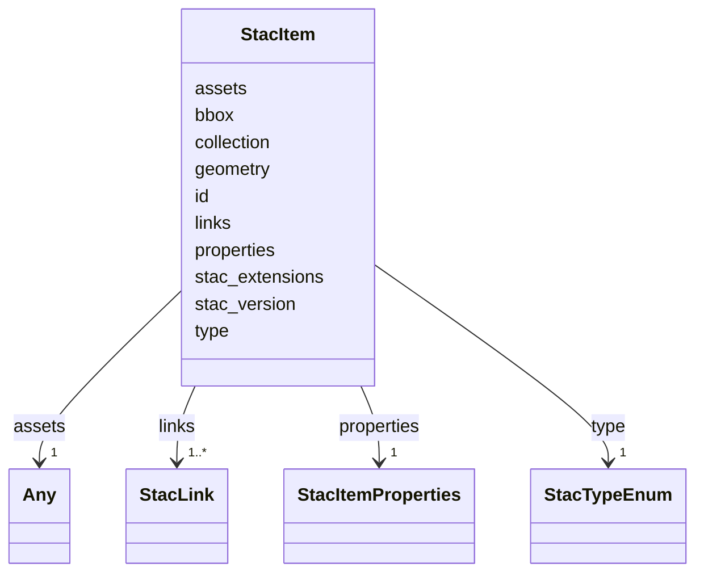

# Class: StacItem 


_A STAC 1.1 Item describing one plot. Closes audit §3.1 rows for `apps/vscode/src/types/stac.ts`, `apps/vscode/src/services/sceneThumbnailService.ts`, and `apps/web-shell/src/mocks/stacService.ts`. Persisted to `<store>/<catalog>/<plot-slug>/item.json`._


URI: [debrief:class/StacItem](https://debrief.info/schemas/class/StacItem)





<!-- no inheritance hierarchy -->


## Slots

| Name | Cardinality and Range | Description | Inheritance |
| ---  | --- | --- | --- |
| [type](../slots/type.md) | 1 <br/> [StacTypeEnum](../enums/StacTypeEnum.md) | STAC discriminator — always "Feature" for Items | direct |
| [stac_version](../slots/stac_version.md) | 1 <br/> [String](../types/String.md) | STAC version string — "1 | direct |
| [stac_extensions](../slots/stac_extensions.md) | * <br/> [String](../types/String.md) | Optional STAC extension schema URIs | direct |
| [id](../slots/id.md) | 1 <br/> [String](../types/String.md) | Item identifier (slug, UUID, or composite) | direct |
| [geometry](../slots/geometry.md) | 1 <br/> [String](../types/String.md)&nbsp;or&nbsp;<br />[GeoJSONPoint](../classes/GeoJSONPoint.md)&nbsp;or&nbsp;<br />[GeoJSONEmptyPoint](../classes/GeoJSONEmptyPoint.md)&nbsp;or&nbsp;<br />[GeoJSONLineString](../classes/GeoJSONLineString.md)&nbsp;or&nbsp;<br />[GeoJSONPolygon](../classes/GeoJSONPolygon.md)&nbsp;or&nbsp;<br />[GeoJSONMultiPoint](../classes/GeoJSONMultiPoint.md)&nbsp;or&nbsp;<br />[GeoJSONMultiLineString](../classes/GeoJSONMultiLineString.md)&nbsp;or&nbsp;<br />[GeoJSONMultiPolygon](../classes/GeoJSONMultiPolygon.md) | GeoJSON geometry — any_of union over the seven existing geometry classes in g... | direct |
| [bbox](../slots/bbox.md) | 1..* <br/> [Float](../types/Float.md) | Bounding box — either [west, south, east, north] (4-element 2D) or [west, sou... | direct |
| [properties](../slots/properties.md) | 1 <br/> [StacItemProperties](../classes/StacItemProperties.md) | STAC Item properties — core fields + debrief: extension + open-record additio... | direct |
| [links](../slots/links.md) | 1..* <br/> [StacLink](../classes/StacLink.md) | Catalog navigation links (`self`, `root`, `parent`, `derived_from`, etc | direct |
| [assets](../slots/assets.md) | 1 <br/> [Any](../classes/Any.md) | Asset map keyed by arbitrary string (`features`, `thumbnail`, `overview`, `so... | direct |
| [collection](../slots/collection.md) | 0..1 <br/> [String](../types/String.md) | Parent Collection ID, when the Item belongs to a Collection (STAC 1 | direct |


## Identifier and Mapping Information


### Schema Source


* from schema: https://debrief.info/schemas/debrief


## Mappings

| Mapping Type | Mapped Value |
| ---  | ---  |
| self | debrief:StacItem |
| native | debrief:StacItem |


## LinkML Source

<!-- TODO: investigate https://stackoverflow.com/questions/37606292/how-to-create-tabbed-code-blocks-in-mkdocs-or-sphinx -->

### Direct

<details>
```yaml
name: StacItem
description: A STAC 1.1 Item describing one plot. Closes audit §3.1 rows for `apps/vscode/src/types/stac.ts`,
  `apps/vscode/src/services/sceneThumbnailService.ts`, and `apps/web-shell/src/mocks/stacService.ts`.
  Persisted to `<store>/<catalog>/<plot-slug>/item.json`.
from_schema: https://debrief.info/schemas/debrief
attributes:
  type:
    name: type
    description: STAC discriminator — always "Feature" for Items.
    from_schema: https://debrief.info/schemas/stac
    domain_of:
    - GeoJSONPoint
    - GeoJSONEmptyPoint
    - GeoJSONLineString
    - GeoJSONPolygon
    - GeoJSONMultiPoint
    - GeoJSONMultiLineString
    - GeoJSONMultiPolygon
    - TrackFeature
    - ReferenceLocation
    - SystemState
    - MultiPointFeature
    - MultiPolygonFeature
    - NarrativeEntry
    - CircleAnnotation
    - RectangleAnnotation
    - LineAnnotation
    - TextAnnotation
    - VectorAnnotation
    - PolyAnnotation
    - ToolParameter
    - FileProvEntry
    - StacItem
    - StacCatalog
    - StacLink
    - StacAsset
    - StacItemAssetDefinition
    - StacCollection
    - RawGeoJSONFeature
    - RawGeoJSONFeatureCollection
    - DatasetAxisMetadata
    - DatasetEntry
    - StoryboardFeature
    - SceneFeature
    - SceneThumbnailAssetEntry
    - MCPContentItem
    - MCPParamSchema
    - ToolsUpdateMessage
    range: StacTypeEnum
    required: true
    equals_string: Feature
  stac_version:
    name: stac_version
    description: STAC version string — "1.0.0" or "1.1.0" (Research R-005).
    from_schema: https://debrief.info/schemas/stac
    rank: 1000
    domain_of:
    - StacItem
    - StacCatalog
    - StacCollection
    range: string
    required: true
  stac_extensions:
    name: stac_extensions
    description: Optional STAC extension schema URIs. Absent on STAC 1.0 fixtures,
      present on STAC 1.1 fixtures (Research R-005).
    from_schema: https://debrief.info/schemas/stac
    rank: 1000
    domain_of:
    - StacItem
    - StacCatalog
    - StacCollection
    range: string
    required: false
    multivalued: true
  id:
    name: id
    description: Item identifier (slug, UUID, or composite).
    from_schema: https://debrief.info/schemas/stac
    domain_of:
    - TrackFeature
    - ReferenceLocation
    - SystemState
    - MultiPointFeature
    - MultiPolygonFeature
    - NarrativeEntry
    - CircleAnnotation
    - RectangleAnnotation
    - LineAnnotation
    - TextAnnotation
    - VectorAnnotation
    - PolyAnnotation
    - Tool
    - PlatformRecord
    - PlotSummary
    - StacItemSummary
    - StacItem
    - StacCatalog
    - StacCollection
    - RawGeoJSONFeature
    - StoryboardProperties
    - SceneProperties
    - StoryboardFeature
    - SceneFeature
    - ToolDefinition
    range: string
    required: true
  geometry:
    name: geometry
    description: GeoJSON geometry — any_of union over the seven existing geometry
      classes in geojson.yaml. Reuses the same pattern as RawGeoJSONFeature.geometry.
    from_schema: https://debrief.info/schemas/stac
    domain_of:
    - TrackFeature
    - ReferenceLocation
    - SystemState
    - MultiPointFeature
    - MultiPolygonFeature
    - InputFeatureState
    - NarrativeEntry
    - CircleAnnotation
    - RectangleAnnotation
    - LineAnnotation
    - TextAnnotation
    - VectorAnnotation
    - PolyAnnotation
    - StacItem
    - RawGeoJSONFeature
    - StoryboardFeature
    - SceneFeature
    required: true
    any_of:
    - range: GeoJSONPoint
    - range: GeoJSONEmptyPoint
    - range: GeoJSONLineString
    - range: GeoJSONPolygon
    - range: GeoJSONMultiPoint
    - range: GeoJSONMultiLineString
    - range: GeoJSONMultiPolygon
  bbox:
    name: bbox
    description: Bounding box — either [west, south, east, north] (4-element 2D) or
      [west, south, min_alt, east, north, max_alt] (6-element 3D). Live fixtures use
      4-element 2D (Research R-004).
    from_schema: https://debrief.info/schemas/stac
    domain_of:
    - TrackFeature
    - MultiPointFeature
    - MultiPolygonFeature
    - PlotSummary
    - StacItemSummary
    - StacItem
    - StacSpatialExtent
    - RawGeoJSONFeature
    - RawGeoJSONFeatureCollection
    range: float
    required: true
    multivalued: true
    minimum_cardinality: 4
    maximum_cardinality: 6
  properties:
    name: properties
    description: 'STAC Item properties — core fields + debrief: extension + open-record
      additional keys (Research R-002 / R-003).'
    from_schema: https://debrief.info/schemas/stac
    domain_of:
    - TrackFeature
    - ReferenceLocation
    - SystemState
    - MultiPointFeature
    - MultiPolygonFeature
    - InputFeatureState
    - NarrativeEntry
    - CircleAnnotation
    - RectangleAnnotation
    - LineAnnotation
    - TextAnnotation
    - VectorAnnotation
    - PolyAnnotation
    - StacItem
    - RawGeoJSONFeature
    - StoryboardFeature
    - SceneFeature
    range: StacItemProperties
    required: true
    inlined: true
  links:
    name: links
    description: Catalog navigation links (`self`, `root`, `parent`, `derived_from`,
      etc.). Order is preserved.
    from_schema: https://debrief.info/schemas/stac
    rank: 1000
    domain_of:
    - StacItem
    - StacCatalog
    - StacCollection
    range: StacLink
    required: true
    multivalued: true
    inlined: true
    inlined_as_list: true
  assets:
    name: assets
    description: 'Asset map keyed by arbitrary string (`features`, `thumbnail`, `overview`,
      `source-<id>`, `scene-thumbnail-<id>`). Open-record per Research R-002 — modelled
      as `range: Any` here because the STAC wire format is a dict, not a list. The
      generator post-processor rewrites this to `dict[str, StacAsset]` (Pydantic)
      and `Record<string, StacAsset>` (TypeScript).'
    from_schema: https://debrief.info/schemas/stac
    rank: 1000
    domain_of:
    - StacItem
    range: Any
    required: true
  collection:
    name: collection
    description: Parent Collection ID, when the Item belongs to a Collection (STAC
      1.1 optional field).
    from_schema: https://debrief.info/schemas/stac
    rank: 1000
    domain_of:
    - StacItem
    range: string
    required: false

```
</details>

### Induced

<details>
```yaml
name: StacItem
description: A STAC 1.1 Item describing one plot. Closes audit §3.1 rows for `apps/vscode/src/types/stac.ts`,
  `apps/vscode/src/services/sceneThumbnailService.ts`, and `apps/web-shell/src/mocks/stacService.ts`.
  Persisted to `<store>/<catalog>/<plot-slug>/item.json`.
from_schema: https://debrief.info/schemas/debrief
attributes:
  type:
    name: type
    description: STAC discriminator — always "Feature" for Items.
    from_schema: https://debrief.info/schemas/stac
    alias: type
    owner: StacItem
    domain_of:
    - GeoJSONPoint
    - GeoJSONEmptyPoint
    - GeoJSONLineString
    - GeoJSONPolygon
    - GeoJSONMultiPoint
    - GeoJSONMultiLineString
    - GeoJSONMultiPolygon
    - TrackFeature
    - ReferenceLocation
    - SystemState
    - MultiPointFeature
    - MultiPolygonFeature
    - NarrativeEntry
    - CircleAnnotation
    - RectangleAnnotation
    - LineAnnotation
    - TextAnnotation
    - VectorAnnotation
    - PolyAnnotation
    - ToolParameter
    - FileProvEntry
    - StacItem
    - StacCatalog
    - StacLink
    - StacAsset
    - StacItemAssetDefinition
    - StacCollection
    - RawGeoJSONFeature
    - RawGeoJSONFeatureCollection
    - DatasetAxisMetadata
    - DatasetEntry
    - StoryboardFeature
    - SceneFeature
    - SceneThumbnailAssetEntry
    - MCPContentItem
    - MCPParamSchema
    - ToolsUpdateMessage
    range: StacTypeEnum
    required: true
    equals_string: Feature
  stac_version:
    name: stac_version
    description: STAC version string — "1.0.0" or "1.1.0" (Research R-005).
    from_schema: https://debrief.info/schemas/stac
    rank: 1000
    alias: stac_version
    owner: StacItem
    domain_of:
    - StacItem
    - StacCatalog
    - StacCollection
    range: string
    required: true
  stac_extensions:
    name: stac_extensions
    description: Optional STAC extension schema URIs. Absent on STAC 1.0 fixtures,
      present on STAC 1.1 fixtures (Research R-005).
    from_schema: https://debrief.info/schemas/stac
    rank: 1000
    alias: stac_extensions
    owner: StacItem
    domain_of:
    - StacItem
    - StacCatalog
    - StacCollection
    range: string
    required: false
    multivalued: true
  id:
    name: id
    description: Item identifier (slug, UUID, or composite).
    from_schema: https://debrief.info/schemas/stac
    alias: id
    owner: StacItem
    domain_of:
    - TrackFeature
    - ReferenceLocation
    - SystemState
    - MultiPointFeature
    - MultiPolygonFeature
    - NarrativeEntry
    - CircleAnnotation
    - RectangleAnnotation
    - LineAnnotation
    - TextAnnotation
    - VectorAnnotation
    - PolyAnnotation
    - Tool
    - PlatformRecord
    - PlotSummary
    - StacItemSummary
    - StacItem
    - StacCatalog
    - StacCollection
    - RawGeoJSONFeature
    - StoryboardProperties
    - SceneProperties
    - StoryboardFeature
    - SceneFeature
    - ToolDefinition
    range: string
    required: true
  geometry:
    name: geometry
    description: GeoJSON geometry — any_of union over the seven existing geometry
      classes in geojson.yaml. Reuses the same pattern as RawGeoJSONFeature.geometry.
    from_schema: https://debrief.info/schemas/stac
    alias: geometry
    owner: StacItem
    domain_of:
    - TrackFeature
    - ReferenceLocation
    - SystemState
    - MultiPointFeature
    - MultiPolygonFeature
    - InputFeatureState
    - NarrativeEntry
    - CircleAnnotation
    - RectangleAnnotation
    - LineAnnotation
    - TextAnnotation
    - VectorAnnotation
    - PolyAnnotation
    - StacItem
    - RawGeoJSONFeature
    - StoryboardFeature
    - SceneFeature
    range: string
    required: true
    any_of:
    - range: GeoJSONPoint
    - range: GeoJSONEmptyPoint
    - range: GeoJSONLineString
    - range: GeoJSONPolygon
    - range: GeoJSONMultiPoint
    - range: GeoJSONMultiLineString
    - range: GeoJSONMultiPolygon
  bbox:
    name: bbox
    description: Bounding box — either [west, south, east, north] (4-element 2D) or
      [west, south, min_alt, east, north, max_alt] (6-element 3D). Live fixtures use
      4-element 2D (Research R-004).
    from_schema: https://debrief.info/schemas/stac
    alias: bbox
    owner: StacItem
    domain_of:
    - TrackFeature
    - MultiPointFeature
    - MultiPolygonFeature
    - PlotSummary
    - StacItemSummary
    - StacItem
    - StacSpatialExtent
    - RawGeoJSONFeature
    - RawGeoJSONFeatureCollection
    range: float
    required: true
    multivalued: true
    minimum_cardinality: 4
    maximum_cardinality: 6
  properties:
    name: properties
    description: 'STAC Item properties — core fields + debrief: extension + open-record
      additional keys (Research R-002 / R-003).'
    from_schema: https://debrief.info/schemas/stac
    alias: properties
    owner: StacItem
    domain_of:
    - TrackFeature
    - ReferenceLocation
    - SystemState
    - MultiPointFeature
    - MultiPolygonFeature
    - InputFeatureState
    - NarrativeEntry
    - CircleAnnotation
    - RectangleAnnotation
    - LineAnnotation
    - TextAnnotation
    - VectorAnnotation
    - PolyAnnotation
    - StacItem
    - RawGeoJSONFeature
    - StoryboardFeature
    - SceneFeature
    range: StacItemProperties
    required: true
    inlined: true
  links:
    name: links
    description: Catalog navigation links (`self`, `root`, `parent`, `derived_from`,
      etc.). Order is preserved.
    from_schema: https://debrief.info/schemas/stac
    rank: 1000
    alias: links
    owner: StacItem
    domain_of:
    - StacItem
    - StacCatalog
    - StacCollection
    range: StacLink
    required: true
    multivalued: true
    inlined: true
    inlined_as_list: true
  assets:
    name: assets
    description: 'Asset map keyed by arbitrary string (`features`, `thumbnail`, `overview`,
      `source-<id>`, `scene-thumbnail-<id>`). Open-record per Research R-002 — modelled
      as `range: Any` here because the STAC wire format is a dict, not a list. The
      generator post-processor rewrites this to `dict[str, StacAsset]` (Pydantic)
      and `Record<string, StacAsset>` (TypeScript).'
    from_schema: https://debrief.info/schemas/stac
    rank: 1000
    alias: assets
    owner: StacItem
    domain_of:
    - StacItem
    range: Any
    required: true
  collection:
    name: collection
    description: Parent Collection ID, when the Item belongs to a Collection (STAC
      1.1 optional field).
    from_schema: https://debrief.info/schemas/stac
    rank: 1000
    alias: collection
    owner: StacItem
    domain_of:
    - StacItem
    range: string
    required: false

```
</details>