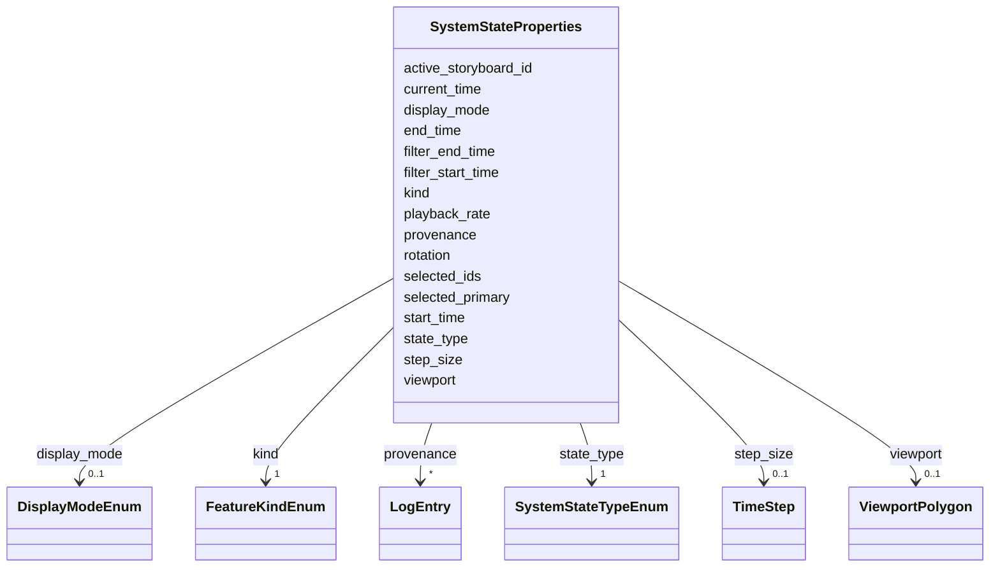

# Class: SystemStateProperties 


_Properties for SYSTEM features storing application state_


URI: [debrief:class/SystemStateProperties](https://debrief.info/schemas/class/SystemStateProperties)





<!-- no inheritance hierarchy -->


## Slots

| Name | Cardinality and Range | Description | Inheritance |
| ---  | --- | --- | --- |
| [kind](../slots/kind.md) | 1 <br/> [FeatureKindEnum](../enums/FeatureKindEnum.md) | Feature type discriminator | direct |
| [state_type](../slots/state_type.md) | 1 <br/> [SystemStateTypeEnum](../enums/SystemStateTypeEnum.md) | Discriminator for state variant (temporal, spatial, selection, active_storybo... | direct |
| [start_time](../slots/start_time.md) | 0..1 <br/> [datetime](../slots/datetime.md) | Analytical window start (ISO8601) - for temporal state | direct |
| [end_time](../slots/end_time.md) | 0..1 <br/> [datetime](../slots/datetime.md) | Analytical window end (ISO8601) - for temporal state | direct |
| [current_time](../slots/current_time.md) | 0..1 <br/> [datetime](../slots/datetime.md) | Playhead position at save (ISO-8601) | direct |
| [filter_start_time](../slots/filter_start_time.md) | 0..1 <br/> [datetime](../slots/datetime.md) | Visible-window filter start (ISO-8601) | direct |
| [filter_end_time](../slots/filter_end_time.md) | 0..1 <br/> [datetime](../slots/datetime.md) | Visible-window filter end (ISO-8601) | direct |
| [display_mode](../slots/display_mode.md) | 0..1 <br/> [DisplayModeEnum](../enums/DisplayModeEnum.md) | Track visualization mode for this plot | direct |
| [step_size](../slots/step_size.md) | 0..1 <br/> [TimeStep](../classes/TimeStep.md) | Playback step granularity for this plot | direct |
| [playback_rate](../slots/playback_rate.md) | 0..1 <br/> [Float](../types/Float.md) | Playback speed multiplier for this plot (0 | direct |
| [viewport](../slots/viewport.md) | 0..1 <br/> [ViewportPolygon](../classes/ViewportPolygon.md) | Saved map viewport (ViewportPolygon) | direct |
| [rotation](../slots/rotation.md) | 0..1 <br/> [Float](../types/Float.md) | Map rotation in degrees (0-360) | direct |
| [selected_ids](../slots/selected_ids.md) | * <br/> [String](../types/String.md) | Array of selected feature IDs - for selection state | direct |
| [selected_primary](../slots/selected_primary.md) | 0..1 <br/> [String](../types/String.md) | Primary selection path for properties display | direct |
| [active_storyboard_id](../slots/active_storyboard_id.md) | 0..1 <br/> [String](../types/String.md) | Storyboard properties | direct |
| [provenance](../slots/provenance.md) | * <br/> [LogEntry](../classes/LogEntry.md) | PROV-aligned provenance records (append-only log of tool operations) | direct |


## Usages

| used by | used in | type | used |
| ---  | --- | --- | --- |
| [SystemState](../classes/SystemState.md) | [properties](../slots/properties.md) | range | [SystemStateProperties](../classes/SystemStateProperties.md) |


## Rules


### 

| Rule Applied | Preconditions | Postconditions | Elseconditions |
|--------------|---------------|----------------|----------------|| slot_conditions |```{'state_type': {'equals_string': 'temporal'}}``` |```{'start_time': {'required': True}, 'end_time': {'required': True}}``` | |


### 

| Rule Applied | Preconditions | Postconditions | Elseconditions |
|--------------|---------------|----------------|----------------|| slot_conditions |```{'state_type': {'equals_string': 'spatial'}}``` |```{'viewport': {'required': True}}``` | |


### 

| Rule Applied | Preconditions | Postconditions | Elseconditions |
|--------------|---------------|----------------|----------------|| slot_conditions |```{'state_type': {'equals_string': 'selection'}}``` |```{'selected_ids': {'required': True}}``` | |


### 

| Rule Applied | Preconditions | Postconditions | Elseconditions |
|--------------|---------------|----------------|----------------|| slot_conditions |```{'state_type': {'equals_string': 'active_storyboard'}}``` |```{'active_storyboard_id': {'required': True}}``` | |


## Identifier and Mapping Information


### Schema Source


* from schema: https://debrief.info/schemas/debrief


## Mappings

| Mapping Type | Mapped Value |
| ---  | ---  |
| self | debrief:SystemStateProperties |
| native | debrief:SystemStateProperties |


## LinkML Source

<!-- TODO: investigate https://stackoverflow.com/questions/37606292/how-to-create-tabbed-code-blocks-in-mkdocs-or-sphinx -->

### Direct

<details>
```yaml
name: SystemStateProperties
description: Properties for SYSTEM features storing application state
from_schema: https://debrief.info/schemas/debrief
attributes:
  kind:
    name: kind
    description: Feature type discriminator
    from_schema: https://debrief.info/schemas/geojson
    domain_of:
    - BaseFeatureProperties
    - TrackProperties
    - ReferenceLocationProperties
    - SystemStateProperties
    - MultiPointFeatureProperties
    - MultiPolygonFeatureProperties
    - NarrativeEntryProperties
    - CircleAnnotationProperties
    - RectangleAnnotationProperties
    - LineAnnotationProperties
    - TextAnnotationProperties
    - VectorAnnotationProperties
    - PolyAnnotationProperties
    - SelectionRequirement
    - SystemRecordProperties
    - StoryboardProperties
    - SceneProperties
    - MCPSelectionRequirement
    range: FeatureKindEnum
    required: true
    equals_string: SYSTEM
  state_type:
    name: state_type
    description: Discriminator for state variant (temporal, spatial, selection, active_storyboard)
    from_schema: https://debrief.info/schemas/geojson
    rank: 1000
    domain_of:
    - SystemStateProperties
    range: SystemStateTypeEnum
    required: true
  start_time:
    name: start_time
    description: Analytical window start (ISO8601) - for temporal state
    from_schema: https://debrief.info/schemas/geojson
    domain_of:
    - SegmentMetadata
    - TrackProperties
    - SystemStateProperties
    range: datetime
  end_time:
    name: end_time
    description: Analytical window end (ISO8601) - for temporal state
    from_schema: https://debrief.info/schemas/geojson
    domain_of:
    - SegmentMetadata
    - TrackProperties
    - SystemStateProperties
    range: datetime
  current_time:
    name: current_time
    description: Playhead position at save (ISO-8601). When present, must lie within
      [start_time, end_time] (enforced by the load validator, not the schema).
    from_schema: https://debrief.info/schemas/geojson
    rank: 1000
    domain_of:
    - SystemStateProperties
    range: datetime
  filter_start_time:
    name: filter_start_time
    description: Visible-window filter start (ISO-8601). Absent = unbounded start.
    from_schema: https://debrief.info/schemas/geojson
    rank: 1000
    domain_of:
    - SystemStateProperties
    range: datetime
  filter_end_time:
    name: filter_end_time
    description: Visible-window filter end (ISO-8601). Absent = unbounded end.
    from_schema: https://debrief.info/schemas/geojson
    rank: 1000
    domain_of:
    - SystemStateProperties
    range: datetime
  display_mode:
    name: display_mode
    description: Track visualization mode for this plot.
    from_schema: https://debrief.info/schemas/geojson
    rank: 1000
    domain_of:
    - SystemStateProperties
    - SceneProperties
    range: DisplayModeEnum
  step_size:
    name: step_size
    description: Playback step granularity for this plot.
    from_schema: https://debrief.info/schemas/geojson
    rank: 1000
    domain_of:
    - SystemStateProperties
    range: TimeStep
  playback_rate:
    name: playback_rate
    description: Playback speed multiplier for this plot (0.1-100).
    from_schema: https://debrief.info/schemas/geojson
    rank: 1000
    domain_of:
    - SystemStateProperties
    range: float
    minimum_value: 0.1
    maximum_value: 100.0
  viewport:
    name: viewport
    description: Saved map viewport (ViewportPolygon). Identity-mapped to SpatialSlice.viewport.
    from_schema: https://debrief.info/schemas/geojson
    rank: 1000
    domain_of:
    - SystemStateProperties
    - SpatialSlice
    - SceneProperties
    range: ViewportPolygon
  rotation:
    name: rotation
    description: Map rotation in degrees (0-360).
    from_schema: https://debrief.info/schemas/geojson
    rank: 1000
    domain_of:
    - SystemStateProperties
    - SpatialSlice
    range: float
    minimum_value: 0
    maximum_value: 360
  selected_ids:
    name: selected_ids
    description: Array of selected feature IDs - for selection state
    from_schema: https://debrief.info/schemas/geojson
    rank: 1000
    domain_of:
    - SystemStateProperties
    range: string
    multivalued: true
  selected_primary:
    name: selected_primary
    description: Primary selection path for properties display.
    from_schema: https://debrief.info/schemas/geojson
    rank: 1000
    domain_of:
    - SystemStateProperties
    range: string
  active_storyboard_id:
    name: active_storyboard_id
    description: Storyboard properties.id the analyst last pinned for this plot (#237)
    from_schema: https://debrief.info/schemas/geojson
    rank: 1000
    domain_of:
    - SystemStateProperties
    range: string
  provenance:
    name: provenance
    description: PROV-aligned provenance records (append-only log of tool operations)
    from_schema: https://debrief.info/schemas/geojson
    domain_of:
    - BaseFeatureProperties
    - SystemStateProperties
    - SystemRecordProperties
    range: LogEntry
    multivalued: true
    inlined: true
    inlined_as_list: true
rules:
- preconditions:
    slot_conditions:
      state_type:
        name: state_type
        equals_string: temporal
  postconditions:
    slot_conditions:
      start_time:
        name: start_time
        required: true
      end_time:
        name: end_time
        required: true
  description: temporal variant requires start_time and end_time
- preconditions:
    slot_conditions:
      state_type:
        name: state_type
        equals_string: spatial
  postconditions:
    slot_conditions:
      viewport:
        name: viewport
        required: true
  description: spatial variant requires viewport
- preconditions:
    slot_conditions:
      state_type:
        name: state_type
        equals_string: selection
  postconditions:
    slot_conditions:
      selected_ids:
        name: selected_ids
        required: true
  description: selection variant requires selected_ids
- preconditions:
    slot_conditions:
      state_type:
        name: state_type
        equals_string: active_storyboard
  postconditions:
    slot_conditions:
      active_storyboard_id:
        name: active_storyboard_id
        required: true
  description: active_storyboard variant requires active_storyboard_id

```
</details>

### Induced

<details>
```yaml
name: SystemStateProperties
description: Properties for SYSTEM features storing application state
from_schema: https://debrief.info/schemas/debrief
attributes:
  kind:
    name: kind
    description: Feature type discriminator
    from_schema: https://debrief.info/schemas/geojson
    alias: kind
    owner: SystemStateProperties
    domain_of:
    - BaseFeatureProperties
    - TrackProperties
    - ReferenceLocationProperties
    - SystemStateProperties
    - MultiPointFeatureProperties
    - MultiPolygonFeatureProperties
    - NarrativeEntryProperties
    - CircleAnnotationProperties
    - RectangleAnnotationProperties
    - LineAnnotationProperties
    - TextAnnotationProperties
    - VectorAnnotationProperties
    - PolyAnnotationProperties
    - SelectionRequirement
    - SystemRecordProperties
    - StoryboardProperties
    - SceneProperties
    - MCPSelectionRequirement
    range: FeatureKindEnum
    required: true
    equals_string: SYSTEM
  state_type:
    name: state_type
    description: Discriminator for state variant (temporal, spatial, selection, active_storyboard)
    from_schema: https://debrief.info/schemas/geojson
    rank: 1000
    alias: state_type
    owner: SystemStateProperties
    domain_of:
    - SystemStateProperties
    range: SystemStateTypeEnum
    required: true
  start_time:
    name: start_time
    description: Analytical window start (ISO8601) - for temporal state
    from_schema: https://debrief.info/schemas/geojson
    alias: start_time
    owner: SystemStateProperties
    domain_of:
    - SegmentMetadata
    - TrackProperties
    - SystemStateProperties
    range: datetime
  end_time:
    name: end_time
    description: Analytical window end (ISO8601) - for temporal state
    from_schema: https://debrief.info/schemas/geojson
    alias: end_time
    owner: SystemStateProperties
    domain_of:
    - SegmentMetadata
    - TrackProperties
    - SystemStateProperties
    range: datetime
  current_time:
    name: current_time
    description: Playhead position at save (ISO-8601). When present, must lie within
      [start_time, end_time] (enforced by the load validator, not the schema).
    from_schema: https://debrief.info/schemas/geojson
    rank: 1000
    alias: current_time
    owner: SystemStateProperties
    domain_of:
    - SystemStateProperties
    range: datetime
  filter_start_time:
    name: filter_start_time
    description: Visible-window filter start (ISO-8601). Absent = unbounded start.
    from_schema: https://debrief.info/schemas/geojson
    rank: 1000
    alias: filter_start_time
    owner: SystemStateProperties
    domain_of:
    - SystemStateProperties
    range: datetime
  filter_end_time:
    name: filter_end_time
    description: Visible-window filter end (ISO-8601). Absent = unbounded end.
    from_schema: https://debrief.info/schemas/geojson
    rank: 1000
    alias: filter_end_time
    owner: SystemStateProperties
    domain_of:
    - SystemStateProperties
    range: datetime
  display_mode:
    name: display_mode
    description: Track visualization mode for this plot.
    from_schema: https://debrief.info/schemas/geojson
    rank: 1000
    alias: display_mode
    owner: SystemStateProperties
    domain_of:
    - SystemStateProperties
    - SceneProperties
    range: DisplayModeEnum
  step_size:
    name: step_size
    description: Playback step granularity for this plot.
    from_schema: https://debrief.info/schemas/geojson
    rank: 1000
    alias: step_size
    owner: SystemStateProperties
    domain_of:
    - SystemStateProperties
    range: TimeStep
  playback_rate:
    name: playback_rate
    description: Playback speed multiplier for this plot (0.1-100).
    from_schema: https://debrief.info/schemas/geojson
    rank: 1000
    alias: playback_rate
    owner: SystemStateProperties
    domain_of:
    - SystemStateProperties
    range: float
    minimum_value: 0.1
    maximum_value: 100.0
  viewport:
    name: viewport
    description: Saved map viewport (ViewportPolygon). Identity-mapped to SpatialSlice.viewport.
    from_schema: https://debrief.info/schemas/geojson
    rank: 1000
    alias: viewport
    owner: SystemStateProperties
    domain_of:
    - SystemStateProperties
    - SpatialSlice
    - SceneProperties
    range: ViewportPolygon
  rotation:
    name: rotation
    description: Map rotation in degrees (0-360).
    from_schema: https://debrief.info/schemas/geojson
    rank: 1000
    alias: rotation
    owner: SystemStateProperties
    domain_of:
    - SystemStateProperties
    - SpatialSlice
    range: float
    minimum_value: 0
    maximum_value: 360
  selected_ids:
    name: selected_ids
    description: Array of selected feature IDs - for selection state
    from_schema: https://debrief.info/schemas/geojson
    rank: 1000
    alias: selected_ids
    owner: SystemStateProperties
    domain_of:
    - SystemStateProperties
    range: string
    multivalued: true
  selected_primary:
    name: selected_primary
    description: Primary selection path for properties display.
    from_schema: https://debrief.info/schemas/geojson
    rank: 1000
    alias: selected_primary
    owner: SystemStateProperties
    domain_of:
    - SystemStateProperties
    range: string
  active_storyboard_id:
    name: active_storyboard_id
    description: Storyboard properties.id the analyst last pinned for this plot (#237)
    from_schema: https://debrief.info/schemas/geojson
    rank: 1000
    alias: active_storyboard_id
    owner: SystemStateProperties
    domain_of:
    - SystemStateProperties
    range: string
  provenance:
    name: provenance
    description: PROV-aligned provenance records (append-only log of tool operations)
    from_schema: https://debrief.info/schemas/geojson
    alias: provenance
    owner: SystemStateProperties
    domain_of:
    - BaseFeatureProperties
    - SystemStateProperties
    - SystemRecordProperties
    range: LogEntry
    multivalued: true
    inlined: true
    inlined_as_list: true
rules:
- preconditions:
    slot_conditions:
      state_type:
        name: state_type
        equals_string: temporal
  postconditions:
    slot_conditions:
      start_time:
        name: start_time
        required: true
      end_time:
        name: end_time
        required: true
  description: temporal variant requires start_time and end_time
- preconditions:
    slot_conditions:
      state_type:
        name: state_type
        equals_string: spatial
  postconditions:
    slot_conditions:
      viewport:
        name: viewport
        required: true
  description: spatial variant requires viewport
- preconditions:
    slot_conditions:
      state_type:
        name: state_type
        equals_string: selection
  postconditions:
    slot_conditions:
      selected_ids:
        name: selected_ids
        required: true
  description: selection variant requires selected_ids
- preconditions:
    slot_conditions:
      state_type:
        name: state_type
        equals_string: active_storyboard
  postconditions:
    slot_conditions:
      active_storyboard_id:
        name: active_storyboard_id
        required: true
  description: active_storyboard variant requires active_storyboard_id

```
</details>