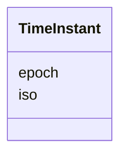

# Class: TimeInstant 


_A point in time with dual representations (FR-032, FR-033)_


URI: [debrief:class/TimeInstant](https://debrief.info/schemas/class/TimeInstant)





<!-- no inheritance hierarchy -->


## Slots

| Name | Cardinality and Range | Description | Inheritance |
| ---  | --- | --- | --- |
| [epoch](../slots/epoch.md) | 1 <br/> [Integer](../types/Integer.md) | Milliseconds since Unix epoch | direct |
| [iso](../slots/iso.md) | 1 <br/> [String](../types/String.md) | ISO 8601 UTC format string | direct |


## Usages

| used by | used in | type | used |
| ---  | --- | --- | --- |
| [TimeRange](../classes/TimeRange.md) | [start](../slots/start.md) | range | [TimeInstant](../classes/TimeInstant.md) |
| [TimeRange](../classes/TimeRange.md) | [end](../slots/end.md) | range | [TimeInstant](../classes/TimeInstant.md) |
| [FeatureSelection](../classes/FeatureSelection.md) | [timestamp](../slots/timestamp.md) | range | [TimeInstant](../classes/TimeInstant.md) |
| [TemporalSlice](../classes/TemporalSlice.md) | [currentTime](../slots/currentTime.md) | range | [TimeInstant](../classes/TimeInstant.md) |


## Identifier and Mapping Information


### Schema Source


* from schema: https://debrief.info/schemas/debrief


## Mappings

| Mapping Type | Mapped Value |
| ---  | ---  |
| self | debrief:TimeInstant |
| native | debrief:TimeInstant |


## LinkML Source

<!-- TODO: investigate https://stackoverflow.com/questions/37606292/how-to-create-tabbed-code-blocks-in-mkdocs-or-sphinx -->

### Direct

<details>
```yaml
name: TimeInstant
description: A point in time with dual representations (FR-032, FR-033)
from_schema: https://debrief.info/schemas/debrief
attributes:
  epoch:
    name: epoch
    description: Milliseconds since Unix epoch
    from_schema: https://debrief.info/schemas/common
    rank: 1000
    domain_of:
    - TimeInstant
    range: integer
    required: true
  iso:
    name: iso
    description: ISO 8601 UTC format string
    from_schema: https://debrief.info/schemas/common
    rank: 1000
    domain_of:
    - TimeInstant
    range: string
    required: true
    pattern: ^\d{4}-\d{2}-\d{2}T\d{2}:\d{2}:\d{2}(\.\d{3})?Z$

```
</details>

### Induced

<details>
```yaml
name: TimeInstant
description: A point in time with dual representations (FR-032, FR-033)
from_schema: https://debrief.info/schemas/debrief
attributes:
  epoch:
    name: epoch
    description: Milliseconds since Unix epoch
    from_schema: https://debrief.info/schemas/common
    rank: 1000
    alias: epoch
    owner: TimeInstant
    domain_of:
    - TimeInstant
    range: integer
    required: true
  iso:
    name: iso
    description: ISO 8601 UTC format string
    from_schema: https://debrief.info/schemas/common
    rank: 1000
    alias: iso
    owner: TimeInstant
    domain_of:
    - TimeInstant
    range: string
    required: true
    pattern: ^\d{4}-\d{2}-\d{2}T\d{2}:\d{2}:\d{2}(\.\d{3})?Z$

```
</details>