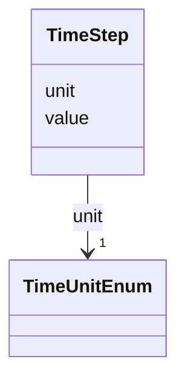

# Class: TimeStep 


_Step size for discrete time navigation (FR-008)_


URI: [debrief:class/TimeStep](https://debrief.info/schemas/class/TimeStep)





<!-- no inheritance hierarchy -->


## Slots

| Name | Cardinality and Range | Description | Inheritance |
| ---  | --- | --- | --- |
| [value](../slots/value.md) | 1 <br/> [Float](../types/Float.md) | Numeric step value | direct |
| [unit](../slots/unit.md) | 1 <br/> [TimeUnitEnum](../enums/TimeUnitEnum.md) | Unit of the step | direct |


## Usages

| used by | used in | type | used |
| ---  | --- | --- | --- |
| [SystemStateProperties](../classes/SystemStateProperties.md) | [step_size](../slots/step_size.md) | range | [TimeStep](../classes/TimeStep.md) |
| [TemporalSlice](../classes/TemporalSlice.md) | [stepSize](../slots/stepSize.md) | range | [TimeStep](../classes/TimeStep.md) |


## Identifier and Mapping Information


### Schema Source


* from schema: https://debrief.info/schemas/debrief


## Mappings

| Mapping Type | Mapped Value |
| ---  | ---  |
| self | debrief:TimeStep |
| native | debrief:TimeStep |


## LinkML Source

<!-- TODO: investigate https://stackoverflow.com/questions/37606292/how-to-create-tabbed-code-blocks-in-mkdocs-or-sphinx -->

### Direct

<details>
```yaml
name: TimeStep
description: Step size for discrete time navigation (FR-008)
from_schema: https://debrief.info/schemas/debrief
attributes:
  value:
    name: value
    description: Numeric step value
    from_schema: https://debrief.info/schemas/common
    rank: 1000
    domain_of:
    - TimeStep
    - ParameterValue
    - ToolParameterMeta
    range: float
    required: true
    minimum_value: 0
  unit:
    name: unit
    description: Unit of the step
    from_schema: https://debrief.info/schemas/common
    rank: 1000
    domain_of:
    - TimeStep
    range: TimeUnitEnum
    required: true

```
</details>

### Induced

<details>
```yaml
name: TimeStep
description: Step size for discrete time navigation (FR-008)
from_schema: https://debrief.info/schemas/debrief
attributes:
  value:
    name: value
    description: Numeric step value
    from_schema: https://debrief.info/schemas/common
    rank: 1000
    alias: value
    owner: TimeStep
    domain_of:
    - TimeStep
    - ParameterValue
    - ToolParameterMeta
    range: float
    required: true
    minimum_value: 0
  unit:
    name: unit
    description: Unit of the step
    from_schema: https://debrief.info/schemas/common
    rank: 1000
    alias: unit
    owner: TimeStep
    domain_of:
    - TimeStep
    range: TimeUnitEnum
    required: true

```
</details>