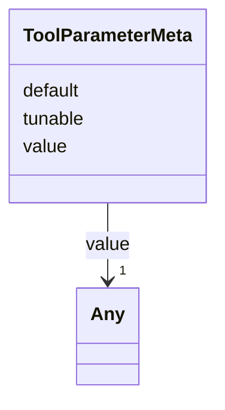

# Class: ToolParameterMeta 


_Tunable parameter metadata recorded alongside a tool result for provenance. Closes audit §3.1 row 21. Matches the live web-shell mock shape — three slots tracking value, default-ness, and whether the parameter is operator-tunable._


URI: [debrief:class/ToolParameterMeta](https://debrief.info/schemas/class/ToolParameterMeta)





<!-- no inheritance hierarchy -->


## Slots

| Name | Cardinality and Range | Description | Inheritance |
| ---  | --- | --- | --- |
| [value](../slots/value.md) | 1 <br/> [Any](../classes/Any.md) | Parameter value used during the invocation | direct |
| [default](../slots/default.md) | 1 <br/> [Boolean](../types/Boolean.md) | Whether the parameter took its default value | direct |
| [tunable](../slots/tunable.md) | 1 <br/> [Boolean](../types/Boolean.md) | Whether the parameter is operator-tunable | direct |


## Identifier and Mapping Information


### Schema Source


* from schema: https://debrief.info/schemas/debrief


## Mappings

| Mapping Type | Mapped Value |
| ---  | ---  |
| self | debrief:ToolParameterMeta |
| native | debrief:ToolParameterMeta |


## LinkML Source

<!-- TODO: investigate https://stackoverflow.com/questions/37606292/how-to-create-tabbed-code-blocks-in-mkdocs-or-sphinx -->

### Direct

<details>
```yaml
name: ToolParameterMeta
description: Tunable parameter metadata recorded alongside a tool result for provenance.
  Closes audit §3.1 row 21. Matches the live web-shell mock shape — three slots tracking
  value, default-ness, and whether the parameter is operator-tunable.
from_schema: https://debrief.info/schemas/debrief
attributes:
  value:
    name: value
    description: Parameter value used during the invocation.
    from_schema: https://debrief.info/schemas/mcp
    domain_of:
    - TimeStep
    - ParameterValue
    - ToolParameterMeta
    range: Any
    required: true
  default:
    name: default
    description: Whether the parameter took its default value.
    from_schema: https://debrief.info/schemas/mcp
    domain_of:
    - ParameterValue
    - ToolParameterMeta
    range: boolean
    required: true
  tunable:
    name: tunable
    description: Whether the parameter is operator-tunable.
    from_schema: https://debrief.info/schemas/mcp
    domain_of:
    - ParameterValue
    - ToolParameterMeta
    range: boolean
    required: true

```
</details>

### Induced

<details>
```yaml
name: ToolParameterMeta
description: Tunable parameter metadata recorded alongside a tool result for provenance.
  Closes audit §3.1 row 21. Matches the live web-shell mock shape — three slots tracking
  value, default-ness, and whether the parameter is operator-tunable.
from_schema: https://debrief.info/schemas/debrief
attributes:
  value:
    name: value
    description: Parameter value used during the invocation.
    from_schema: https://debrief.info/schemas/mcp
    alias: value
    owner: ToolParameterMeta
    domain_of:
    - TimeStep
    - ParameterValue
    - ToolParameterMeta
    range: Any
    required: true
  default:
    name: default
    description: Whether the parameter took its default value.
    from_schema: https://debrief.info/schemas/mcp
    alias: default
    owner: ToolParameterMeta
    domain_of:
    - ParameterValue
    - ToolParameterMeta
    range: boolean
    required: true
  tunable:
    name: tunable
    description: Whether the parameter is operator-tunable.
    from_schema: https://debrief.info/schemas/mcp
    alias: tunable
    owner: ToolParameterMeta
    domain_of:
    - ParameterValue
    - ToolParameterMeta
    range: boolean
    required: true

```
</details>