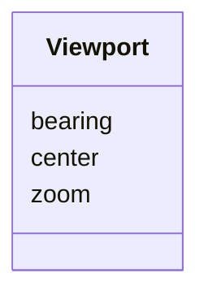

# Class: Viewport 


_Camera state sub-record inside a Scene. Captures the map viewport at capture time._


URI: [debrief:class/Viewport](https://debrief.info/schemas/class/Viewport)





<!-- no inheritance hierarchy -->


## Slots

| Name | Cardinality and Range | Description | Inheritance |
| ---  | --- | --- | --- |
| [center](../slots/center.md) | 1..* <br/> [Float](../types/Float.md) | [longitude, latitude] in degrees | direct |
| [zoom](../slots/zoom.md) | 1 <br/> [Float](../types/Float.md) | Leaflet-compatible zoom level | direct |
| [bearing](../slots/bearing.md) | 1 <br/> [Float](../types/Float.md) | Viewport bearing in degrees | direct |


## Usages

| used by | used in | type | used |
| ---  | --- | --- | --- |
| [SceneProperties](../classes/SceneProperties.md) | [viewport](../slots/viewport.md) | range | [Viewport](../classes/Viewport.md) |
| [SceneProperties](../classes/SceneProperties.md) | [viewport_end](../slots/viewport_end.md) | range | [Viewport](../classes/Viewport.md) |


## Identifier and Mapping Information


### Schema Source


* from schema: https://debrief.info/schemas/debrief


## Mappings

| Mapping Type | Mapped Value |
| ---  | ---  |
| self | debrief:Viewport |
| native | debrief:Viewport |


## LinkML Source

<!-- TODO: investigate https://stackoverflow.com/questions/37606292/how-to-create-tabbed-code-blocks-in-mkdocs-or-sphinx -->

### Direct

<details>
```yaml
name: Viewport
description: Camera state sub-record inside a Scene. Captures the map viewport at
  capture time.
from_schema: https://debrief.info/schemas/debrief
attributes:
  center:
    name: center
    description: '[longitude, latitude] in degrees'
    from_schema: https://debrief.info/schemas/storyboard
    domain_of:
    - CircleAnnotationProperties
    - Viewport
    range: float
    required: true
    multivalued: true
    minimum_cardinality: 2
    maximum_cardinality: 2
  zoom:
    name: zoom
    description: Leaflet-compatible zoom level
    from_schema: https://debrief.info/schemas/storyboard
    domain_of:
    - ViewportPolygon
    - Viewport
    range: float
    required: true
  bearing:
    name: bearing
    description: Viewport bearing in degrees. MUST be 0 in schema v1 (reserved slot
      for future rotated viewports).
    from_schema: https://debrief.info/schemas/storyboard
    domain_of:
    - SensorContact
    - TUASolution
    - VectorAnnotationProperties
    - Viewport
    range: float
    required: true
    minimum_value: 0
    maximum_value: 0

```
</details>

### Induced

<details>
```yaml
name: Viewport
description: Camera state sub-record inside a Scene. Captures the map viewport at
  capture time.
from_schema: https://debrief.info/schemas/debrief
attributes:
  center:
    name: center
    description: '[longitude, latitude] in degrees'
    from_schema: https://debrief.info/schemas/storyboard
    alias: center
    owner: Viewport
    domain_of:
    - CircleAnnotationProperties
    - Viewport
    range: float
    required: true
    multivalued: true
    minimum_cardinality: 2
    maximum_cardinality: 2
  zoom:
    name: zoom
    description: Leaflet-compatible zoom level
    from_schema: https://debrief.info/schemas/storyboard
    alias: zoom
    owner: Viewport
    domain_of:
    - ViewportPolygon
    - Viewport
    range: float
    required: true
  bearing:
    name: bearing
    description: Viewport bearing in degrees. MUST be 0 in schema v1 (reserved slot
      for future rotated viewports).
    from_schema: https://debrief.info/schemas/storyboard
    alias: bearing
    owner: Viewport
    domain_of:
    - SensorContact
    - TUASolution
    - VectorAnnotationProperties
    - Viewport
    range: float
    required: true
    minimum_value: 0
    maximum_value: 0

```
</details>