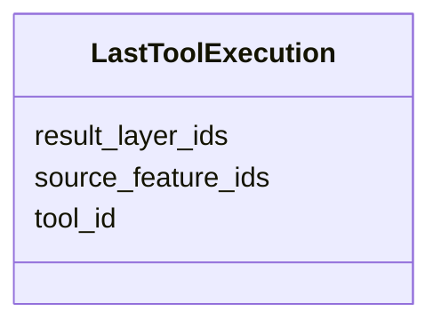

# Class: LastToolExecution 


_Record of the last tool execution, enabling single-step undo. Feature 110-tool-level-undo-gap._

__


URI: [debrief:class/LastToolExecution](https://debrief.info/schemas/class/LastToolExecution)





<!-- no inheritance hierarchy -->


## Slots

| Name | Cardinality and Range | Description | Inheritance |
| ---  | --- | --- | --- |
| [tool_id](../slots/tool_id.md) | 1 <br/> [String](../types/String.md) | Identifier of the tool that was executed | direct |
| [source_feature_ids](../slots/source_feature_ids.md) | 1..* <br/> [String](../types/String.md) | IDs of the source features the tool operated on | direct |
| [result_layer_ids](../slots/result_layer_ids.md) | 1..* <br/> [String](../types/String.md) | IDs of the result layers produced by the tool | direct |


## Usages

| used by | used in | type | used |
| ---  | --- | --- | --- |
| [ResultsSlice](../classes/ResultsSlice.md) | [last_tool_execution](../slots/last_tool_execution.md) | range | [LastToolExecution](../classes/LastToolExecution.md) |


## Identifier and Mapping Information


### Schema Source


* from schema: https://debrief.info/schemas/debrief


## Mappings

| Mapping Type | Mapped Value |
| ---  | ---  |
| self | debrief:LastToolExecution |
| native | debrief:LastToolExecution |


## LinkML Source

<!-- TODO: investigate https://stackoverflow.com/questions/37606292/how-to-create-tabbed-code-blocks-in-mkdocs-or-sphinx -->

### Direct

<details>
```yaml
name: LastToolExecution
description: 'Record of the last tool execution, enabling single-step undo. Feature
  110-tool-level-undo-gap.

  '
from_schema: https://debrief.info/schemas/debrief
attributes:
  tool_id:
    name: tool_id
    description: Identifier of the tool that was executed
    from_schema: https://debrief.info/schemas/session-state
    domain_of:
    - StacAsset
    - LastToolExecution
    - ToolResultForLog
    range: string
    required: true
  source_feature_ids:
    name: source_feature_ids
    description: IDs of the source features the tool operated on
    from_schema: https://debrief.info/schemas/session-state
    rank: 1000
    domain_of:
    - LastToolExecution
    - ToolResultForLog
    range: string
    required: true
    multivalued: true
  result_layer_ids:
    name: result_layer_ids
    description: IDs of the result layers produced by the tool
    from_schema: https://debrief.info/schemas/session-state
    rank: 1000
    domain_of:
    - LastToolExecution
    range: string
    required: true
    multivalued: true

```
</details>

### Induced

<details>
```yaml
name: LastToolExecution
description: 'Record of the last tool execution, enabling single-step undo. Feature
  110-tool-level-undo-gap.

  '
from_schema: https://debrief.info/schemas/debrief
attributes:
  tool_id:
    name: tool_id
    description: Identifier of the tool that was executed
    from_schema: https://debrief.info/schemas/session-state
    alias: tool_id
    owner: LastToolExecution
    domain_of:
    - StacAsset
    - LastToolExecution
    - ToolResultForLog
    range: string
    required: true
  source_feature_ids:
    name: source_feature_ids
    description: IDs of the source features the tool operated on
    from_schema: https://debrief.info/schemas/session-state
    rank: 1000
    alias: source_feature_ids
    owner: LastToolExecution
    domain_of:
    - LastToolExecution
    - ToolResultForLog
    range: string
    required: true
    multivalued: true
  result_layer_ids:
    name: result_layer_ids
    description: IDs of the result layers produced by the tool
    from_schema: https://debrief.info/schemas/session-state
    rank: 1000
    alias: result_layer_ids
    owner: LastToolExecution
    domain_of:
    - LastToolExecution
    range: string
    required: true
    multivalued: true

```
</details>