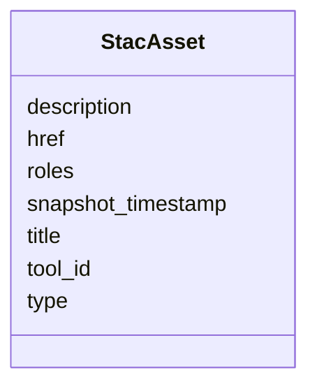

# Class: StacAsset 


_A single asset entry within `assets[<key>]`. Closes R4-masked audit row for `apps/vscode/src/types/stac.ts` and the inline `StacItemAssets` alias at `apps/vscode/src/services/sceneThumbnailService.ts`._

_Open-record per Article XV.2 — accepts arbitrary extension keys (`file:checksum`, `file:size`, `processing:datetime`, `processing:software`, `proj:shape`, `debrief:provenance`, `debrief:toolId`, `debrief:sourceFeatures`) observed in the live fixtures. The generator post-processes this into Pydantic `extra='allow'` and TypeScript `[key: string]: unknown`._


URI: [debrief:class/StacAsset](https://debrief.info/schemas/class/StacAsset)





<!-- no inheritance hierarchy -->


## Slots

| Name | Cardinality and Range | Description | Inheritance |
| ---  | --- | --- | --- |
| [href](../slots/href.md) | 1 <br/> [String](../types/String.md) | URI to the asset | direct |
| [type](../slots/type.md) | 0..1 <br/> [String](../types/String.md) | IANA media type | direct |
| [title](../slots/title.md) | 0..1 <br/> [String](../types/String.md) | Human-readable asset title | direct |
| [description](../slots/description.md) | 0..1 <br/> [String](../types/String.md) | Asset description (STAC 1 | direct |
| [roles](../slots/roles.md) | * <br/> [String](../types/String.md) | Asset roles — "data", "thumbnail", "overview", "source", "result", etc | direct |
| [tool_id](../slots/tool_id.md) | 0..1 <br/> [String](../types/String.md) | Identifier of the debrief-calc tool that produced this result asset | direct |
| [snapshot_timestamp](../slots/snapshot_timestamp.md) | 0..1 <br/> [String](../types/String.md) | ISO-8601 UTC timestamp recorded when a snapshot asset is written | direct |


## Identifier and Mapping Information


### Schema Source


* from schema: https://debrief.info/schemas/debrief


## Mappings

| Mapping Type | Mapped Value |
| ---  | ---  |
| self | debrief:StacAsset |
| native | debrief:StacAsset |


## LinkML Source

<!-- TODO: investigate https://stackoverflow.com/questions/37606292/how-to-create-tabbed-code-blocks-in-mkdocs-or-sphinx -->

### Direct

<details>
```yaml
name: StacAsset
description: 'A single asset entry within `assets[<key>]`. Closes R4-masked audit
  row for `apps/vscode/src/types/stac.ts` and the inline `StacItemAssets` alias at
  `apps/vscode/src/services/sceneThumbnailService.ts`.

  Open-record per Article XV.2 — accepts arbitrary extension keys (`file:checksum`,
  `file:size`, `processing:datetime`, `processing:software`, `proj:shape`, `debrief:provenance`,
  `debrief:toolId`, `debrief:sourceFeatures`) observed in the live fixtures. The generator
  post-processes this into Pydantic `extra=''allow''` and TypeScript `[key: string]:
  unknown`.'
from_schema: https://debrief.info/schemas/debrief
attributes:
  href:
    name: href
    description: URI to the asset. Required on `StacItem.assets[<key>]` — STAC 1.1
      mandates a concrete URI on Item assets. The declaration-only shape on `StacCollection.item_assets[<key>]`
      (no `href`) is covered by the sibling `StacItemAssetDefinition` class.
    from_schema: https://debrief.info/schemas/stac
    domain_of:
    - StacLink
    - StacAsset
    - ToolResultAnnotations
    - SceneThumbnailAssetEntry
    range: string
    required: true
  type:
    name: type
    description: IANA media type.
    from_schema: https://debrief.info/schemas/stac
    domain_of:
    - GeoJSONPoint
    - GeoJSONEmptyPoint
    - GeoJSONLineString
    - GeoJSONPolygon
    - GeoJSONMultiPoint
    - GeoJSONMultiLineString
    - GeoJSONMultiPolygon
    - TrackFeature
    - ReferenceLocation
    - SystemState
    - MultiPointFeature
    - MultiPolygonFeature
    - NarrativeEntry
    - CircleAnnotation
    - RectangleAnnotation
    - LineAnnotation
    - TextAnnotation
    - VectorAnnotation
    - PolyAnnotation
    - ToolParameter
    - FileProvEntry
    - StacItem
    - StacCatalog
    - StacLink
    - StacAsset
    - StacItemAssetDefinition
    - StacCollection
    - RawGeoJSONFeature
    - RawGeoJSONFeatureCollection
    - DatasetAxisMetadata
    - DatasetEntry
    - StoryboardFeature
    - SceneFeature
    - SceneThumbnailAssetEntry
    - MCPContentItem
    - MCPParamSchema
    - ToolsUpdateMessage
    range: string
    required: false
  title:
    name: title
    description: Human-readable asset title.
    from_schema: https://debrief.info/schemas/stac
    domain_of:
    - PlotSummary
    - StacItemSummary
    - StacItemProperties
    - StacCatalog
    - StacLink
    - StacAsset
    - StacItemAssetDefinition
    - StacCollection
    - DatasetEntry
    - SceneProperties
    - SceneThumbnailAssetEntry
    range: string
    required: false
  description:
    name: description
    description: Asset description (STAC 1.1 addition).
    from_schema: https://debrief.info/schemas/stac
    domain_of:
    - ReferenceLocationProperties
    - MultiPointFeatureProperties
    - MultiPolygonFeatureProperties
    - Tool
    - ToolParameter
    - StacProvider
    - StacItemProperties
    - StacCatalog
    - StacAsset
    - StacItemAssetDefinition
    - StacCollection
    - LevelDefinition
    - StoryboardProperties
    - SceneProperties
    - MCPParamSchema
    - MCPToolDefinition
    - ToolDefinition
    range: string
    required: false
  roles:
    name: roles
    description: Asset roles — "data", "thumbnail", "overview", "source", "result",
      etc.
    from_schema: https://debrief.info/schemas/stac
    domain_of:
    - StacProvider
    - StacAsset
    - StacItemAssetDefinition
    - SceneThumbnailAssetEntry
    range: string
    required: false
    multivalued: true
  tool_id:
    name: tool_id
    description: 'Identifier of the debrief-calc tool that produced this result asset.
      On-disk key is `debrief:toolId` (colon syntax preserved via slot_uri). Written
      by `addResultAsset`; read at `stacService.ts` (Feature 256 — replaces the hand-typed
      `asset as StacAsset & { ''debrief:toolId''?: string }` cast).'
    from_schema: https://debrief.info/schemas/stac
    rank: 1000
    slot_uri: debrief:toolId
    domain_of:
    - StacAsset
    - LastToolExecution
    - ToolResultForLog
    range: string
    required: false
  snapshot_timestamp:
    name: snapshot_timestamp
    description: ISO-8601 UTC timestamp recorded when a snapshot asset is written.
      On-disk key is `debrief:snapshotTimestamp` (colon syntax preserved via slot_uri).
      Written by `writeSnapshotAsset`.
    from_schema: https://debrief.info/schemas/stac
    rank: 1000
    slot_uri: debrief:snapshotTimestamp
    domain_of:
    - StacAsset
    range: string
    required: false

```
</details>

### Induced

<details>
```yaml
name: StacAsset
description: 'A single asset entry within `assets[<key>]`. Closes R4-masked audit
  row for `apps/vscode/src/types/stac.ts` and the inline `StacItemAssets` alias at
  `apps/vscode/src/services/sceneThumbnailService.ts`.

  Open-record per Article XV.2 — accepts arbitrary extension keys (`file:checksum`,
  `file:size`, `processing:datetime`, `processing:software`, `proj:shape`, `debrief:provenance`,
  `debrief:toolId`, `debrief:sourceFeatures`) observed in the live fixtures. The generator
  post-processes this into Pydantic `extra=''allow''` and TypeScript `[key: string]:
  unknown`.'
from_schema: https://debrief.info/schemas/debrief
attributes:
  href:
    name: href
    description: URI to the asset. Required on `StacItem.assets[<key>]` — STAC 1.1
      mandates a concrete URI on Item assets. The declaration-only shape on `StacCollection.item_assets[<key>]`
      (no `href`) is covered by the sibling `StacItemAssetDefinition` class.
    from_schema: https://debrief.info/schemas/stac
    alias: href
    owner: StacAsset
    domain_of:
    - StacLink
    - StacAsset
    - ToolResultAnnotations
    - SceneThumbnailAssetEntry
    range: string
    required: true
  type:
    name: type
    description: IANA media type.
    from_schema: https://debrief.info/schemas/stac
    alias: type
    owner: StacAsset
    domain_of:
    - GeoJSONPoint
    - GeoJSONEmptyPoint
    - GeoJSONLineString
    - GeoJSONPolygon
    - GeoJSONMultiPoint
    - GeoJSONMultiLineString
    - GeoJSONMultiPolygon
    - TrackFeature
    - ReferenceLocation
    - SystemState
    - MultiPointFeature
    - MultiPolygonFeature
    - NarrativeEntry
    - CircleAnnotation
    - RectangleAnnotation
    - LineAnnotation
    - TextAnnotation
    - VectorAnnotation
    - PolyAnnotation
    - ToolParameter
    - FileProvEntry
    - StacItem
    - StacCatalog
    - StacLink
    - StacAsset
    - StacItemAssetDefinition
    - StacCollection
    - RawGeoJSONFeature
    - RawGeoJSONFeatureCollection
    - DatasetAxisMetadata
    - DatasetEntry
    - StoryboardFeature
    - SceneFeature
    - SceneThumbnailAssetEntry
    - MCPContentItem
    - MCPParamSchema
    - ToolsUpdateMessage
    range: string
    required: false
  title:
    name: title
    description: Human-readable asset title.
    from_schema: https://debrief.info/schemas/stac
    alias: title
    owner: StacAsset
    domain_of:
    - PlotSummary
    - StacItemSummary
    - StacItemProperties
    - StacCatalog
    - StacLink
    - StacAsset
    - StacItemAssetDefinition
    - StacCollection
    - DatasetEntry
    - SceneProperties
    - SceneThumbnailAssetEntry
    range: string
    required: false
  description:
    name: description
    description: Asset description (STAC 1.1 addition).
    from_schema: https://debrief.info/schemas/stac
    alias: description
    owner: StacAsset
    domain_of:
    - ReferenceLocationProperties
    - MultiPointFeatureProperties
    - MultiPolygonFeatureProperties
    - Tool
    - ToolParameter
    - StacProvider
    - StacItemProperties
    - StacCatalog
    - StacAsset
    - StacItemAssetDefinition
    - StacCollection
    - LevelDefinition
    - StoryboardProperties
    - SceneProperties
    - MCPParamSchema
    - MCPToolDefinition
    - ToolDefinition
    range: string
    required: false
  roles:
    name: roles
    description: Asset roles — "data", "thumbnail", "overview", "source", "result",
      etc.
    from_schema: https://debrief.info/schemas/stac
    alias: roles
    owner: StacAsset
    domain_of:
    - StacProvider
    - StacAsset
    - StacItemAssetDefinition
    - SceneThumbnailAssetEntry
    range: string
    required: false
    multivalued: true
  tool_id:
    name: tool_id
    description: 'Identifier of the debrief-calc tool that produced this result asset.
      On-disk key is `debrief:toolId` (colon syntax preserved via slot_uri). Written
      by `addResultAsset`; read at `stacService.ts` (Feature 256 — replaces the hand-typed
      `asset as StacAsset & { ''debrief:toolId''?: string }` cast).'
    from_schema: https://debrief.info/schemas/stac
    rank: 1000
    slot_uri: debrief:toolId
    alias: tool_id
    owner: StacAsset
    domain_of:
    - StacAsset
    - LastToolExecution
    - ToolResultForLog
    range: string
    required: false
  snapshot_timestamp:
    name: snapshot_timestamp
    description: ISO-8601 UTC timestamp recorded when a snapshot asset is written.
      On-disk key is `debrief:snapshotTimestamp` (colon syntax preserved via slot_uri).
      Written by `writeSnapshotAsset`.
    from_schema: https://debrief.info/schemas/stac
    rank: 1000
    slot_uri: debrief:snapshotTimestamp
    alias: snapshot_timestamp
    owner: StacAsset
    domain_of:
    - StacAsset
    range: string
    required: false

```
</details>