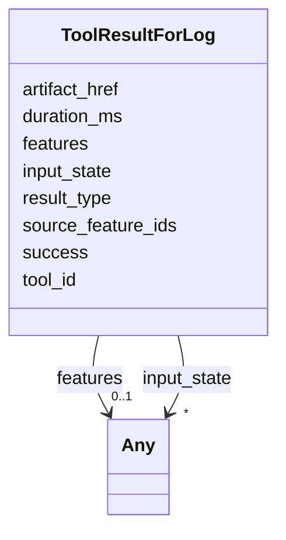

# Class: ToolResultForLog 


_Persisted tool-result shape written by the live tool-result logger and read back by the replay subsystem. Closes audit §3.1 row 4. Slot names match `services/session-state/src/log/types.ts:97` verbatim so existing log fixtures under the session-state fixtures directories continue to deserialise unchanged (FR-011)._


URI: [debrief:class/ToolResultForLog](https://debrief.info/schemas/class/ToolResultForLog)





<!-- no inheritance hierarchy -->


## Slots

| Name | Cardinality and Range | Description | Inheritance |
| ---  | --- | --- | --- |
| [success](../slots/success.md) | 1 <br/> [Boolean](../types/Boolean.md) | Whether the tool succeeded | direct |
| [features](../slots/features.md) | 0..1 <br/> [Any](../classes/Any.md) | GeoJSON FeatureCollection produced by the tool | direct |
| [duration_ms](../slots/duration_ms.md) | 1 <br/> [Integer](../types/Integer.md) | Wall-clock duration of the tool invocation in milliseconds | direct |
| [result_type](../slots/result_type.md) | 0..1 <br/> [String](../types/String.md) | Hierarchical result type (e | direct |
| [source_feature_ids](../slots/source_feature_ids.md) | * <br/> [String](../types/String.md) | IDs of input features used to generate this result | direct |
| [artifact_href](../slots/artifact_href.md) | 0..1 <br/> [String](../types/String.md) | Path to an exported artifact (for non-GeoJSON tool results) | direct |
| [tool_id](../slots/tool_id.md) | 0..1 <br/> [String](../types/String.md) | Tool identifier (mirrors LogEntry | direct |
| [input_state](../slots/input_state.md) | * <br/> [Any](../classes/Any.md) | Pre-tool geometry snapshot for mutation tools — passed through to LogEntry | direct |


## Identifier and Mapping Information


### Schema Source


* from schema: https://debrief.info/schemas/debrief


## Mappings

| Mapping Type | Mapped Value |
| ---  | ---  |
| self | debrief:ToolResultForLog |
| native | debrief:ToolResultForLog |


## LinkML Source

<!-- TODO: investigate https://stackoverflow.com/questions/37606292/how-to-create-tabbed-code-blocks-in-mkdocs-or-sphinx -->

### Direct

<details>
```yaml
name: ToolResultForLog
description: Persisted tool-result shape written by the live tool-result logger and
  read back by the replay subsystem. Closes audit §3.1 row 4. Slot names match `services/session-state/src/log/types.ts:97`
  verbatim so existing log fixtures under the session-state fixtures directories continue
  to deserialise unchanged (FR-011).
from_schema: https://debrief.info/schemas/debrief
attributes:
  success:
    name: success
    description: Whether the tool succeeded.
    from_schema: https://debrief.info/schemas/mcp
    domain_of:
    - ToolResult
    - ToolResultForLog
    - ToolExecutionResultForReplay
    range: boolean
    required: true
  features:
    name: features
    description: GeoJSON FeatureCollection produced by the tool. Free-form per Article
      XV.2 (the tool's output shape is its own contract).
    from_schema: https://debrief.info/schemas/mcp
    domain_of:
    - RawGeoJSONFeatureCollection
    - ToolResultForLog
    - ToolExecutionResultForReplay
    range: Any
  duration_ms:
    name: duration_ms
    description: Wall-clock duration of the tool invocation in milliseconds.
    from_schema: https://debrief.info/schemas/mcp
    domain_of:
    - MCPToolResponse
    - MCPErrorResponse
    - ToolResultForLog
    - ToolExecutionResultForReplay
    range: integer
    required: true
  result_type:
    name: result_type
    description: Hierarchical result type (e.g. mutation/track/smoothed).
    from_schema: https://debrief.info/schemas/mcp
    rank: 1000
    domain_of:
    - ToolResultForLog
    range: string
  source_feature_ids:
    name: source_feature_ids
    description: IDs of input features used to generate this result.
    from_schema: https://debrief.info/schemas/mcp
    domain_of:
    - LastToolExecution
    - ToolResultForLog
    range: string
    multivalued: true
  artifact_href:
    name: artifact_href
    description: Path to an exported artifact (for non-GeoJSON tool results).
    from_schema: https://debrief.info/schemas/mcp
    rank: 1000
    domain_of:
    - ToolResultForLog
    - ToolExecutionResultForReplay
    range: string
  tool_id:
    name: tool_id
    description: Tool identifier (mirrors LogEntry.was_generated_by.tool).
    from_schema: https://debrief.info/schemas/mcp
    domain_of:
    - StacAsset
    - LastToolExecution
    - ToolResultForLog
    range: string
  input_state:
    name: input_state
    description: 'Pre-tool geometry snapshot for mutation tools — passed through to
      LogEntry. Free-form per Article XV.2 (the inner InputFeatureState shape is owned
      by #224 session-state).'
    from_schema: https://debrief.info/schemas/mcp
    domain_of:
    - LogEntry
    - ToolResultForLog
    range: Any
    multivalued: true

```
</details>

### Induced

<details>
```yaml
name: ToolResultForLog
description: Persisted tool-result shape written by the live tool-result logger and
  read back by the replay subsystem. Closes audit §3.1 row 4. Slot names match `services/session-state/src/log/types.ts:97`
  verbatim so existing log fixtures under the session-state fixtures directories continue
  to deserialise unchanged (FR-011).
from_schema: https://debrief.info/schemas/debrief
attributes:
  success:
    name: success
    description: Whether the tool succeeded.
    from_schema: https://debrief.info/schemas/mcp
    alias: success
    owner: ToolResultForLog
    domain_of:
    - ToolResult
    - ToolResultForLog
    - ToolExecutionResultForReplay
    range: boolean
    required: true
  features:
    name: features
    description: GeoJSON FeatureCollection produced by the tool. Free-form per Article
      XV.2 (the tool's output shape is its own contract).
    from_schema: https://debrief.info/schemas/mcp
    alias: features
    owner: ToolResultForLog
    domain_of:
    - RawGeoJSONFeatureCollection
    - ToolResultForLog
    - ToolExecutionResultForReplay
    range: Any
  duration_ms:
    name: duration_ms
    description: Wall-clock duration of the tool invocation in milliseconds.
    from_schema: https://debrief.info/schemas/mcp
    alias: duration_ms
    owner: ToolResultForLog
    domain_of:
    - MCPToolResponse
    - MCPErrorResponse
    - ToolResultForLog
    - ToolExecutionResultForReplay
    range: integer
    required: true
  result_type:
    name: result_type
    description: Hierarchical result type (e.g. mutation/track/smoothed).
    from_schema: https://debrief.info/schemas/mcp
    rank: 1000
    alias: result_type
    owner: ToolResultForLog
    domain_of:
    - ToolResultForLog
    range: string
  source_feature_ids:
    name: source_feature_ids
    description: IDs of input features used to generate this result.
    from_schema: https://debrief.info/schemas/mcp
    alias: source_feature_ids
    owner: ToolResultForLog
    domain_of:
    - LastToolExecution
    - ToolResultForLog
    range: string
    multivalued: true
  artifact_href:
    name: artifact_href
    description: Path to an exported artifact (for non-GeoJSON tool results).
    from_schema: https://debrief.info/schemas/mcp
    rank: 1000
    alias: artifact_href
    owner: ToolResultForLog
    domain_of:
    - ToolResultForLog
    - ToolExecutionResultForReplay
    range: string
  tool_id:
    name: tool_id
    description: Tool identifier (mirrors LogEntry.was_generated_by.tool).
    from_schema: https://debrief.info/schemas/mcp
    alias: tool_id
    owner: ToolResultForLog
    domain_of:
    - StacAsset
    - LastToolExecution
    - ToolResultForLog
    range: string
  input_state:
    name: input_state
    description: 'Pre-tool geometry snapshot for mutation tools — passed through to
      LogEntry. Free-form per Article XV.2 (the inner InputFeatureState shape is owned
      by #224 session-state).'
    from_schema: https://debrief.info/schemas/mcp
    alias: input_state
    owner: ToolResultForLog
    domain_of:
    - LogEntry
    - ToolResultForLog
    range: Any
    multivalued: true

```
</details>