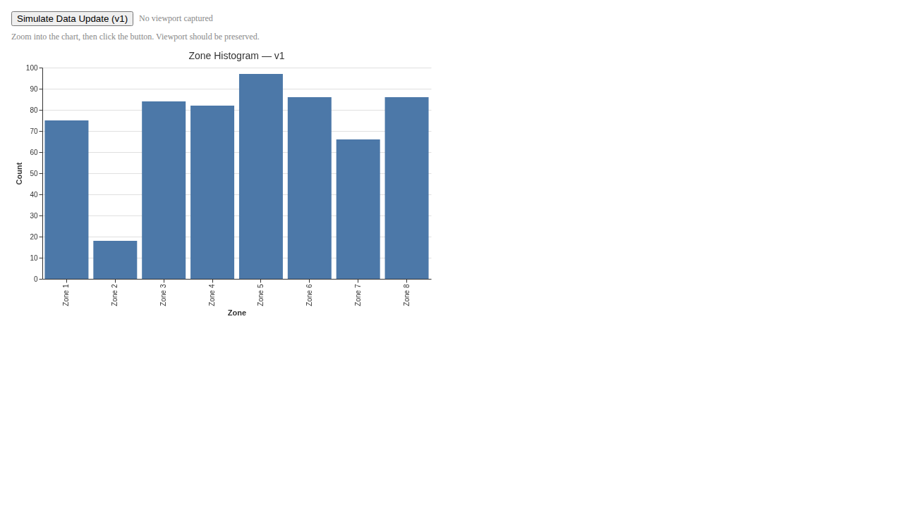
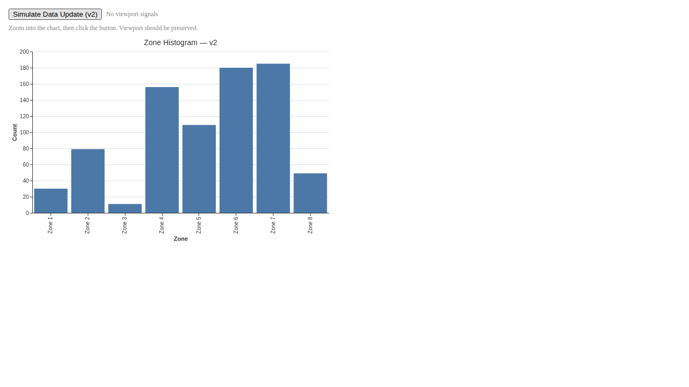
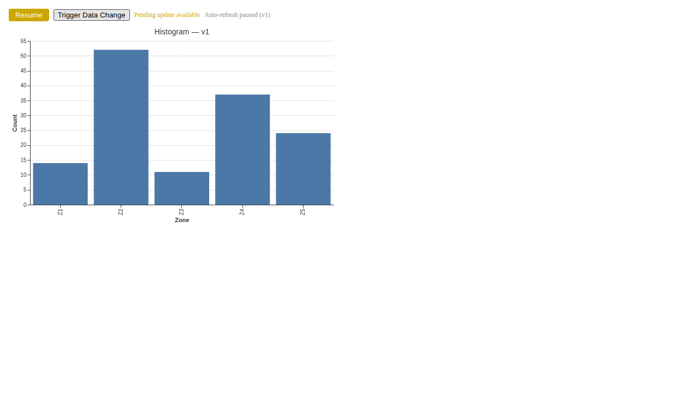
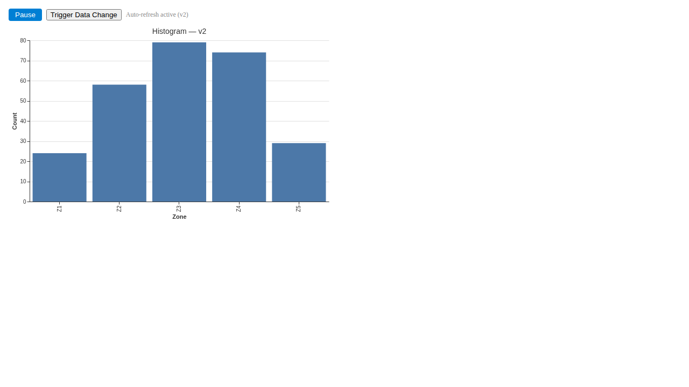

## What We Built

An analyst runs a zone histogram, zooms into a cluster of interest, adjusts a parameter, and re-runs the tool. Previously that meant closing the chart, re-opening it, and navigating back to the same zoom region. Now the chart updates in place, and the analyst's zoom level, pan position, and any active brush selections survive the refresh.

The `AutoRefreshController` sits in `services/session-state` and subscribes to `ResultIdRegistry` change events. When a tool re-run produces new output for a known result ID, the controller debounces the event (300ms trailing edge, per result ID), captures viewport state from the Vega view's signal API — `x_domain`, `y_domain`, selection signals — renders the new data, then writes those signals back. The `useAutoRefresh` React hook exposes this to the component layer: registration, state, toggle, and pending-update flag. Orchestration logic stays in the service layer; the component layer gets a thin hook.

Four additional behaviours round this out. Multiple views watching the same result ID each refresh independently — pausing one has no effect on the other. Views in background tabs skip rendering entirely and flush stale data when they become visible. Rapid tool re-runs (the debounce handles five updates in a second as one render). And a per-view pause/resume toggle: when paused, incoming events are captured as a pending event but not applied; resume flushes the latest state in one render, with no intermediate versions shown.

The pause state is visible in the tab header — a blue dot when updates are waiting, a toggle button that flips between pause and resume. The controller extends the existing `ChartRenderer` component via `forwardRef` and `useImperativeHandle`, which exposed viewport capture and restore as an imperative handle rather than forcing the signal capture into render logic.

This is the capstone of Epic E04 (Results Visualization), built on the chart renderer (#085), results bottom panel (#086), and logical result ID registry (#087) delivered earlier in the epic.

## Screenshots

*The auto-refresh Storybook story in light theme. The refresh button simulates a tool re-run — clicking it produces a v2 label on the chart without resetting the view.*

*Same view after the update. The chart has re-rendered with the v2 dataset; zoom and pan state are unchanged.*

*Auto-refresh paused while a data change arrived. The blue dot indicates an update is waiting. The view has not changed.*

*After resuming. The pending event is flushed in a single render — the view jumps directly to the latest state.*

## Lessons Learned

The viewport preservation question raised in the planning post — what happens when re-run data changes substantially? — turned out to be less of a problem in practice than anticipated. The Vega signal API writes signals back without throwing when the values are out of the new data range; Vega simply clips at the boundary. That's a reasonable default for now, and the `restoreViewportSignals` utility is isolated enough that we can add range-checking later if analysts flag it.

The `forwardRef` + `useImperativeHandle` pattern for the chart renderer was the right call. Viewport signals are inherently imperative — they live in a Vega view object, not in React state — and trying to model them declaratively would have added complexity without benefit.

One thing that surprised me: the debounce-per-result-ID requirement looked simple but needed care. A single shared debounce timer would have let a burst on one result ID delay an unrelated result's refresh. Keeping a `Map<resultId, Timer>` in the controller solved it cleanly.

The 49 unit tests (20 controller, 9 viewport, 10 hook, 10 regression) and 6 E2E tests across three theme variants all pass. The full existing suite of 61 E2E tests continues to pass without change.

## What's Next

E04 is complete. The next planned work is the custom editor provider (#088), which will give result views a second host alongside the bottom panel — the same auto-refresh wiring will apply there without changes to the controller.

→ [See the spec](../spec.md)
→ [See the contracts](../contracts/auto-refresh-controller.ts)
