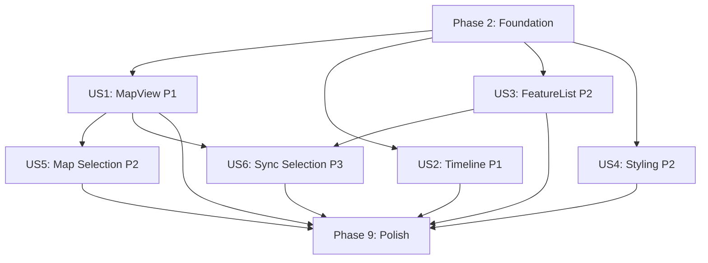

# Tasks: Shared React Component Library

**Input**: Design documents from `/specs/001-shared-react-components/`
**Prerequisites**: plan.md (required), spec.md (required for user stories)

**Tests**: Unit tests included via Vitest + Testing Library as specified in plan.md. Storybook stories serve as visual tests.

**Organization**: Tasks are grouped by user story to enable independent implementation and testing of each story.

---

## Evidence Requirements

> **Purpose**: Capture artifacts that demonstrate the feature works as expected. These are used in PR descriptions, documentation, and future blog posts.

**Evidence Directory**: `specs/001-shared-react-components/evidence/`
**Media Directory**: `specs/001-shared-react-components/media/`

### Planned Artifacts

| Artifact | Description | Captured When |
|----------|-------------|---------------|
| test-summary.md | Vitest results with coverage | After all tests pass |
| usage-example.md | Code snippet showing 5-line map display (SC-001) | After MapView works |
| storybook-screenshots/ | Screenshots of key component states | After Storybook complete |
| bundle-size.md | Gzipped bundle size report (<200KB target) | After build complete |

### Media Content

| Artifact | Description | Created When |
|----------|-------------|--------------|
| media/planning-post.md | Blog post announcing the feature | During /speckit.plan (already exists) |
| media/linkedin-planning.md | LinkedIn summary for planning | During /speckit.plan (already exists) |
| media/shipped-post.md | Blog post celebrating completion | During Polish phase |
| media/linkedin-shipped.md | LinkedIn summary for shipped | During Polish phase |

### PR Creation

| Action | Description | Created When |
|--------|-------------|--------------|
| Feature PR | PR in debrief-future with evidence | Final task in Polish phase |
| Blog PR | PR in debrief.github.io with post | Triggered by /speckit.pr |

---

## Phase 1: Setup (Shared Infrastructure)

**Purpose**: Project initialization and pnpm workspace configuration

- [x] T001 Create package directory structure `shared/components/`
- [x] T002 Initialize package.json with pnpm workspace config `shared/components/package.json`
- [x] T003 [P] Configure TypeScript with strict mode `shared/components/tsconfig.json`
- [x] T004 [P] Configure Vite for library build `shared/components/vite.config.ts`
- [x] T005 [P] Configure Vitest for testing `shared/components/vitest.config.ts`
- [x] T006 [P] Create test setup file with jsdom `shared/components/tests/setup.ts`
- [x] T007 Setup Storybook configuration `shared/components/.storybook/main.ts`
- [x] T008 [P] Configure Storybook preview with decorators `shared/components/.storybook/preview.ts`
- [x] T009 [P] Configure Storybook manager UI `shared/components/.storybook/manager.ts`
- [x] T010 Create main library entry point `shared/components/src/index.ts`

**Checkpoint**: Project scaffolding complete - foundation can begin

---

## Phase 2: Foundational (Blocking Prerequisites)

**Purpose**: Core infrastructure that MUST be complete before ANY user story can be implemented

**CRITICAL**: No user story work can begin until this phase is complete

### Shared Types & Utilities

- [x] T011 Re-export types from @debrief/schemas and add convenience unions `shared/components/src/utils/types.ts`
- [x] T012 [P] Implement calculateBounds utility `shared/components/src/utils/bounds.ts`
- [x] T013 [P] Implement calculateTimeExtent utility `shared/components/src/utils/time.ts`
- [x] T014 [P] Implement getFeatureLabel and getFeatureIcon utilities `shared/components/src/utils/labels.ts`
- [x] T015 [test] Write utility unit tests `shared/components/src/utils/__tests__/utils.test.ts`

### Theme Infrastructure

- [x] T016 Define CSS custom property tokens `shared/components/src/styles/tokens.css`
- [x] T017 Create ThemeContext with TypeScript definitions `shared/components/src/ThemeProvider/ThemeContext.ts`
- [x] T018 Define default theme values `shared/components/src/ThemeProvider/defaultTheme.ts`
- [x] T019 Implement ThemeProvider component `shared/components/src/ThemeProvider/ThemeProvider.tsx`
- [x] T020 Create useTheme hook `shared/components/src/hooks/useTheme.ts`
- [x] T021 [P] Create ThemeProvider index export `shared/components/src/ThemeProvider/index.ts`
- [x] T022 [test] Write ThemeProvider tests `shared/components/src/ThemeProvider/ThemeProvider.test.tsx`
- [x] T023 Create ThemeProvider Storybook stories `shared/components/src/ThemeProvider/ThemeProvider.stories.tsx`

### Selection Infrastructure

- [x] T024 Implement useSelection hook for shared state `shared/components/src/hooks/useSelection.ts`
- [x] T025 [test] Write useSelection hook tests `shared/components/src/hooks/__tests__/useSelection.test.ts`

**Checkpoint**: Foundation ready - user story implementation can now begin in parallel

---

## Phase 3: User Story 1 - Display Map with Features (Priority: P1)

**Goal**: Developers can display a map showing track features from a plot using 5 or fewer lines of code

**Independent Test**: Import MapView, pass valid GeoJSON track data, verify features render on map canvas

### Tests for User Story 1

- [x] T026 [P][test] Write MapView render tests `shared/components/src/MapView/MapView.test.tsx`
- [x] T027 [P][test] Write MapView zoom/pan interaction tests `shared/components/src/MapView/MapView.test.tsx`

### Implementation for User Story 1

- [x] T028 Create MapView component structure `shared/components/src/MapView/index.ts`
- [x] T029 Implement useMapInteraction hook `shared/components/src/MapView/hooks/useMapInteraction.ts`
- [x] T030 Implement MapView core component with Leaflet `shared/components/src/MapView/MapView.tsx`
- [x] T031 Style MapView with CSS custom properties `shared/components/src/MapView/MapView.css`
- [x] T032 Create MapView Storybook stories (Default, LargeDataset, Empty) `shared/components/src/MapView/MapView.stories.tsx`

**Checkpoint**: MapView displays features - SC-001 (5 lines of code) can be verified

---

## Phase 4: User Story 2 - Display Timeline with Temporal Features (Priority: P1)

**Goal**: Developers can display a timeline showing when tracks and events occurred

**Independent Test**: Import Timeline, pass features with temporal data, verify timeline renders with correct time spans

### Tests for User Story 2

- [x] T033 [P][test] Write Timeline render tests `shared/components/src/Timeline/Timeline.test.tsx`
- [x] T034 [P][test] Write Timeline time range adjustment tests `shared/components/src/Timeline/Timeline.test.tsx`

### Implementation for User Story 2

- [x] T035 Create Timeline component structure `shared/components/src/Timeline/index.ts`
- [x] T036 Implement TimeAxis Canvas renderer `shared/components/src/Timeline/canvas/TimeAxis.ts`
- [x] T037 Implement FeatureBars Canvas renderer `shared/components/src/Timeline/canvas/FeatureBars.ts`
- [x] T038 Implement Timeline core component with Canvas `shared/components/src/Timeline/Timeline.tsx`
- [x] T039 Style Timeline with CSS custom properties `shared/components/src/Timeline/Timeline.css`
- [x] T040 Create Timeline Storybook stories (Default, Overlapping, TimeRange) `shared/components/src/Timeline/Timeline.stories.tsx`

**Checkpoint**: Timeline displays temporal features - acceptance scenarios verified

---

## Phase 5: User Story 3 - Display Feature List (Priority: P2)

**Goal**: Developers can show a scrollable list of all features with names, types, and key attributes

**Independent Test**: Import FeatureList, pass FeatureCollection with various types, verify list renders with correct labels

### Tests for User Story 3

- [x] T041 [P][test] Write FeatureList render tests `shared/components/src/FeatureList/FeatureList.test.tsx`
- [x] T042 [P][test] Write FeatureList virtualization performance tests `shared/components/src/FeatureList/FeatureList.test.tsx`

### Implementation for User Story 3

- [x] T043 Create FeatureList component structure `shared/components/src/FeatureList/index.ts`
- [x] T044 Implement FeatureRow component `shared/components/src/FeatureList/FeatureRow.tsx`
- [x] T045 Implement FeatureList with @tanstack/react-virtual `shared/components/src/FeatureList/FeatureList.tsx`
- [x] T046 Style FeatureList with CSS custom properties `shared/components/src/FeatureList/FeatureList.css`
- [x] T047 Create FeatureList Storybook stories (Default, ManyFeatures, Empty) `shared/components/src/FeatureList/FeatureList.stories.tsx`

**Checkpoint**: FeatureList displays features with virtualization - performance maintained with 1000+ items

---

## Phase 6: User Story 4 - Consistent Styling Across Apps (Priority: P2)

**Goal**: Components automatically apply Debrief design system in both Electron and VS Code contexts

**Independent Test**: Render same component in different contexts, verify visual appearance matches

### Tests for User Story 4

- [ ] T048 [test] Write theme inheritance tests `shared/components/src/ThemeProvider/__tests__/theme-inheritance.test.tsx`

### Implementation for User Story 4

- [ ] T049 Create VS Code theme adapter `shared/components/src/ThemeProvider/vsCodeAdapter.ts`
- [ ] T050 Create Electron theme adapter `shared/components/src/ThemeProvider/electronAdapter.ts`
- [ ] T051 Add theme context to all components (verify usage) `shared/components/src/`
- [ ] T052 Create cross-context Storybook stories `shared/components/.storybook/decorators/ContextDecorator.tsx`
- [ ] T053 Add theme switcher to Storybook `shared/components/.storybook/preview.ts`

**Checkpoint**: Theme tokens propagate correctly - components look consistent across contexts

---

## Phase 7: User Story 5 - Select Features on Map (Priority: P2)

**Goal**: Users can select features by clicking on the map with visual feedback

**Independent Test**: Render MapView with selection enabled, simulate click, verify callback fires with correct ID

### Tests for User Story 5

- [ ] T054 [P][test] Write MapView click selection tests `shared/components/src/MapView/__tests__/selection.test.tsx`
- [ ] T055 [P][test] Write MapView multi-select tests `shared/components/src/MapView/__tests__/selection.test.tsx`

### Implementation for User Story 5

- [ ] T056 Add selection handlers to MapView `shared/components/src/MapView/MapView.tsx`
- [ ] T057 Implement feature highlight styling on selection `shared/components/src/MapView/MapView.css`
- [ ] T058 Add selection clear on empty space click `shared/components/src/MapView/MapView.tsx`
- [ ] T059 Create MapView selection Storybook stories `shared/components/src/MapView/MapView.stories.tsx`

**Checkpoint**: Map selection works - click highlights feature and fires callback

---

## Phase 8: User Story 6 - Synchronize Selection Across Components (Priority: P3)

**Goal**: Selection in one component highlights corresponding feature in other components

**Independent Test**: Render MapView and FeatureList with shared selection state, select in one, verify other highlights

### Tests for User Story 6

- [ ] T060 [test] Write cross-component selection sync tests `shared/components/src/__tests__/selection-sync.test.tsx`

### Implementation for User Story 6

- [ ] T061 Add selectedIds prop to FeatureList `shared/components/src/FeatureList/FeatureList.tsx`
- [ ] T062 Add selectedIds prop to Timeline `shared/components/src/Timeline/Timeline.tsx`
- [ ] T063 Implement scroll-to-selected in FeatureList `shared/components/src/FeatureList/FeatureList.tsx`
- [ ] T064 Implement center-on-selected in MapView `shared/components/src/MapView/MapView.tsx`
- [ ] T065 Create synchronized selection Storybook story `shared/components/.storybook/stories/SynchronizedSelection.stories.tsx`

**Checkpoint**: Selection syncs across all components - full integration verified

---

## Phase 9: Polish & Cross-Cutting Concerns

**Purpose**: Performance verification, documentation, and evidence collection

### Build & Bundle Verification

- [ ] T066 Configure tree-shakeable exports in package.json `shared/components/package.json`
- [ ] T067 Run production build and verify bundle size <200KB `shared/components/`
- [ ] T068 Verify 60fps performance in performance stories `shared/components/`

### Storybook Deployment

- [ ] T069 Configure GitHub Pages deployment for Storybook `shared/components/.storybook/`
- [ ] T070 Add accessibility addon verification `shared/components/.storybook/`

### Evidence Collection

- [ ] T071 Create evidence directory `specs/001-shared-react-components/evidence/`
- [ ] T072 Capture test summary with Vitest results `specs/001-shared-react-components/evidence/test-summary.md`
- [ ] T073 Create usage example demonstrating 5-line map display `specs/001-shared-react-components/evidence/usage-example.md`
- [ ] T074 [P] Capture MapView Storybook screenshot `specs/001-shared-react-components/evidence/storybook-screenshots/mapview.png`
- [ ] T075 [P] Capture Timeline Storybook screenshot `specs/001-shared-react-components/evidence/storybook-screenshots/timeline.png`
- [ ] T076 [P] Capture FeatureList Storybook screenshot `specs/001-shared-react-components/evidence/storybook-screenshots/featurelist.png`
- [ ] T077 Document bundle size analysis `specs/001-shared-react-components/evidence/bundle-size.md`

### Media Content

- [ ] T078 Create shipped blog post `specs/001-shared-react-components/media/shipped-post.md`
- [ ] T079 [P] Create LinkedIn shipped summary `specs/001-shared-react-components/media/linkedin-shipped.md`

### PR Creation

- [ ] T080 Create PR and publish blog: run /speckit.pr

**Task T080 must run last. It depends on all evidence and media tasks being complete.**

---

## Dependencies & Execution Order

### Phase Dependencies

- **Setup (Phase 1)**: No dependencies - can start immediately
- **Foundational (Phase 2)**: Depends on Setup completion - BLOCKS all user stories
- **User Stories (Phase 3-8)**: All depend on Foundational phase completion
  - US1 (MapView) and US2 (Timeline) can proceed in parallel (both P1)
  - US3 (FeatureList) can start after Foundation
  - US4 (Styling) depends on ThemeProvider from Foundation
  - US5 (Map Selection) depends on US1 (MapView)
  - US6 (Sync Selection) depends on US1, US3 (MapView + FeatureList)
- **Polish (Phase 9)**: Depends on all user stories being complete

### User Story Dependencies



### Within Each User Story

- Tests written FIRST, ensure they FAIL before implementation
- Component structure before implementation
- Core component before styling
- Styling before Storybook stories
- Story complete before moving to next priority

### Parallel Opportunities

**Phase 1 (Setup):**
- T003, T004, T005, T006 can run in parallel (config files)
- T008, T009 can run in parallel (Storybook config)

**Phase 2 (Foundation):**
- T012, T013, T014 can run in parallel (utilities)
- T021, T022 can run in parallel (ThemeProvider finalization)

**Phase 3-5 (P1/P2 Stories):**
- US1 (MapView) and US2 (Timeline) can run in parallel after Foundation
- US3 (FeatureList) can start alongside US1/US2

**Phase 9 (Polish):**
- T074, T075, T076 can run in parallel (screenshots)
- T078, T079 can run in parallel (media content)

---

## Parallel Example: Foundation Phase

```bash
# Launch all utility implementations together:
Task: "Implement calculateBounds utility" shared/components/src/utils/bounds.ts
Task: "Implement calculateTimeExtent utility" shared/components/src/utils/time.ts
Task: "Implement getFeatureLabel and getFeatureIcon utilities" shared/components/src/utils/labels.ts
```

## Parallel Example: User Stories 1 & 2

```bash
# After Foundation complete, launch both P1 stories:
Task: "Implement MapView core component" shared/components/src/MapView/MapView.tsx
Task: "Implement Timeline core component" shared/components/src/Timeline/Timeline.tsx
```

---

## Implementation Strategy

### MVP First (User Stories 1 & 2 Only)

1. Complete Phase 1: Setup
2. Complete Phase 2: Foundation (CRITICAL - blocks all stories)
3. Complete Phase 3: User Story 1 - MapView (P1)
4. Complete Phase 4: User Story 2 - Timeline (P1)
5. **STOP and VALIDATE**: Test MapView + Timeline independently
6. Deploy Storybook for stakeholder review

### Incremental Delivery

1. Complete Setup + Foundation → Foundation ready
2. Add MapView (US1) → Test independently → Deploy Storybook (MVP!)
3. Add Timeline (US2) → Test independently → Deploy Storybook
4. Add FeatureList (US3) → Test independently → Deploy Storybook
5. Add Styling (US4) → Test cross-context → Deploy Storybook
6. Add Selection (US5) → Test interactions → Deploy Storybook
7. Add Sync (US6) → Test full integration → Deploy Storybook
8. Each story adds value without breaking previous stories

### Success Criteria Verification Points

| Criteria | Verification Point | Phase |
|----------|-------------------|-------|
| SC-001: 5 lines to display map | After T032 (MapView stories) | Phase 3 |
| SC-002: <500ms initial render | After T068 (performance verification) | Phase 9 |
| SC-003: <200KB gzipped | After T067 (bundle size check) | Phase 9 |
| SC-004: Visual regression tests | After T070 (Storybook deployment) | Phase 9 |
| SC-005: 100% TypeScript coverage | Continuous (strict mode enabled) | All |
| SC-006: 60fps interaction | After T068 (performance verification) | Phase 9 |

---

## Notes

- [P] tasks = different files, no dependencies
- [test] tasks = write tests first, ensure they fail
- Each user story should be independently completable and testable
- Commit after each task or logical group
- Stop at any checkpoint to validate story independently
- Storybook is central to development workflow - create stories as you build
- **Evidence is required** - capture artifacts that prove the feature works
- Run `/speckit.pr` after all tasks complete to create PR with evidence
