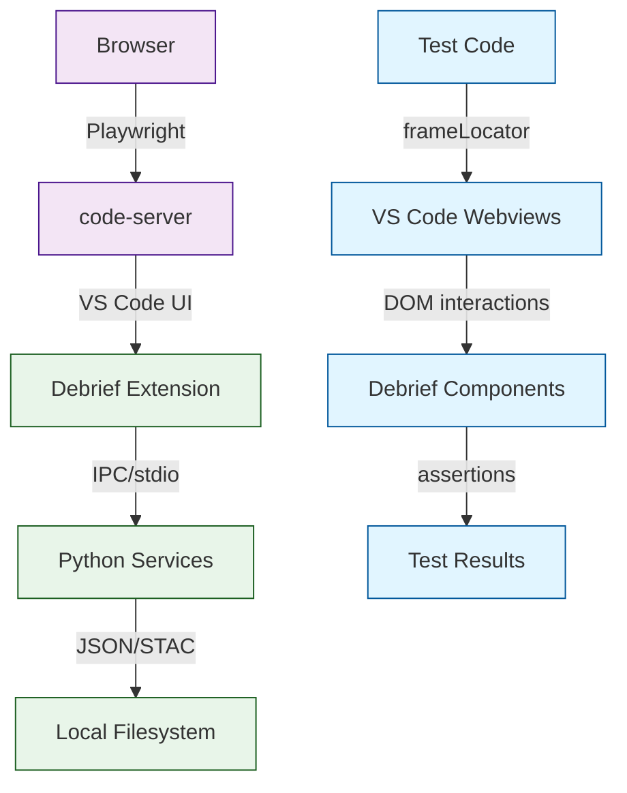

## What We Built

The Debrief VS Code extension orchestrates three Python services (io, stac, calc) into workflows that analysts depend on. Each service has comprehensive unit tests. But nothing was testing the complete user journey: open a REP file, see tracks on the map, select features, run an analysis tool, check results in the catalog. That path passes through four different layers — io parsing, STAC storage, calc analysis, and the extension's TypeScript orchestration — any one of which could fail silently in production while all unit tests pass.

We built a complete E2E test infrastructure that exercises these workflows through the real VS Code interface. code-server hosts VS Code as a web application, Playwright automates a Chromium browser, and tests interact with actual panels, webviews, command palette, and notifications. No mocks, no simulated environment.

The infrastructure consists of three test files aligned to user stories:
- **Load and Display** (P1): Open a REP file, verify tracks appear on the map
- **Analysis Tool Execution** (P2): Select features, run a tool, verify results in the catalog
- **Error Feedback** (P3): Attempt invalid operations, verify meaningful error messages

Supporting this are page object models (`CodeServerPage` for VS Code interactions, `DebriefWebview` for Debrief component interactions), Docker configuration for CI reproducibility, Playwright configuration with generous timeouts and retry logic, and a pre-configured test workspace with symlinked sample data.

## How It Works

The test architecture addresses a fundamental constraint: the VS Code extension's orchestration layer has no Python equivalent. File loading, tool selection, result persistence — these happen in TypeScript, speaking directly to Python services. The only way to test this boundary is to drive the extension through its actual UI.

The key insight is nested iframes. VS Code renders webviews inside two layers: an outer `iframe.webview.ready` container and an inner `#active-frame`. Playwright's `frameLocator()` method navigates this hierarchy at the Chrome DevTools Protocol level. Tests wait for the `.ready` class before drilling in, and assertions target Debrief-controlled DOM elements (Leaflet map, catalog tree, tool UI) whose structure we control — not VS Code's internal chrome, which changes between versions.

The test flow for file loading looks like this:

1. Test opens a REP file via VS Code's Quick Open dialog
2. Extension's file handler parses it using the io service
3. io service outputs GeoJSON features
4. Extension stores features in a STAC catalog (stac service)
5. Extension displays the STAC items on the map (React + Leaflet webview)
6. Test waits for the map to render, counts tracks, asserts count > 0

All of this happens in a real VS Code instance, with real services running locally. A breaking change anywhere in the pipeline causes at least one test to fail.

## Key Decisions

**code-server as the VS Code host.** MIT-licensed, tracks VS Code 1.108, Docker-ready. Critically, code-server's own test suite uses Playwright with nested iframe patterns — we have a reference implementation for the patterns we need. Authentication disabled for testing (`--auth none`).

**Webview access via frameLocator().** VS Code's webview architecture would be a nightmare to test if Playwright didn't have native support for nested frames. The `frameLocator()` method handles iframe traversal at the CDP level, abstracting away the nesting complexity. This is what made the architecture feasible.

**Page object models for maintainability.** Tests don't directly interact with Playwright's `locator()` API. Instead, `CodeServerPage` encapsulates all VS Code chrome interactions (open file, trigger command, read notifications), and `DebriefWebview` encapsulates all Debrief component interactions (wait for map, count tracks, select feature). Tests read like user stories. When a selector changes, only one page object needs updating.

**Docker for CI, local code-server for dev.** Developers run `code-server --auth none --port 8080` locally and execute the same Playwright tests against it. The CI pipeline builds a Docker image layering code-server, Python services, and the packaged VS Code extension, then runs the same test suite inside the container. Same test code, two environments, reproducible results.

**Three test files for three user stories.** Not splitting by technical layer (unit/integration/e2e) but by user intent. Each story is a complete workflow that a DSTL scientist would actually perform. This makes it clear what happens when a story's tests fail — not "some IO test broke", but "analysts can't load files anymore".

**Test workspace with symlinked fixtures.** Rather than duplicating sample REP files, tests reference the existing io service test fixtures via symlinks. STAC catalogs are created fresh for test isolation. This reduces maintenance burden and ensures test data matches production expectations.

## What's Next

The test infrastructure is ready. What it's waiting for is the extension itself — specs 043 (file loading) and 001 (tool execution) need to be implemented in TypeScript before these tests can pass. Once they are, the tests become the acceptance criteria: "file loading is done when these three tests pass". When a developer later modifies the io service or changes how results are persisted, they'll know immediately if they broke something in the user-visible workflow.

The infrastructure is also a foundation for other tests. Error handling (spec 003) tests can use the same page objects and webview access patterns. UI-specific workflows (cross-plot selections, timeline interactions) can extend the same patterns.

→ [See the code](https://github.com/debrief/debrief-future/tree/005-e2e-workflow-tests/tests/e2e)
→ [Review the spec](https://github.com/debrief/debrief-future/tree/005-e2e-workflow-tests/specs/005-e2e-workflow-tests)
