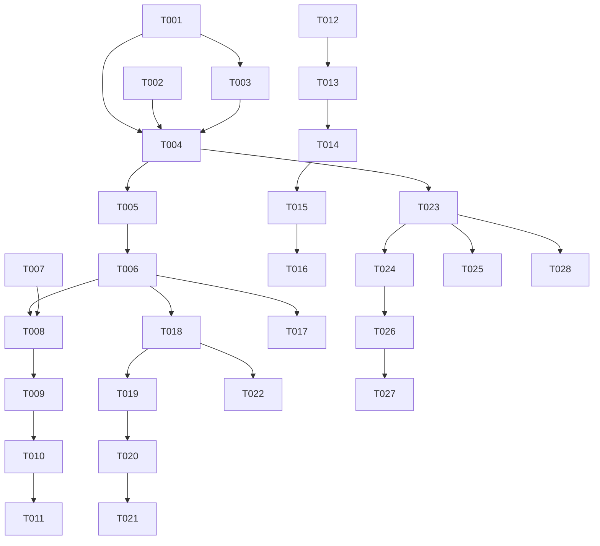

# Implementation Plan: Context-Sensitive Tool Offering in VS Code

**Feature**: 038-context-tool-offering-vscode
**Complexity**: Medium (Sonnet)
**Created**: 2026-01-27

## Executive Summary

This plan integrates the context-sensitive tool offering system (#027) into the VS Code extension. Key integration points:

- **ToolMatchService** from `@debrief/components` provides matching logic (already implemented in #027)
- **SessionManager** from #029 provides selection state via Zustand subscriptions
- **CalcService** provides MCP communication (needs enhancement for requirements-based tools)
- **ToolsTreeProvider** provides sidebar UI (needs enhancement for unavailable tools)

## Existing Infrastructure Analysis

| Component | Location | Current State | Required Changes |
|-----------|----------|---------------|------------------|
| CalcService | `apps/vscode/src/services/calcService.ts` | Basic contextType matching | Adapt to use ToolMatchService |
| ToolsTreeProvider | `apps/vscode/src/providers/toolsTreeProvider.ts` | Shows active tools only | Add unavailable toggle, explanations |
| SessionManager | `apps/vscode/src/services/sessionManager.ts` | Manages session state (#029) | Subscribe to selection changes |
| ToolMatchService | `shared/components/src/ToolMatch/` | Full matching with explanations (#027) | Import and wire to VS Code |
| Tool types | `apps/vscode/src/types/tool.ts` | contextType-based | Migrate to requirements-based |

## Implementation Phases

### Phase 1: Core Wiring (T001-T006)

Integrate ToolMatchService from #027 and wire to session-state selection.

#### T001: Add ToolMatchService Adapter

**File**: `apps/vscode/src/services/toolMatchAdapter.ts` (new)

Create adapter that bridges ToolMatchService to VS Code extension:

```typescript
import { ToolMatchService, createSelection, type MatchResult } from '@debrief/components';
import type { Tool } from '@debrief/schemas';
import type { SessionStoreApi } from '@debrief/session-state';

export class ToolMatchAdapter {
  private service: ToolMatchService | null = null;
  private cachedResults: MatchResult[] = [];

  setTools(tools: Tool[]): void;
  getMatchResults(): MatchResult[];
  getActiveTools(): Tool[];
  subscribeToSelection(session: SessionStoreApi): () => void;
}
```

**Acceptance**: Unit tests pass for selection → match result mapping.

---

#### T002: Update CalcService Tool Fetching

**File**: `apps/vscode/src/services/calcService.ts`

Update `fetchToolsFromMcp()` to return tools with `requirements` field instead of `contextType`:

```typescript
// Before (simulated tools)
{ name: 'range-bearing', contextType: 'multi-track', ... }

// After (requirements-based from #027 schema)
{
  name: 'range-bearing',
  description: '...',
  requirements: [
    { kind: 'TRACK', min: 2, max: 2 }
  ]
}
```

**Acceptance**: `listTools()` returns tools matching `@debrief/schemas` Tool type.

---

#### T003: Create Selection Subscription Hook

**File**: `apps/vscode/src/services/toolMatchAdapter.ts`

Add method to subscribe to session-state selection changes:

```typescript
subscribeToSelection(session: SessionStoreApi, callback: (results: MatchResult[]) => void): () => void {
  const unsubscribe = session.subscribe(
    (state) => state.features.selection,
    (selectedIds) => {
      const selection = this.buildSelectionFromIds(selectedIds);
      this.cachedResults = this.service.getMatchResults(selection);
      callback(this.cachedResults);
    }
  );
  return unsubscribe;
}
```

**Acceptance**: Callback fires within 50ms of selection change with correct match results.

---

#### T004: Wire SessionManager to ToolMatchAdapter

**File**: `apps/vscode/src/extension.ts`

On extension activation:
1. Create ToolMatchAdapter singleton
2. Fetch tools via CalcService on startup
3. Subscribe to SessionManager.onActiveSessionChange
4. Re-subscribe to selection when active session changes

**Acceptance**: Tool matching updates when selection changes across documents.

---

#### T005: Add Selection-to-Kinds Converter

**File**: `apps/vscode/src/services/toolMatchAdapter.ts`

Convert selected feature IDs to kind counts:

```typescript
private buildSelectionFromIds(selectedIds: Set<string>): Selection {
  // Get features from session store
  // Count kinds from selected features
  const kindCounts: Record<string, number> = {};
  for (const id of selectedIds) {
    const feature = this.getFeatureById(id);
    const kind = feature?.properties?.['debrief:kind'] ?? 'UNKNOWN';
    kindCounts[kind] = (kindCounts[kind] ?? 0) + 1;
  }
  return createSelectionFromCounts(kindCounts);
}
```

**Acceptance**: Selection of 2 tracks produces `Map { 'TRACK' => 2 }`.

---

#### T006: Add Tool Inventory Event Emitter

**File**: `apps/vscode/src/services/toolMatchAdapter.ts`

Add event for tool inventory changes (for dynamic command registration):

```typescript
readonly onToolsChanged = new vscode.EventEmitter<Tool[]>();

async refreshTools(): Promise<void> {
  const tools = await this.calcService.listTools();
  this.service = new ToolMatchService(tools);
  this.onToolsChanged.fire(tools);
}
```

**Acceptance**: Event fires after tool discovery with valid tool list.

---

### Phase 2: Context Menu Integration (T007-T011)

Add analysis tools to map panel context menu.

#### T007: Register Context Menu Contribution

**File**: `apps/vscode/package.json`

Add menu contribution:

```json
{
  "contributes": {
    "menus": {
      "webview/context": [
        {
          "submenu": "debrief.analysisTools",
          "group": "analysis",
          "when": "webviewId == 'debrief.mapPanel'"
        }
      ]
    },
    "submenus": [
      {
        "id": "debrief.analysisTools",
        "label": "Analysis Tools"
      }
    ]
  }
}
```

**Acceptance**: Right-click in map panel shows "Analysis Tools" submenu.

---

#### T008: Create Dynamic Menu Provider

**File**: `apps/vscode/src/providers/analysisToolsMenuProvider.ts` (new)

Register commands dynamically based on active tools:

```typescript
export class AnalysisToolsMenuProvider {
  private registeredCommands: vscode.Disposable[] = [];

  updateMenuItems(activeTools: Tool[]): void {
    // Dispose old commands
    // Register new commands for each active tool
    // Add to webview/context menu
  }
}
```

**Acceptance**: Menu shows only active tools for current selection.

---

#### T009: Wire Menu to Match Results

**File**: `apps/vscode/src/providers/analysisToolsMenuProvider.ts`

Subscribe to ToolMatchAdapter and update menu when match results change:

```typescript
constructor(toolMatchAdapter: ToolMatchAdapter) {
  toolMatchAdapter.onMatchResultsChanged((results) => {
    const activeTools = results.filter(r => r.isActive).map(r => r.tool);
    this.updateMenuItems(activeTools);
  });
}
```

**Acceptance**: Menu updates within 100ms of selection change.

---

#### T010: Add "No Applicable Tools" Placeholder

**File**: `apps/vscode/src/providers/analysisToolsMenuProvider.ts`

When no tools match, show disabled placeholder:

```typescript
if (activeTools.length === 0) {
  this.registerDisabledItem('No applicable tools');
}
```

**Acceptance**: Empty selection shows "No applicable tools" (disabled).

---

#### T011: Wire Menu Items to Execute Command

**File**: `apps/vscode/src/providers/analysisToolsMenuProvider.ts`

Each menu item executes `debrief.executeTool` with tool name:

```typescript
vscode.commands.registerCommand(`debrief.tool.${tool.name}`, () => {
  vscode.commands.executeCommand('debrief.executeTool', { toolName: tool.name });
});
```

**Acceptance**: Clicking menu item executes tool with current selection.

---

### Phase 3: Sidebar Panel Enhancement (T012-T017)

Enhance ToolsTreeProvider with unavailable tools and explanations.

#### T012: Add ShowUnavailable Toggle State

**File**: `apps/vscode/src/providers/toolsTreeProvider.ts`

Add state for toggle:

```typescript
private showUnavailable: boolean = false;

setShowUnavailable(show: boolean): void {
  this.showUnavailable = show;
  this.refresh();
}

getShowUnavailable(): boolean {
  return this.showUnavailable;
}
```

**Acceptance**: Toggle state persists and triggers refresh.

---

#### T013: Update getChildren for Unavailable Tools

**File**: `apps/vscode/src/providers/toolsTreeProvider.ts`

Return both active and inactive tools when toggle enabled:

```typescript
async getChildren(): Promise<ToolTreeItem[]> {
  const results = this.toolMatchAdapter.getMatchResults();
  const items: ToolTreeItem[] = [];

  // Active tools section
  const active = results.filter(r => r.isActive);
  if (active.length > 0) {
    items.push(new SectionHeader('AVAILABLE', active.length));
    items.push(...active.map(r => new ToolTreeItem(r.tool, true)));
  }

  // Inactive tools section (if toggle enabled)
  if (this.showUnavailable) {
    const inactive = results.filter(r => !r.isActive);
    if (inactive.length > 0) {
      items.push(new SectionHeader('UNAVAILABLE', inactive.length));
      items.push(...inactive.map(r => new ToolTreeItem(r.tool, false, r.explanation)));
    }
  }

  return items;
}
```

**Acceptance**: Toggle shows/hides inactive tools with explanations.

---

#### T014: Add Explanation Tooltip to Inactive Tools

**File**: `apps/vscode/src/providers/toolsTreeProvider.ts`

Show explanation in tooltip:

```typescript
class ToolTreeItem extends vscode.TreeItem {
  constructor(tool: Tool, isActive: boolean, explanation?: string) {
    super(tool.name);
    this.description = isActive ? '' : explanation;
    this.tooltip = isActive ? tool.description : `${tool.description}\n\n⚠ ${explanation}`;
    this.contextValue = isActive ? 'tool-active' : 'tool-inactive';
  }
}
```

**Acceptance**: Hovering inactive tool shows explanation tooltip.

---

#### T015: Register Toggle Command

**File**: `apps/vscode/src/commands/index.ts`

Register command to toggle unavailable tools:

```typescript
vscode.commands.registerCommand('debrief.toggleUnavailableTools', () => {
  const current = toolsTreeProvider.getShowUnavailable();
  toolsTreeProvider.setShowUnavailable(!current);
  vscode.commands.executeCommand('setContext', 'debrief.showUnavailableTools', !current);
});
```

**Acceptance**: Command toggles view state.

---

#### T016: Add Toggle Button to View Title

**File**: `apps/vscode/package.json`

Add view title action:

```json
{
  "view/title": [
    {
      "command": "debrief.toggleUnavailableTools",
      "when": "view == debrief.tools",
      "group": "navigation"
    }
  ]
}
```

**Acceptance**: Toggle button appears in Tools panel title bar.

---

#### T017: Wire Sidebar to ToolMatchAdapter

**File**: `apps/vscode/src/providers/toolsTreeProvider.ts`

Replace current matching logic with ToolMatchAdapter:

```typescript
constructor(toolMatchAdapter: ToolMatchAdapter) {
  this.toolMatchAdapter = toolMatchAdapter;

  toolMatchAdapter.onMatchResultsChanged(() => {
    this.refresh();
  });
}
```

**Acceptance**: Sidebar updates when selection changes.

---

### Phase 4: Command Palette Integration (T018-T022)

Add tools to command palette with dynamic when clauses.

#### T018: Register Dynamic Tool Commands

**File**: `apps/vscode/src/commands/toolCommands.ts` (new)

Register commands for each tool after discovery:

```typescript
export function registerToolCommands(tools: Tool[]): vscode.Disposable[] {
  return tools.map(tool =>
    vscode.commands.registerCommand(`debrief.tool.${tool.name}`, () => {
      vscode.commands.executeCommand('debrief.executeTool', { toolName: tool.name });
    })
  );
}
```

**Acceptance**: Commands registered for all discovered tools.

---

#### T019: Set When Clause Context per Tool

**File**: `apps/vscode/src/commands/toolCommands.ts`

Update context when match results change:

```typescript
function updateToolContexts(results: MatchResult[]): void {
  for (const result of results) {
    vscode.commands.executeCommand(
      'setContext',
      `debrief.tool.${result.tool.name}.active`,
      result.isActive
    );
  }
}
```

**Acceptance**: Context values reflect current match state.

---

#### T020: Add When Clauses to Package.json

**File**: `apps/vscode/package.json`

Note: Since tools are discovered dynamically, we can't pre-define when clauses in package.json. Instead, use a general condition:

```json
{
  "commands": [
    {
      "command": "debrief.executeTool",
      "title": "Debrief: Execute Analysis Tool",
      "enablement": "debrief.hasActiveTools"
    }
  ]
}
```

**Acceptance**: Command palette shows tools when selection has matches.

---

#### T021: Create hasActiveTools Context

**File**: `apps/vscode/src/services/toolMatchAdapter.ts`

Update context when any tools are active:

```typescript
private updateActiveToolsContext(results: MatchResult[]): void {
  const hasActive = results.some(r => r.isActive);
  vscode.commands.executeCommand('setContext', 'debrief.hasActiveTools', hasActive);
}
```

**Acceptance**: `debrief.hasActiveTools` reflects current match state.

---

#### T022: Clean Up Commands on Tool Refresh

**File**: `apps/vscode/src/commands/toolCommands.ts`

Dispose and re-register commands when tool inventory changes:

```typescript
let currentCommands: vscode.Disposable[] = [];

export function refreshToolCommands(tools: Tool[]): void {
  // Dispose existing
  currentCommands.forEach(d => d.dispose());
  // Register new
  currentCommands = registerToolCommands(tools);
}
```

**Acceptance**: No command leaks on tool refresh.

---

### Phase 5: Execution & Provenance (T023-T028)

Enhance tool execution with provenance tracking.

#### T023: Update executeTool Command

**File**: `apps/vscode/src/commands/executeTool.ts`

Get selection from session state instead of old selection model:

```typescript
async function executeTool(args: { toolName: string }): Promise<void> {
  const session = sessionManager.getActiveSession();
  if (!session) return;

  const state = session.getState();
  const selectedIds = Array.from(state.features.selection);

  // Execute via CalcService
  const result = await calcService.executeTool({
    toolName: args.toolName,
    featureIds: selectedIds,
  });
}
```

**Acceptance**: Tool executes with correct selection from session state.

---

#### T024: Add Provenance to Result Features

**File**: `apps/vscode/src/services/calcService.ts`

Attach provenance metadata to result features:

```typescript
interface Provenance {
  'debrief:provenance': {
    toolName: string;
    toolVersion: string;
    timestamp: string;
    sourceFeatureIds: string[];
  };
}

private attachProvenance(
  features: FeatureCollection,
  toolName: string,
  sourceIds: string[]
): FeatureCollection {
  return {
    ...features,
    features: features.features.map(f => ({
      ...f,
      properties: {
        ...f.properties,
        'debrief:provenance': {
          toolName,
          toolVersion: '1.0.0',
          timestamp: new Date().toISOString(),
          sourceFeatureIds: sourceIds,
        },
      },
    })),
  };
}
```

**Acceptance**: All result features have `debrief:provenance` property.

---

#### T025: Show Progress During Execution

**File**: `apps/vscode/src/commands/executeTool.ts`

Use VS Code progress API:

```typescript
await vscode.window.withProgress(
  {
    location: vscode.ProgressLocation.Notification,
    title: `Running ${tool.name}...`,
    cancellable: true,
  },
  async (progress, token) => {
    token.onCancellationRequested(() => calcService.cancelExecution());
    return calcService.executeTool(request);
  }
);
```

**Acceptance**: Progress notification appears during execution.

---

#### T026: Apply Result Envelope to Session

**File**: `apps/vscode/src/commands/executeTool.ts`

Apply result operations to session state:

```typescript
function applyResultEnvelope(session: SessionStoreApi, result: ToolExecutionResult): void {
  const state = session.getState();

  if (result.envelope.add) {
    state.addFeatures(result.envelope.add);
  }
  if (result.envelope.update) {
    state.updateFeatures(result.envelope.update);
  }
  if (result.envelope.remove) {
    state.removeFeatures(result.envelope.remove);
  }
}
```

**Acceptance**: Result features appear in session state.

---

#### T027: Persist Changes via STAC

**File**: `apps/vscode/src/commands/executeTool.ts`

Save modified plot to STAC:

```typescript
async function persistChanges(session: SessionStoreApi): Promise<void> {
  const state = session.getState();
  const uri = state.document.featureCollectionUri;

  await stacService.writePlot(uri, state.getFeatureCollection());
}
```

**Acceptance**: Changes persist to STAC catalog.

---

#### T028: Handle Execution Errors

**File**: `apps/vscode/src/commands/executeTool.ts`

Show user-friendly error notifications:

```typescript
if (!result.success) {
  vscode.window.showErrorMessage(
    `Tool execution failed: ${result.error}`,
    'Show Details'
  ).then(selection => {
    if (selection === 'Show Details') {
      outputChannel.show();
    }
  });
}
```

**Acceptance**: Errors shown with option to view details.

---

## Testing Strategy

### Unit Tests

| Test File | Coverage |
|-----------|----------|
| `toolMatchAdapter.test.ts` | T001, T003, T005 |
| `toolsTreeProvider.test.ts` | T012, T013, T014 |
| `toolCommands.test.ts` | T018, T019, T022 |

### Integration Tests

| Test File | Coverage |
|-----------|----------|
| `toolIntegration.test.ts` | T004, T017, T023 |
| `contextMenu.test.ts` | T007-T011 |

### Manual Verification

1. Select features → verify correct tools appear in all surfaces
2. Toggle "Show unavailable" → verify explanations
3. Execute tool → verify provenance in result

## Dependencies



## Risk Mitigation

| Risk | Mitigation |
|------|------------|
| ToolMatchService API changes | Pin @debrief/components version |
| Session state not available (#029 incomplete) | Mock session store for testing; implement fallback |
| Context menu API limitations | Use submenu pattern already proven in VS Code |
| Command palette when clause complexity | Use single hasActiveTools context |

## Success Metrics

- Tool matching completes within 50ms (NFR-001)
- Context menu renders within 100ms (NFR-002)
- Sidebar updates within 200ms (NFR-003)
- All result features have provenance (FR-030, FR-031)
