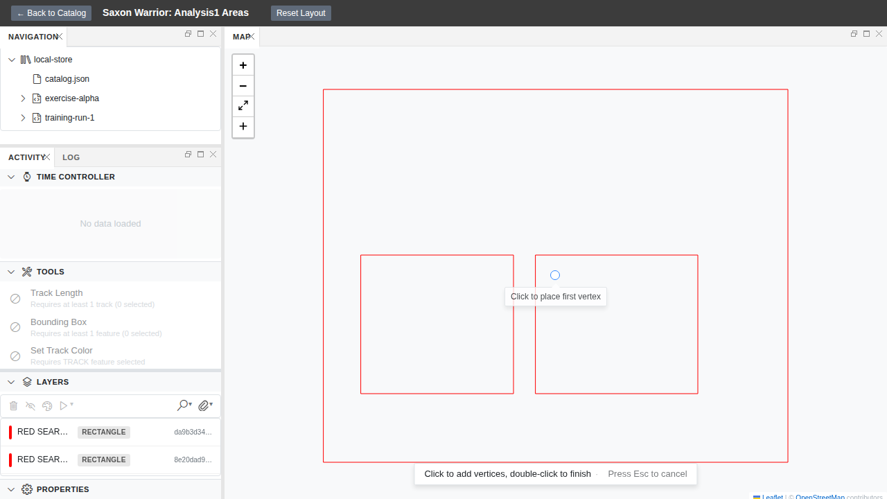
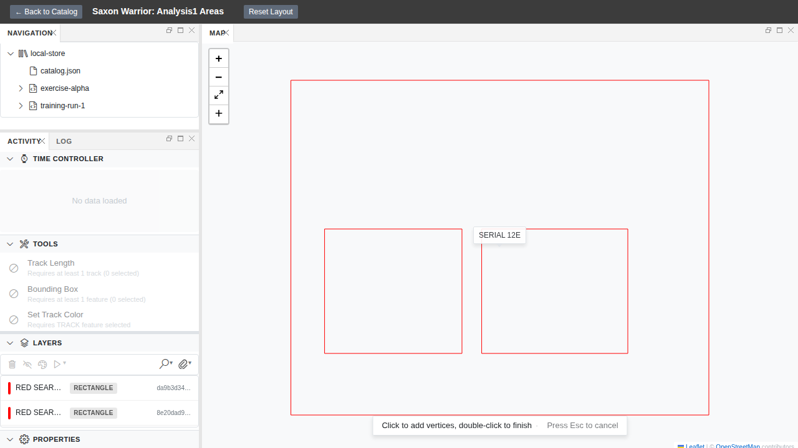

## Hook

| Before | After |
|---|---|
| Arm the polygon tool in the VS Code map. Hide and re-show the panel, or run "Developer: Reload Webviews". The toolbar silently snaps back to "no tool selected" and you have to re-click. | Arm the polygon tool. Trigger the same rebuild. The toolbar comes back armed on the same tool, with the same palette colour, and you can keep drawing without breaking stride. |

## What We're Building

When you arm a drawing tool in the VS Code map panel today, the armed state lives in a React `useState` hook inside the webview. The moment that webview rebuilds — hide/show the panel, "Developer: Reload Webviews", or any layout change that forces a remount — the local state is thrown away and the tool silently disarms. You're left looking at a toolbar that has helpfully reset itself to "no tool" without telling you.

This change moves the drawing mode and palette index out of component-local state and onto the existing `session-state` spatial slice, so they survive a webview rebuild. The architectural rule is simple: anything that's part of the user's session — the armed tool, the colour they picked, the time slider, the display mode — belongs in the store, not in a transient React hook. Drawing mode was the last hold-out, and it's the one users actually notice when it breaks.

## How It Fits

This closes findings F-3.1 and F-3.2 from the architectural-consistency review (Epic E06). Most of the wiring already exists from PR #559: the web-shell reads drawing values from the store, the VS Code host subscribes to the spatial slice and forwards changes across the message bridge, and the webview round-trips toolbar clicks back as `drawingModeChanged`. The one remaining gap is the bootstrap path — when a new webview comes up and sends `webviewReady`, the host seeds it with current time and display mode but not with current drawing mode or palette index. So the store keeps the right value across a rebuild; the webview just never asks for it on the way back in. Two `postMessage` calls in the existing `webviewReady` handler close the loop.

## Screenshots

**Before reload** — polygon tool armed, palette set to entry 1.

**After reload** — same session, same toolbar state.

The wiring also exposes drawing state to any reader, not just the map component. The web-shell console can now observe and mutate the drawing mode directly from the store.

## By the Numbers

| Metric | Count |
|--------|-------|
| Feature tests | 13/13 passing |
| Vitest (VS Code message bridge) | 5 tests |
| Vitest (session-state observability) | 4 tests |
| Playwright (web-shell store wiring) | 4 tests |
| Production changes | ~30 lines in mapPanel.ts |
| Pre-existing regressions covered | 7 drawing toolbar tests, all pass |
| Full CI gate | Ruff, pyright, ESLint, tsc, pytest, vitest — all green |
| TypeScript unit tests (monorepo-wide) | 3,664 passed |
| Python tests (monorepo-wide) | 1,887 passed |

## Lessons Learned

- **Gap-fill beats rewrite.** The architectural review uncovered this gap after PR #559 had already landed the main session-state plumbing. Rather than re-architecting the message bridge, we added two missing seed messages to an existing handler. About 30–60 lines of production change. The rule is useful: if 90% of the wiring exists and works, don't rewrite it.

- **Webview iframes can't import the host store; a host-driven mirror is the legitimate pattern.** The webview is isolated and can't directly import Zustand. Some local React state is not just acceptable but necessary. What matters is that it's host-driven — the host is the authority, the webview is a read-cache. The fix documents this explicitly in code so future maintainers don't treat the `useState` as a bug.

- **Pin contracts at the message boundary with Vitest, not Playwright on real VS Code.** Playwright against the Extension Development Host has been unreliable in CI (see issue #142). For anything that lives in the host-webview protocol, a deterministic unit test on `handleWebviewMessage('webviewReady', …)` is more honest and faster than trying to automate VS Code chrome under xvfb. The web-shell regression suite stays on Playwright, where the browser environment is well-supported.

- **Expose test-mode store handles unconditionally; don't gate behind import.meta.env.** The spec originally proposed `if (import.meta.env.DEV) window.__sessionStore = …`, but that creates two handles in development and zero in a production test. Instead, the handle is always set (only in webview context where it's safe). It's either used or harmlessly ignored.

## What's Next

The same `webviewReady` flush pattern can absorb any future host→webview seeding without re-architecting. Remaining epic items (F-3.3 result-layer lifecycle, F-3.5 tool-undo gap) have their own scopes and don't need architectural changes here.

→ See `specs/108-drawing-mode-session-state/` for the full spec, plan, and evidence trail.
