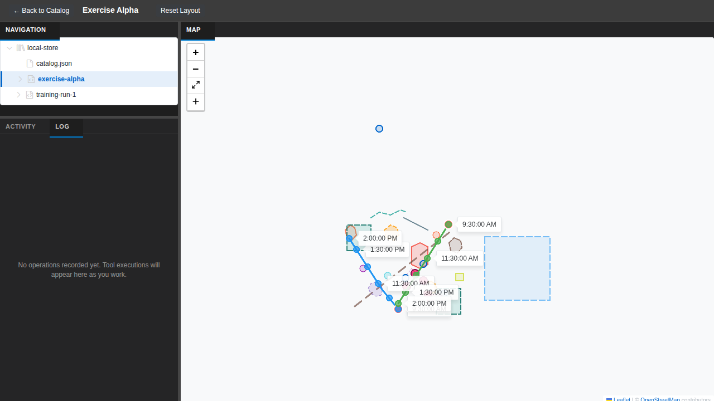
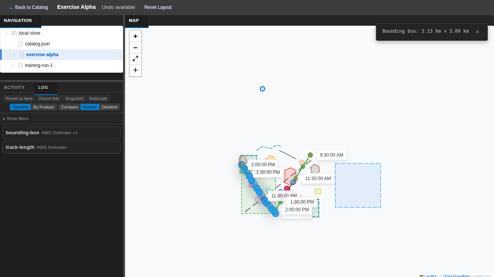
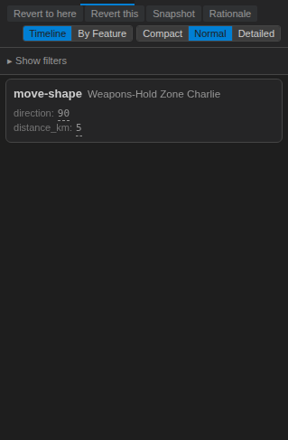
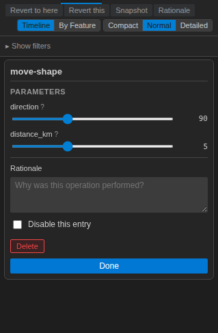
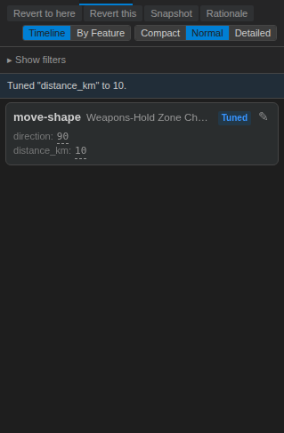
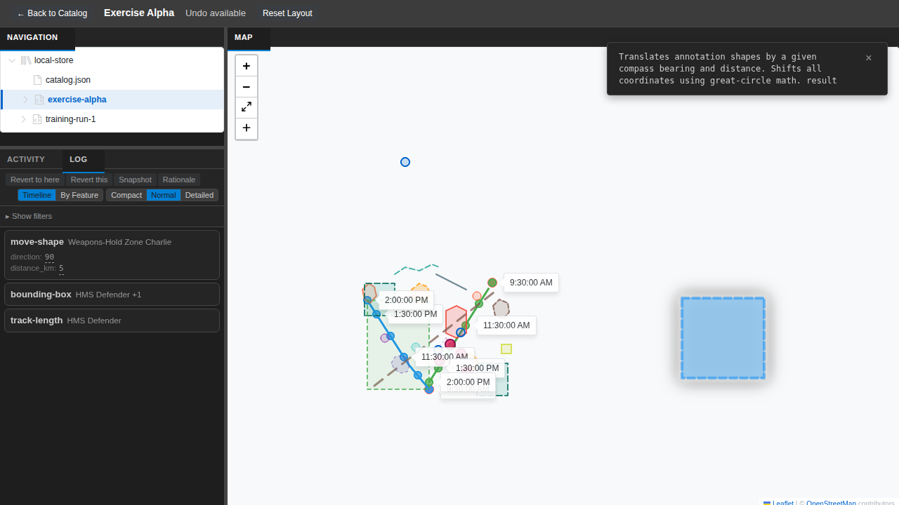

## What We Built

The Log Panel shows every operation performed on a plot — imports, property edits, analyses — as a timeline of provenance cards. When an analyst wanted to adjust a parameter from a past step, we opened a separate Tune dialog. It worked, but broke context. You left the timeline, edited in isolation, confirmed, then mentally reconnected.

We shipped a flip-card interaction instead. Each card in the Log Panel now has a pencil icon that appears on hover. Click it, the card performs a CSS 3D flip to reveal an editable back face. That back face shows type-aware parameter controls — sliders for bounded numbers, dropdowns for enums, toggles for booleans, colour pickers for named colours. Drag a slider, and the tool re-executes with the new value. The map updates immediately. No dialog, no context switch.

The edit face surfaces metadata the front can't show: timestamp, duration, file size, tool version. It has an editable rationale text field for analyst notes, a disable toggle that replays the timeline skipping that step, and a delete button behind a confirmation prompt. Click Done and the card flips back to read-only.

The controls are schema-driven. When a card flips for the first time, we request the tool's parameter schema from the extension. The extension queries the MCP tool registry and returns types, bounds, constraints. A loading skeleton shows while the schema arrives. Once fetched, it's cached for the session — flip a second card from the same tool and controls render instantly.

## Screenshots

The Log Panel starts empty — a clean slate before any analysis work.

Run a few tools and entries appear as cards in the timeline. Each card shows the tool name, affected features, and parameters at a glance.

Parameters with dashed underlines are tunable — click one to adjust. Here the move-shape tool shows `direction: 90` and `distance_km: 5` as inline tunable values.

Click the pencil icon and the card flips to reveal the edit face. Sliders for bounded numbers, a rationale text field, disable toggle, and delete button — all in place without leaving the timeline.

After tuning `distance_km` from 5 to 10, the entry shows a "Tuned" badge and a notification confirms the change.

The full layout with three log entries and the map reflecting the moved annotation shape. The rectangle has shifted according to the move-shape tool's parameters.

## Lessons Learned

**Problem: CSS 3D transforms on dynamic content.** The card needed to grow in height when flipping to the edit face (because the back face has more content — metadata, rationale field, buttons). A naive approach animates both `transform: rotateY(180deg)` and `max-height` at the same time. On some browsers, layout thrashing occurred mid-flip because the height change triggered reflow during the rotation. The fix: use `backface-visibility: hidden` on both faces, and split height and rotation into separate keyframes so the rotation completes before the height animation becomes visible. The card appears to flip and *then* grow, which actually feels more intentional.

**Problem: Schema cache invalidation.** Schemas are mutable — a tool might publish a new version with different parameters. We cache per-session to avoid repeated round-trips, but what if the analyst flips the same tool twice in the same session after we've pushed a schema update? We're accepting this as a known edge case: schemas are cached until the session ends. If an analyst needs the latest schema, they can reload the extension. This is a trade-off between responsiveness (instant second-flip) and currency (stale schema).

**Problem: Single-card edit state.** Only one card can be in edit mode at a time. This meant tracking `editingActivityId: string | null` in React state. When the timeline updates (via Zustand), we need to find the card that was being edited by matching the `activityId` and update the reference. Early versions didn't do this — if the timeline updated mid-edit (because another panel modified the provenance), the edit face would reference stale data. The fix: on every `timeline:update`, if `editingActivityId` is set, search the new timeline for a matching entry by ID and update the card's internal reference.

**Decision: Disable vs. delete.** Disable toggles an entry off during replay — the card goes grey with strikethrough, but stays in the timeline and can be re-enabled anytime. Delete is a soft-remove behind a confirmation prompt — the entry stays struck-through until the next snapshot. The original spec treated these as equivalent operations. Testing revealed analysts need different recovery semantics: disable is "try without this step" (reversible), delete is "remove this from the record" (soft but intentional). Both now trigger a cascade check that auto-disables downstream entries if their inputs are lost. The cascade includes a `visited` guard to prevent infinite loops on circular dependency graphs — a real possibility in complex timelines.

**Decision: Debounce strategy.** Slider drags and text inputs are debounced at 300ms to batch rapid adjustments into a single replay. Dropdown and toggle changes fire immediately — the analyst made a deliberate choice. If a replay is already running when a new value arrives, we cancel the current replay via `AbortController` and restart with the latest value. This prevents the map from updating with stale results and gives responsive visual feedback during fast interactions.

## What's Next

This feature unlocks inline editing of parameters without leaving the timeline view. The next milestone is integrating this with the analysis tools infrastructure (#076) to ensure tool re-execution happens cleanly across all calculation types. We also need to test the cascade logic with real-world timelines that have 50+ operations to ensure dependency resolution remains fast.

→ [See the code](https://github.com/debrief/debrief-future/tree/113-prov-card-flip)
→ [View Storybook demo](https://debrief.github.io/debrief-future/storybook/?path=/story/components-logpanel--card-flip)
