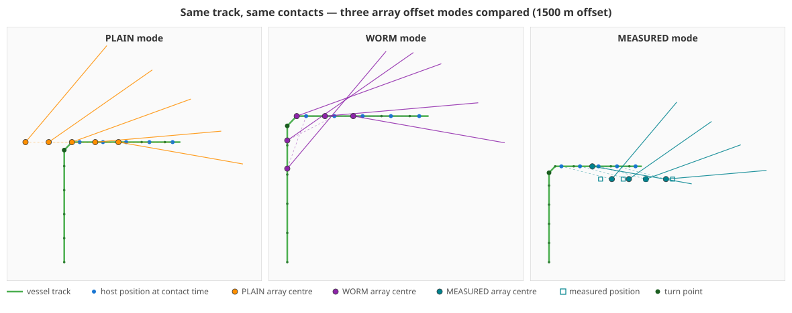
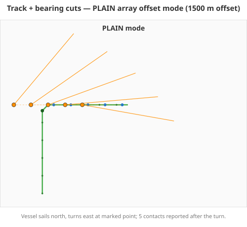
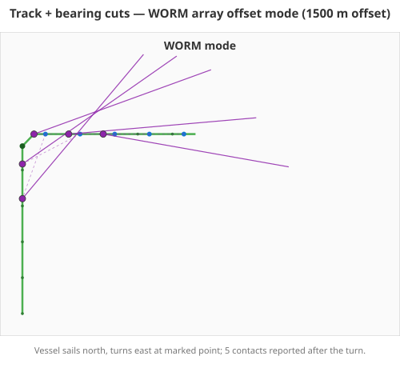
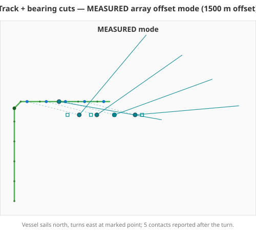

# Visual Evidence: PLAIN vs WORM vs MEASURED through a vessel turn

**Captured**: 2026-04-14 at `e2af89b` (refreshed from real algorithm output)

Every coordinate on these plots is produced by the real
`compute_array_centre` dispatcher in
`services/calc/debrief_calc/tools/sensor/array_offset.py` — the generator
script (`scripts/119-render-comparison-plots.py`) imports the module and
projects its actual outputs. No mocks, no hand-drawn illustrations.

## Scenario

- **Track**: a vessel sails straight north for 15 fixes (~3 km), executes a
  90° right turn, and continues east for another 15 fixes (~3 km).
- **Sensor**: towed array with **1500 m offset** — deliberately large
  relative to the leg lengths so the mode differences are visible at chart
  scale.
- **Contacts**: five bearing cuts reported **after** the turn (times 16, 19,
  22, 25, 28 minutes past start, bearings 40°/55°/70°/85°/100°).
- **Measured positions**: four positions offset ~300 m south of the
  eastbound leg, spanning contacts 1–4. Contact 5 falls outside the
  measured range, forcing the documented PLAIN fallback (FR-004).

## Side-by-side comparison



## Per-mode plots

| Mode | Plot |
|------|------|
| **PLAIN** — backtrack along current heading |  |
| **WORM** — walk backward along recorded track |  |
| **MEASURED** — interpolate measured positions, fall back to PLAIN out of range |  |

## Key observations from the plots

### Contact 1 (10:16, one minute after the turn)

| Mode | Origin (lon, lat) | Behaviour |
|------|-------------------|-----------|
| PLAIN | `(-5.0150, 50.0000)` | 1500 m due west of the vessel along reverse heading 270° |
| WORM  | `(-5.0000, 49.9892)` | **On the pre-turn northbound leg** — the array is still trailing through the turn |
| MEASURED | `(-4.9695, 49.9960)` | Interpolated between two measured positions just south of the track |

This is exactly the scenario WORM is designed for: immediately after a
manoeuvre the cable-towed array physically lags behind on the previous leg.
PLAIN would mis-anchor the bearing lines 1500 m west of the vessel when the
array is actually 1500 m *south*, still strung along the pre-turn track.

### Contact 5 (10:28, 13 minutes after the turn)

| Mode | Origin (lon, lat) | Behaviour |
|------|-------------------|-----------|
| PLAIN | `(-4.9790, 50.0000)` | 1500 m due west |
| WORM  | `(-4.9790, 50.0000)` | Identical to PLAIN — 1500 m back along the eastbound leg doesn't reach the turn |
| MEASURED | `(-4.9790, 50.0000)` | **Falls back to PLAIN** — contact time is outside the measured range (FR-004) |

Once the vessel has been on a straight course long enough for the array to
settle, PLAIN and WORM agree. The plot confirms this visually — at contact
5 the orange and purple origins overlap.

## Full coordinate table

| Contact | Time | Host position | PLAIN | WORM | MEASURED |
|---------|------|---------------|-------|------|----------|
| 1 | 10:16 | `(-4.9940, 50.0000)` | `(-5.0150, 50.0000)` | `(-5.0000, 49.9892)` | `(-4.9695, 49.9960)` |
| 2 | 10:19 | `(-4.9850, 50.0000)` | `(-5.0060, 50.0000)` | `(-5.0000, 49.9950)` | `(-4.9613, 49.9960)` |
| 3 | 10:22 | `(-4.9760, 50.0000)` | `(-4.9970, 50.0000)` | `(-4.9970, 50.0000)` | `(-4.9530, 49.9960)` |
| 4 | 10:25 | `(-4.9670, 50.0000)` | `(-4.9880, 50.0000)` | `(-4.9880, 50.0000)` | `(-4.9433, 49.9960)` |
| 5 | 10:28 | `(-4.9580, 50.0000)` | `(-4.9790, 50.0000)` | `(-4.9790, 50.0000)` | `(-4.9790, 50.0000)` *(fallback)* |

## Reproducing the plots

```sh
uv run python scripts/119-render-comparison-plots.py
```

Regenerates all four SVGs (`plot-plain.svg`, `plot-worm.svg`,
`plot-measured.svg`, `plot-comparison.svg`) from the current algorithm.
The script imports `debrief_calc.tools.sensor.array_offset` directly, so any
change to the dispatcher is immediately visible in the plots.

## Relationship to the golden fixture

These plots illustrate the same calculation exercised by the golden fixture
`shared/schemas/src/fixtures/valid/array-offset-golden-01.json` —
`case-4-worm-through-turn` is the tight numeric test of the post-turn WORM
branch, while these plots show the full 5-contact scenario that analysts
will see at chart scale. Both are produced by the same dispatcher and agree
with the TypeScript implementation to zero metres (see
[`golden-parity.md`](./golden-parity.md)).
