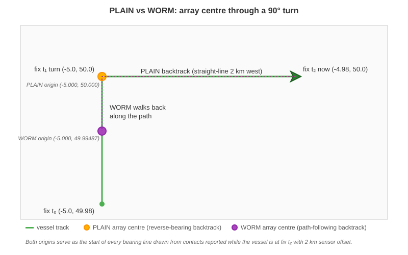

# Visual Evidence: WORM vs PLAIN through a vessel turn

**Captured**: 2026-04-14 at `3d42aa0`

This illustration accompanies the golden fixture's `case-4-worm-through-turn`
and visualises the difference between PLAIN and WORM array centres when the
host vessel has manoeuvred recently.



## Scenario

- **Track**: three fixes forming a right-angle path —
  `(-5.0, 49.98)` → `(-5.0, 50.0)` → `(-4.98, 50.0)`
- **Vessel** (at contact time): latest fix `(-4.98, 50.0)`, course **090°**
- **Sensor offset**: **2000 m** (far enough to reach back across the turn)

## Computed origins

| Mode | Origin (lon, lat) | Placement |
|------|-------------------|-----------|
| **PLAIN** | `(-5.00000, 50.00000)` | 2 km *straight-line* west (reverse bearing 270°) |
| **WORM**  | `(-5.00000, 49.99487)` | Path-length 2 km: ~1.43 km on the east-west leg + ~0.57 km on the pre-turn southbound leg |

The WORM origin ends up *south of* the turn because the array physically
follows the vessel's prior path.  The PLAIN origin ignores the turn and
assumes the array is simply 2 km behind the vessel's current heading.

## Why this matters

Every bearing line drawn for contacts reported at fix t₂ now radiates from
the mode-correct origin.  With WORM enabled, that means bearing fans are
anchored on the pre-turn leg for contacts collected before the turn had
settled — which is the correct physical model of a towed array working
through a manoeuvre.  The golden test case enforces the correct result
within **5 m** tolerance (rounding accumulates across multi-segment path
walks, so the budget is loosened from the 1 m used by single-step PLAIN
cases).

## Reproducing these values

```python
from debrief_calc.tools.sensor.array_offset import compute_array_centre

track_coords = [[-5.0, 49.98], [-5.0, 50.0], [-4.98, 50.0]]
track_positions = [
    {"time": "2026-01-01T10:00:00Z"},
    {"time": "2026-01-01T10:30:00Z"},
    {"time": "2026-01-01T11:00:00Z"},
]

plain = compute_array_centre(
    host_position=(-4.98, 50.0), course_deg=90.0, offset_metres=2000.0,
    array_centre_mode="PLAIN", measured_positions=None,
    contact_time_iso="2026-01-01T11:00:00Z",
    track_coordinates=track_coords, track_positions=track_positions,
)
# plain = (approx -5.0199, 50.0000) — 2 km due west along heading 270°

worm = compute_array_centre(
    host_position=(-4.98, 50.0), course_deg=90.0, offset_metres=2000.0,
    array_centre_mode="WORM", measured_positions=None,
    contact_time_iso="2026-01-01T11:00:00Z",
    track_coordinates=track_coords, track_positions=track_positions,
)
# worm = (-5.0, 49.994869320037054) — on the pre-turn southbound leg
```

The TypeScript equivalent lives in
`shared/components/src/MapView/array-offset.ts` and produces identical
values (see [`golden-parity.md`](./golden-parity.md)).
