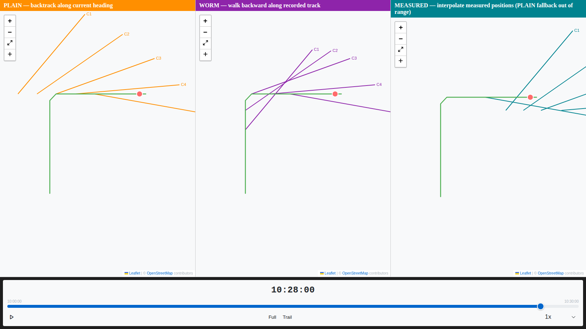
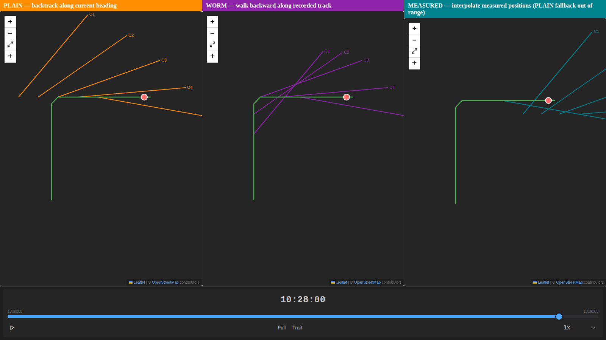
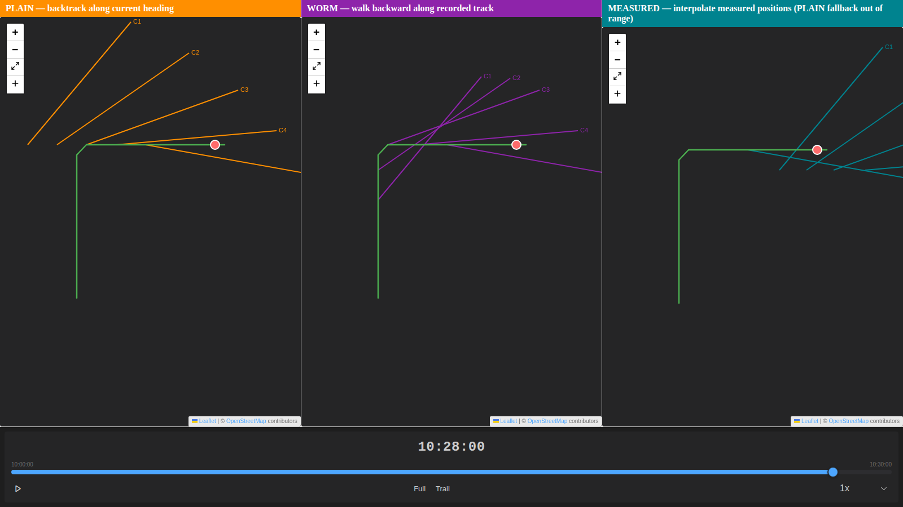
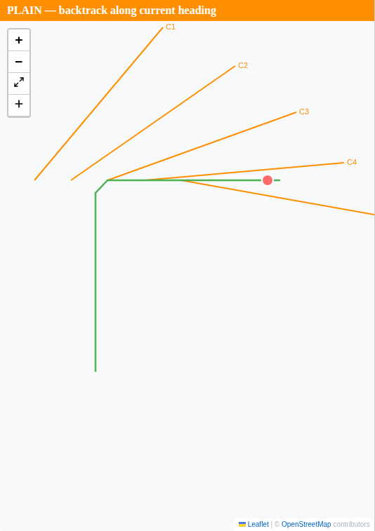
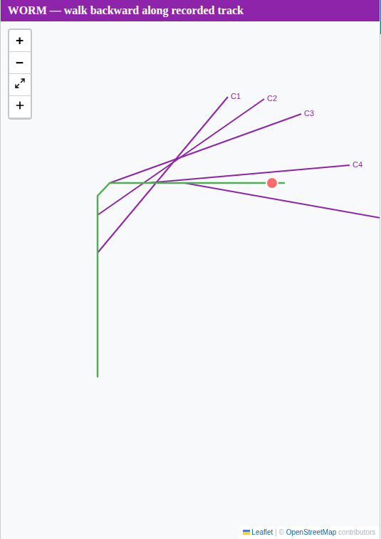
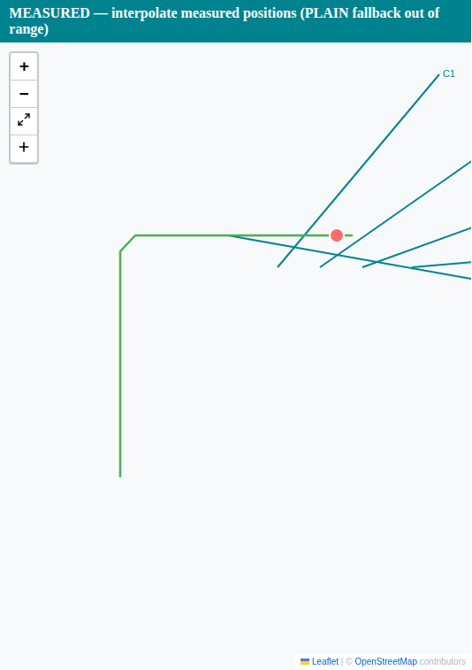

# Visual Evidence: PLAIN vs WORM vs MEASURED through a vessel turn

**Captured**: 2026-04-14 — screenshots refreshed from the real Leaflet
renderer via the Storybook story `ArrayOffsetComparison`, captured by the
Playwright spec `shared/components/e2e/ArrayOffsetComparison.spec.ts`.
Algorithmic SVG plots below are generated separately by
`scripts/119-render-comparison-plots.py`.

Two orthogonal pieces of evidence:

1. **Real renderer screenshots** (`screenshots/`) — Storybook → Playwright →
   `SensorBearingLayer` → Leaflet.  The bearing lines you see are drawn by
   the production rendering pipeline using the real
   `computeArrayCentre` outputs.
2. **Algorithm-accurate SVG plots** (`plot-*.svg`) — hand-projected from
   the same `compute_array_centre` dispatcher in Python, useful for exact
   coordinate readouts and per-panel numeric breakdowns.

## Scenario

- **Track**: a vessel sails straight north for 15 fixes (~3 km), executes a
  90° right turn, and continues east for another 15 fixes (~3 km).
- **Sensor**: towed array with **1500 m offset** — deliberately large
  relative to the leg lengths so the mode differences are visible at chart
  scale.
- **Contacts**: five bearing cuts reported **after** the turn (times 16, 19,
  22, 25, 28 minutes past start, bearings 40°/55°/70°/85°/100°).
- **Measured positions**: four positions offset ~300 m south of the
  eastbound leg, spanning contacts 1–4. Contact 5 falls outside the
  measured range, forcing the documented PLAIN fallback (FR-004).

## Side-by-side comparison (real renderer)


Each panel is a separate live Leaflet instance showing the same track
fixture (`track-feature-sensors-turn-01.json`) with the sensor's
`array_centre_mode` set to PLAIN, WORM, or MEASURED respectively.  The
coloured bearing lines are drawn by `SensorBearingLayer` — the production
rendering layer — using the origins computed by `computeArrayCentre`.

### Theme variants

| Theme | Screenshot |
|-------|------------|
| light |  |
| dark  |  |
| vscode |  |

## Per-mode real-renderer crops

| Mode | Screenshot |
|------|------------|
| **PLAIN** — every bearing line originates from a point 1.5 km west of the vessel at the contact time |  |
| **WORM** — origins distributed along the track path; contacts C1 and C2 (shortly after the turn) anchor on the pre-turn northbound leg |  |
| **MEASURED** — origins sit on the measured position time-series south of the eastbound leg; out-of-range contacts fall back to PLAIN |  |

## Algorithmic plots (with exact coordinates)

The SVG plots below complement the screenshots: hand-projected from
`compute_array_centre` so every point is labelled and every origin marker
lines up with a readable coordinate.


| Mode | Plot |
|------|------|
| PLAIN |  |
| WORM |  |
| MEASURED |  |

## Key observations from the plots

### Contact 1 (10:16, one minute after the turn)

| Mode | Origin (lon, lat) | Behaviour |
|------|-------------------|-----------|
| PLAIN | `(-5.0150, 50.0000)` | 1500 m due west of the vessel along reverse heading 270° |
| WORM  | `(-5.0000, 49.9892)` | **On the pre-turn northbound leg** — the array is still trailing through the turn |
| MEASURED | `(-4.9695, 49.9960)` | Interpolated between two measured positions just south of the track |

This is exactly the scenario WORM is designed for: immediately after a
manoeuvre the cable-towed array physically lags behind on the previous leg.
PLAIN would mis-anchor the bearing lines 1500 m west of the vessel when the
array is actually 1500 m *south*, still strung along the pre-turn track.

### Contact 5 (10:28, 13 minutes after the turn)

| Mode | Origin (lon, lat) | Behaviour |
|------|-------------------|-----------|
| PLAIN | `(-4.9790, 50.0000)` | 1500 m due west |
| WORM  | `(-4.9790, 50.0000)` | Identical to PLAIN — 1500 m back along the eastbound leg doesn't reach the turn |
| MEASURED | `(-4.9790, 50.0000)` | **Falls back to PLAIN** — contact time is outside the measured range (FR-004) |

Once the vessel has been on a straight course long enough for the array to
settle, PLAIN and WORM agree. The plot confirms this visually — at contact
5 the orange and purple origins overlap.

## Full coordinate table

| Contact | Time | Host position | PLAIN | WORM | MEASURED |
|---------|------|---------------|-------|------|----------|
| 1 | 10:16 | `(-4.9940, 50.0000)` | `(-5.0150, 50.0000)` | `(-5.0000, 49.9892)` | `(-4.9695, 49.9960)` |
| 2 | 10:19 | `(-4.9850, 50.0000)` | `(-5.0060, 50.0000)` | `(-5.0000, 49.9950)` | `(-4.9613, 49.9960)` |
| 3 | 10:22 | `(-4.9760, 50.0000)` | `(-4.9970, 50.0000)` | `(-4.9970, 50.0000)` | `(-4.9530, 49.9960)` |
| 4 | 10:25 | `(-4.9670, 50.0000)` | `(-4.9880, 50.0000)` | `(-4.9880, 50.0000)` | `(-4.9433, 49.9960)` |
| 5 | 10:28 | `(-4.9580, 50.0000)` | `(-4.9790, 50.0000)` | `(-4.9790, 50.0000)` | `(-4.9790, 50.0000)` *(fallback)* |

## Reproducing the evidence

**Real-renderer screenshots**:

```sh
# Terminal 1
cd shared/components && pnpm exec storybook dev -p 6006 --no-open

# Terminal 2 (in Claude Code sessions; omit CLAUDE_CODE=1 elsewhere and
# use the Playwright-bundled Chromium)
cd shared/components && CLAUDE_CODE=1 pnpm exec playwright test \
  --config=playwright.config.ts ArrayOffsetComparison.spec.ts
```

Outputs seven PNGs into `specs/119-array-offset-calc/evidence/screenshots/`
— one per-panel crop for each of the three modes, a full-width
comparison, and three theme variants (light/dark/vscode).

**Algorithm-accurate SVG plots**:

```sh
uv run python scripts/119-render-comparison-plots.py
```

Regenerates all four SVGs (`plot-plain.svg`, `plot-worm.svg`,
`plot-measured.svg`, `plot-comparison.svg`) from the current Python
dispatcher. The script imports `debrief_calc.tools.sensor.array_offset`
directly, so any change to the dispatcher is immediately visible in the
plots.

**Regenerating the shared fixture**:

```sh
uv run python scripts/119-generate-sensor-turn-fixture.py
```

Rewrites `shared/schemas/src/fixtures/valid/track-feature-sensors-turn-01.json`
from the canonical scenario. The fixture is consumed by both the Storybook
story (and therefore the screenshots) and the schemas test suite (which
validates it as a legitimate `TrackFeature`).

## Relationship to the golden fixture

These plots illustrate the same calculation exercised by the golden fixture
`shared/schemas/src/fixtures/valid/array-offset-golden-01.json` —
`case-4-worm-through-turn` is the tight numeric test of the post-turn WORM
branch, while these plots show the full 5-contact scenario that analysts
will see at chart scale. Both are produced by the same dispatcher and agree
with the TypeScript implementation to zero metres (see
[`golden-parity.md`](./golden-parity.md)).
