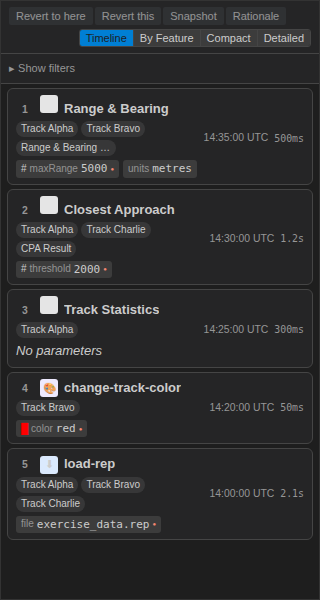
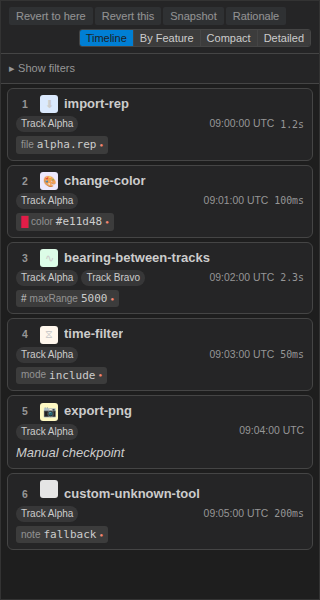
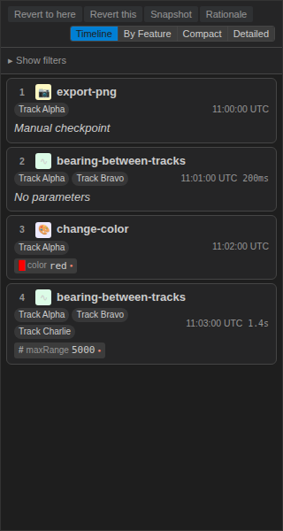
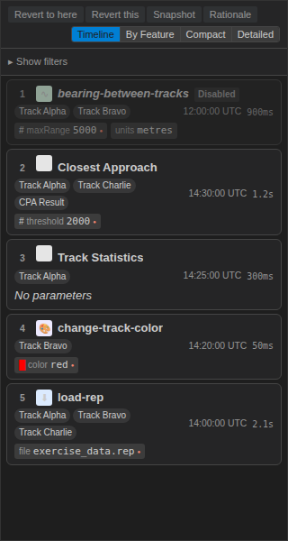

## What We Built

The Log Panel is the analyst's audit trail — every operation applied to track data, in order, with the parameters that were used. Three weeks ago it rendered raw PROV records: tool names, positional indices, ISO 8601 durations. Accurate, but slow to scan, and quietly misleading in one specific way. This PR closes the remaining 15% of the redesign and fixes that quiet problem.

The change analysts will notice first is that **every parameter value now shows**. Previously the panel only rendered parameters that had been changed from their defaults — the idea being to reduce visual noise. In practice, a parameter set like `{speed: 30 (non-default), units: metres (default)}` collapsed to a single chip, and "units: metres" became invisible. An analyst reading the log couldn't tell whether the value was defaulted or simply missing from the record. Now every parameter renders as a chip, up to a cap of five with a `+N more` overflow indicator, and parameters that departed from defaults carry a small red-dot marker. Default and non-default are both present; the difference is visible; nothing is hidden.

Card 1 in the screenshot above shows the new behaviour in one shot: the `maxRange 5000` chip carries the red-dot marker because the analyst changed it; the `units metres` chip renders without the dot because it was left at the default. Both are present on the card. That distinction was impossible to see before this PR.

The second change analysts will notice is that **timestamps are now UTC**, formatted as `HH:MM:SS UTC` regardless of the viewer's timezone. Audit logs compared across labs — Portsmouth, Halifax, Canberra — now mean the same clock. Durations ≥1s render with a single decimal (`1.0s`, `2.3s`, `30.0s`) so you can scan a column of runtimes without the visual jitter of mixed `1s` / `2.3s` formatting; sub-second values stay as `Xms`.

## Category Icons at a Glance

Each tool carries a coloured category icon drawn from a static manifest: blue for import tools, violet for style operations, green for calculations, orange for filters, yellow for snapshot exports, and a neutral grey for any tool that hasn't been classified yet. The analyst can scan an entire timeline and pick out "where did the import happen" without reading a single tool name. This is one of those "obvious once you see it" changes that the previous plain-text rendering couldn't do.

## Placeholders for the Awkward Cases

Two specific entry types used to render badly. **Snapshot entries** (`export-png`, `export-csv`) have no tool runtime — they're manual checkpoints — so showing a `200ms` duration next to them was both meaningless and misleading. Now the duration is suppressed and the parameter row reads `Manual checkpoint` in muted italic. **Parameterless entries** previously rendered an empty row with no affordance for the reader; they now carry a `No parameters` placeholder, again in muted italic.

The multi-track entry (card 4 in the screenshot above) shows the `flex-wrap` behaviour for the track badges — when an operation touches three tracks (Alpha, Bravo, Charlie) the badges wrap onto a second line inside the meta row rather than overflowing the card.

## Before and After

| | Before | After |
|---|--------|-------|
| Parameters rendered | Non-default only | All, capped at 5 + `+N more` |
| Default vs. missing | Indistinguishable | Default renders as chip; non-default carries red-dot marker |
| Empty params | Empty row | `No parameters` placeholder (muted italic) |
| Snapshot entries | Showed a tool runtime that didn't exist | `Manual checkpoint` placeholder, duration hidden |
| Timestamp format | Local time, varied by machine | `HH:MM:SS UTC`, stable across labs |
| Duration ≥1s | Mixed (`1s`, `2.3s`) | Single decimal (`1.0s`, `2.3s`, `30.0s`) |
| Tab navigation | Mouse only | ARIA tablist with ArrowLeft/Right/Home/End |
| Non-default flag | `isDefault` double-negative | `isNonDefault` — true means "show the dot" |

## The polarity flip

One of the smaller commits in this PR was also one of the more satisfying. The contract carried a boolean called `isDefault`, and the component needed the red-dot marker when that flag was `false`. Every call site read as "show the dot when `!isDefault`", which is the kind of double-negative that forces a pause every time you read it. Flipping the flag to `isNonDefault` — across the types, the component, the tests, the spec contract, and the i18n key — removes the negation. The dot renders when the flag is `true`. The tests read in plain English. The future reader doesn't have to decode anything.

This is a tiny change with no user-visible effect, but it's the kind of change that's only cheap to make once. Left in place, `isDefault` would have leaked into every new call site for as long as the component existed.

## Disabled Entries — Visible but Out of Play

A disabled entry (card 1 in the screenshot above) renders at 50% opacity with a red-tinted `Disabled` badge in the header. It stays in the audit trail, stays selectable, and its parameters stay visible. Removing it from the log would break the audit trail; hiding it would leave the analyst wondering why a subsequent calculation expected a feature that doesn't seem to exist. The reduced-opacity treatment makes the suppression obvious without losing any information.

## Accessibility

The 4-tab view-mode bar (Timeline, By Feature, Compact, Detailed) now uses a proper ARIA tablist with roving `tabIndex`. `ArrowLeft` and `ArrowRight` cycle through adjacent tabs with wrap; `Home` and `End` jump to the first or last. Only the active tab has `tabIndex={0}`, so tabbing out of the panel goes to the next focusable element rather than cycling through each tab. Each card carries `aria-selected` reflecting selection state and a step-numbered `aria-label` so a screen reader announces "Step 3, bearing-between-tracks, 09:02:00 UTC" rather than an unlabelled region.

The `@axe-core/playwright` audit across all stories in all themes is tracked as a follow-up under #209 — it's a separate concern from getting the semantics right, which this PR does.

## Storybook

Four focused stories land with this PR, and they are the stories the Playwright component E2E drives when it captures the screenshots above:

- **AllCategories** — one card per tool-category icon (import, style, calc, filter, snapshot, and the neutral-grey fallback).
- **AllChipTypes** — one parameter chip per inferred type (colour, number, boolean, range, enum) so the type-inference chain is visible at a glance.
- **EdgeCases** — the `No parameters` placeholder, the `Manual checkpoint` placeholder on a snapshot entry, a deleted-track badge, and a `+N more` overflow indicator all in one view.
- **DisabledCard** — a card rendered at reduced opacity with its disabled badge.

## By the Numbers

| | |
|---|---|
| LogPanel component + unit tests | 70 |
| New test files | 6 |
| New tests added in this PR | 46 |
| Total `@debrief/components` tests passing | 1,600 |
| Tests failing | 0 |
| i18n strings added | 4 (`chipNonDefaultTooltip`, `trackBadgeDeletedSuffix`, `noParametersLabel`, `manualCheckpointLabel`, `paramOverflowLabel`) |
| New Storybook stories | 4 |

## Known-pending

The webview E2E at `tests/e2e/test-log-panel.spec.ts` moved from `describe.skip` to `describe.fixme`, with an explicit reference to #143. `skip` silently drops a suite from CI; `fixme` surfaces it as a known-pending block so it stays visible until the underlying webview iframe selector instability lands its fix in #143. Same outcome for the run — nothing fails on merge — but the audit trail is now honest about what's not running and why.

The Playwright component E2E spec for this feature is authored and runs locally, but isn't wired into CI yet — it needs a Storybook server step in the workflow. Screenshots are produced manually for now; the paths in the evidence README describe where the CI-captured versions will land.

## Lessons Learned

**Show everything, mark the difference.** The "only render non-defaults" rule was a local optimisation that cost global clarity. Rendering all parameters and marking the non-default ones is more chips on screen but less cognitive load per card — the default values are information, not noise.

**Double-negatives cost more than they look.** `isDefault` wasn't wrong — it was just slightly harder to read than `isNonDefault`, and that slight difficulty compounded across every call site. Renaming it touched fewer files than I expected. Worth doing early.

**UTC is the only timezone that means one thing.** Any per-machine default is a coordination hazard in cross-site work. The timestamp change is five lines of code and several classes of bug removed.

## What's Next

The a11y audit under #209 is the main remaining thread — an automated `@axe-core/playwright` run against all LogPanel stories in all themes, to catch the contrast and focus-visible regressions that are easy to introduce and hard to spot by eye. The webview E2E unblocks when #143 ships. And the flip-card back face (parameter editing, from feature 113) continues to work unchanged — this PR only touched the read-only front face, so the edit workflow stayed as-is.

→ [Spec](../spec.md)
→ [Evidence](../evidence/)
→ [Planning post](./planning-post.md)
