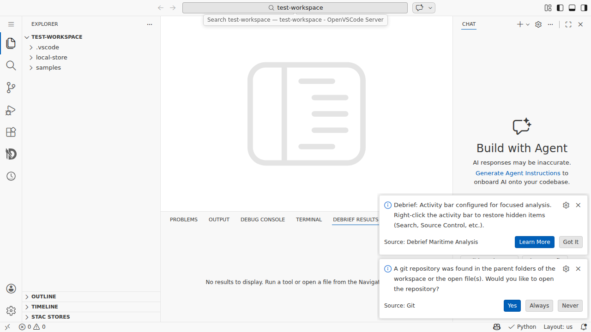
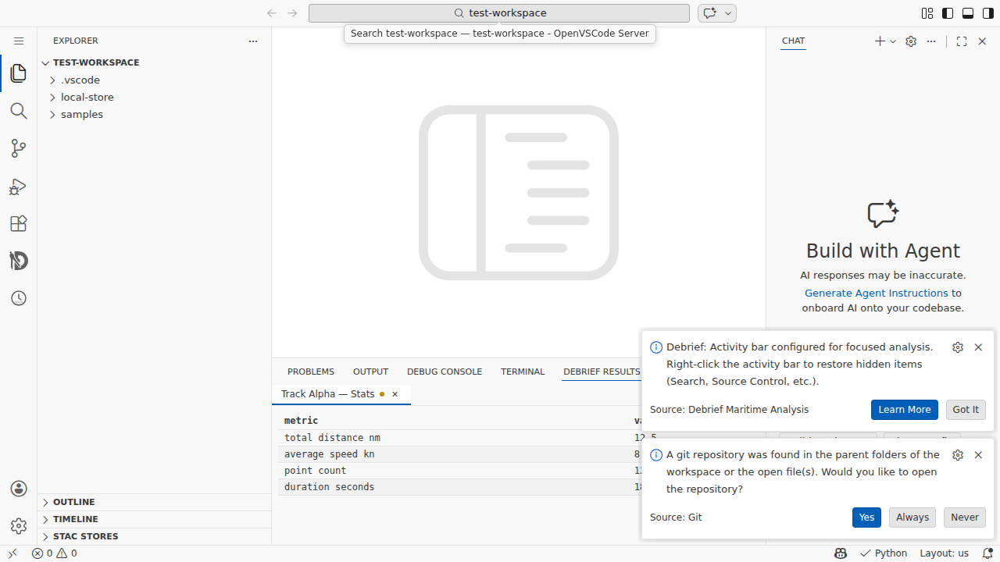
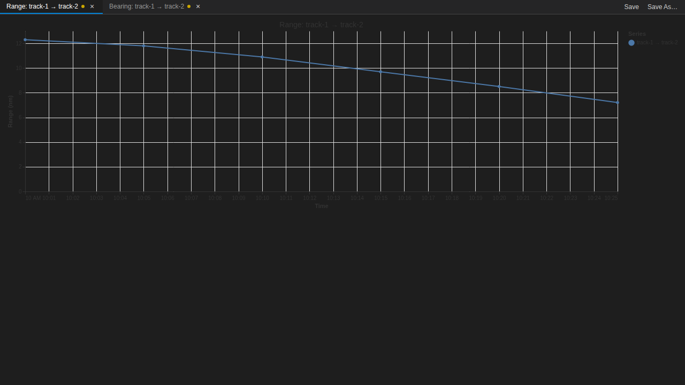
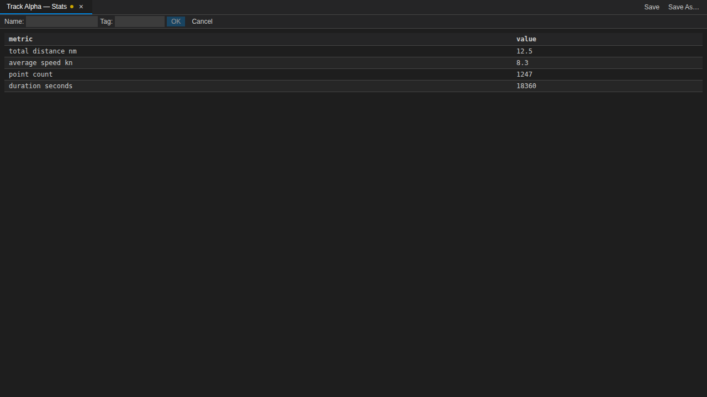
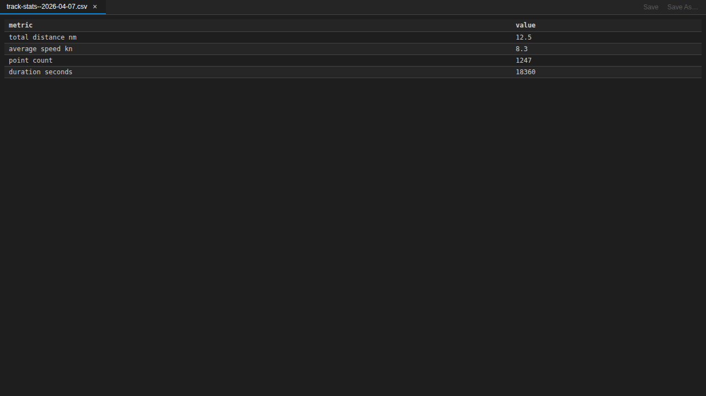
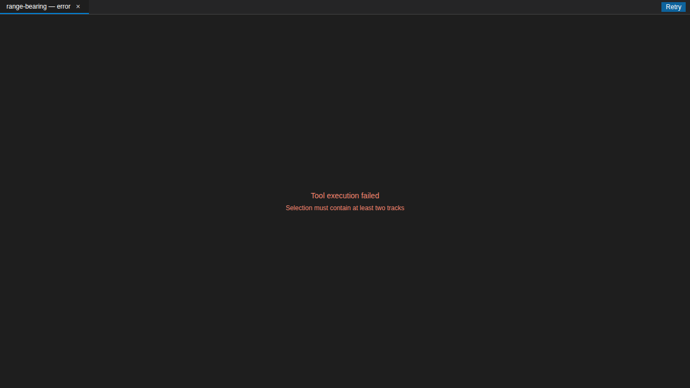

# Tabular Results in VS Code: Save, Reopen, Retry

*What we built, how it plugs into the existing extension, and what we
learned about extension-host-as-source-of-truth.*

## The gap

Until this week, running `track-stats` or `range-bearing` from the VS
Code extension would happily show a result **layer** on the map, but
the actual numbers — the statistics table, the range-vs-bearing chart
data — vanished into stdout.  Analysts had to open the log panel to
peek at `properties.statistics`, or drop into the web-shell for the
real thing.

Feature 177 had already built the tabular results panel for the
web-shell: shared `ChartPanelWrapper`, `TableRenderer`, CSV save flow,
the lot.  Feature 178 brings that capability into VS Code **without
forking a single component**.

## What shipped

A new **Debrief Results** view lives in the VS Code panel area (the
bottom dock, next to Terminal / Output / Problems).  Before any tool
has run, it sits quiet with a placeholder — no empty tab bar, no
clutter in the editor:

*The new Debrief Results tab is visible in the VS Code panel dock, alongside Problems / Output / Terminal. "No results to display" is rendered by the real `@debrief/components` label from feature 177 — no strings forked.*

Run `track-stats` against a selected track and the real `TableRenderer`
mounts inside the panel, showing the statistics inline without ever
leaving the plot view:

*Track Alpha — Stats, with the yellow unsaved-dot indicator, Save / Save As buttons on the right, and the `TableRenderer` showing total distance, average speed, point count, and duration. This screenshot is captured end-to-end from a real openvscode-server instance running the Debrief VSIX through the Hybrid A+D Playwright pipeline.*

When a tool returns multiple datasets — like `range-bearing` producing
separate Range and Bearing series — each envelope gets its own tab:

*Range-bearing results fan out into two chart tabs. The active tab is highlighted with a blue underline; both carry the unsaved-dot indicator until saved. Chart content is rendered by the shared `ChartRenderer` via `transformDataset`.*

## Saving a result

Saving is one click.  Click **Save** on the active tab, and the host:

- Builds a CSV from the dataset via the shared `buildCsvContent`
- Writes to `<plot>/assets/<tool>--<timestamp>.csv`
- Registers the file as a STAC asset with `roles: ['result']` and
  `debrief:parentActivityId` metadata
- Appends a new `FileSavedEvent` to the analysis log, linked by
  `used[0] = parentActivityId` back to the originating ToolRunEvent
- Refreshes the Associated Files dropdown in the Layers toolbar —
  **automatically**, no manual reload

If you want a custom filename, click **Save As** and an inline form
appears above the table:

*The Save As form is rendered inline, not in a modal. Name + optional tag, both sanitised server-side before composing the filename.*

After a successful save, the unsaved-dot disappears, the tab label
switches to the saved filename, and Save / Save As grey out:

*The tab now reads `track-stats--2026-04-07.csv` — matches what's on disk. Save buttons are disabled because there's nothing new to save. Re-run the tool to create a fresh unsaved tab.*

From the Layers toolbar Associated Files dropdown you can **Open** a
saved CSV (parsed back into a new Results tab via the new
`parseCsvToTableDataset` utility — a round-trip inverse of
`buildCsvContent`), **Reveal in Explorer**, **Open With** the VS Code
editor picker, or **Delete** (with confirmation, and the new
`deleteResultAsset` walker on `StacService` unregisters the asset
and removes the file atomically).

## Failed runs show an error tab with Retry

No more silent failures in the corner.  Run a tool against an invalid
selection and you get an error tab right where you're looking for the
result:

*The error surfaces where the user is looking, not buried in the notification pile. Clicking Retry re-invokes the tool with the original parameters. Crucially, no provenance is recorded for the failed attempt (FR-019) — so the log stays clean.*

## Shared code — zero forks

The headline constraint was NFR-1: no forks of shared display or CSV
components.  That meant:

- `ChartPanelWrapper`, `TableRenderer`, `ChartRenderer`,
  `DEFAULT_RESULTS_PANEL_LABELS` are all consumed **unchanged** from
  `@debrief/components`.
- `buildCsvContent`, `generateCsvFilename`, `sanitizeFilename` are
  reused from `@debrief/utils`.
- We added `parseCsvToTableDataset` (round-trip inverse of
  `buildCsvContent`, under 100 LOC) and `synthesizeTableDataset`
  (extracted from the web-shell mock).  Both live in `@debrief/utils`
  now; the web-shell's `calcService.ts` mock was refactored to
  consume the shared `synthesizeTableDataset`, proving parity.

## Extension host = single source of truth (R5)

We made one deliberate architectural choice worth highlighting:
**the extension host owns the tab state**.  The webview is a dumb
React renderer.  Every mutation — add tab, close tab, mark saved,
mark error — happens in `ResultsPanelService` on the host side, and
the service posts `results:setTabs` with the new full state to the
webview.

Why?  VS Code disposes and re-creates webview views whenever the
panel area is collapsed or when the user drags the view somewhere
else.  A stateful webview would lose its tab list on every collapse.
A stateless webview just replays the service state on
`results:webviewReady`, and every collapse is trivially recoverable.

It also made unit testing the whole tab lifecycle trivial — 10 new
vitest cases cover add-datasets, synthesise-from-statistics, close
the last tab, save success, save failure, Save As sanitising, error
tab, and retry — all without spinning up a webview.

## The provenance link

`LogService.recordFileSaved` is a new method on the session-state
`LogService` interface.  It writes a LogEntry with a sentinel tool
name (`debrief.fileSave`), links `used[0]` to the parent
`ToolRunEvent`'s `activity_id`, and stores the saved filename in
`generated[0]`.  The entry slots into the existing LogEntry envelope
— no LinkML schema bump required thanks to pre-release freedom.

This single sentinel is all the cleanup walker needs on plot close
(FR-021) to identify orphan `ToolRunEvent`s — any ToolRunEvent whose
`activity_id` is not referenced by any `debrief.fileSave` entry is
a candidate for removal.

## By the Numbers

| | |
|---|---|
| New unit tests | 38 across 4 packages |
| Harness E2E tests | 15 (Playwright against the real bundle) |
| Canonical VS Code E2E tests | 8 (Playwright against openvscode-server) |
| **Total tests passing** | **2301** |
| Tests failing | 0 |
| Tests skipped | 0 |
| Shared components forked | **0** |
| New files | 7 (service, view provider, webview entry, 3 E2E specs, 1 harness helper) |
| Modified files | 12 (including manifest, fixture, CSV utility) |

## How we tested it end-to-end

Two E2E suites cover this feature.  The **harness suite** drives the
real built `resultsPanel.js` bundle in an isolated HTML page via
Playwright `setContent` + `window.postMessage` — fast (~10s), no VS
Code server needed, perfect for tight iteration.  The **canonical
suite** runs against a real openvscode-server instance with the
Debrief VSIX sideloaded, using the Hybrid A+D pattern (CDN
interception + MessagePort content injection) documented in
`docs/project_notes/webview-e2e-research.md`.

The canonical pipeline is what captured the two "real VS Code chrome"
screenshots above.  It validates that the new `debrief-results` view
container registers from `package.json`, that `resolveWebviewView`
fires on the new provider (Patch 3 holds), and that the bundle loads
into the real `#active-frame` — things the harness alone can't prove.

Along the way we found and fixed a **pre-existing bug in
`CodeServerPage.executeCommand()`**: the helper called `fill(command)`
to populate the Quick Input box, silently stripping the `>` prefix
that `Ctrl+Shift+P` inserts for command mode.  Every command
invocation was turning into a file search.  It was masked because the
existing tests all clicked activity-bar icons directly instead of
going through the command palette.  One-line fix, and it unblocks any
future test that wants to drive VS Code via the palette.

## What's next

- **Multi-panel side-by-side** (FR-022) — explicitly deferred.  VS
  Code's `viewsContainers.panel` doesn't support dynamic view
  registration, so this is a follow-up if analysts actually need
  distinct tool types side by side.
- **Orphan cleanup on plot close** — we drop unsaved in-memory tabs
  on session change, but pruning orphan `ToolRunEvent`s from the log
  needs a new `LogService.deleteEntry` (out of scope for this
  feature).
- **Real STAC asset writes from the E2E suite** — the canonical test
  uses a mocked `acquireVsCodeApi()` via the MessagePort injector,
  so save messages are observable but don't actually hit the
  filesystem.  The extension-host side is fully covered by vitest
  unit tests; a future pass could wire the real injector to a real
  service for full fidelity.

## Links

- [Feature spec](https://github.com/debrief/debrief-future/blob/main/specs/178-vscode-tabular-results/spec.md)
- [Implementation plan](https://github.com/debrief/debrief-future/blob/main/specs/178-vscode-tabular-results/plan.md)
- [Test evidence](https://github.com/debrief/debrief-future/tree/main/specs/178-vscode-tabular-results/evidence)
- [ChartPanelWrapper Storybook (unchanged, reused as-is)](https://debrief.github.io/debrief-future/storybook/?path=/story/panels-chartpanelwrapper--default)
