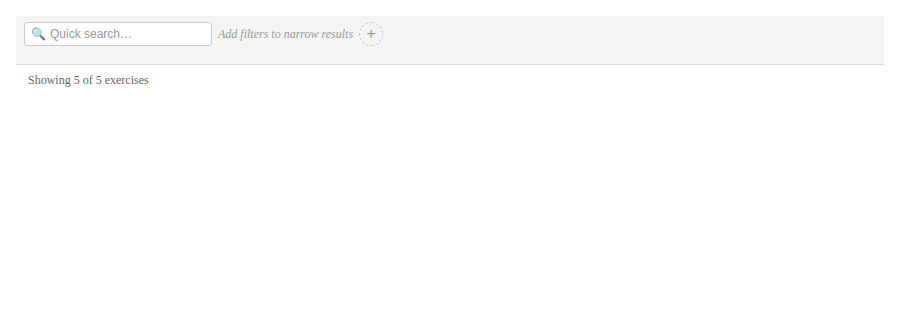
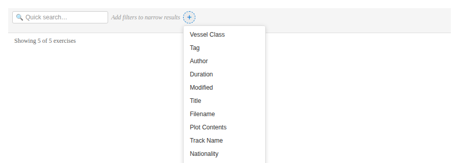
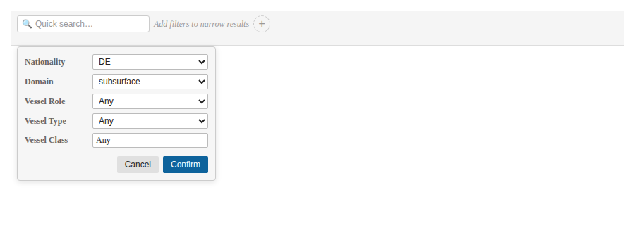
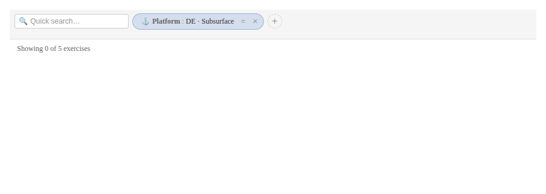
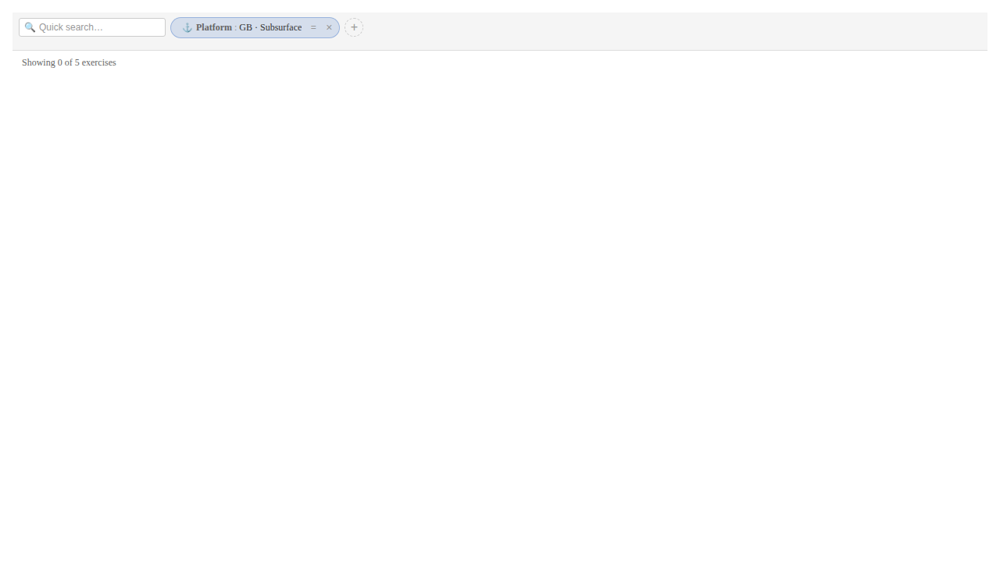
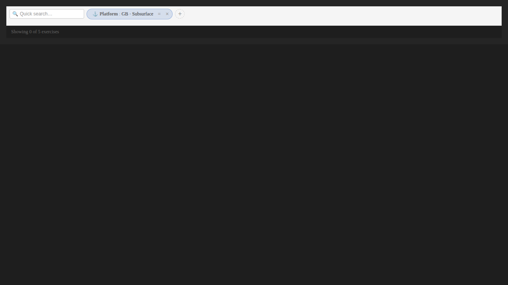
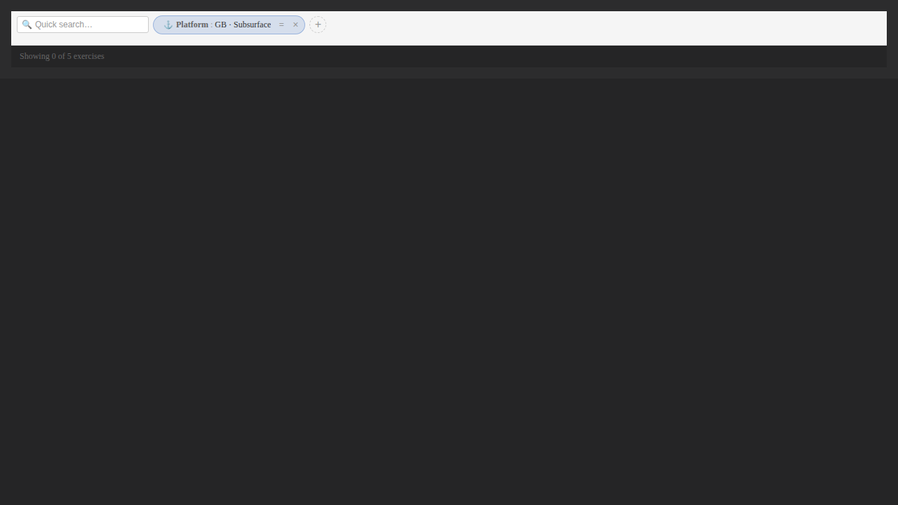

## What We Built

The Filter Bar now has a **Platform** chip. Click the (+) button, pick "Platform", choose any subset of `nationality`, `domain`, `vessel_role`, `vessel_type`, and `vessel_class`, and confirm — one chip lands in the bar. Under the hood, the chip serialises to a single `array_filter(debrief:platforms, …)` CQL2 node whose inner predicate AND-combines the selected attributes. The filter engine evaluates the predicate *per-platform*, so a plot with a British frigate and a German submarine no longer false-positives a "British submarine" query.

The chip behaves like every other chip. Click to edit — the popover re-opens pre-filled with the current attributes. Toggle negate — the CQL2 output wraps in `not` and the result set inverts. Drag it into an OR container and you can build "British submarines OR German frigates" without any new mental model. Remove and the bar returns to baseline.

## The Flow

The whole user story is four screenshots.

### 1 — Empty bar

### 2 — Filter-type menu with the new "Platform" entry

### 3 — Compound editor with attributes selected

### 4 — Confirmed chip

## Theme Parity

Tinted-blue background, anchor glyph, compound label — all additive styling, so existing chip themes are unchanged. The chip reads correctly in every variant we ship.

## Lessons Learned

**Keeping the reducer generic pays off.** Extending `LozengeItem` to a discriminated union over `shape` (instead of splitting into two top-level types) meant the move-to-container, move-to-top-level, negate, and remove branches needed zero new logic — the union is transparent to them. Only the render path and the expression-mapping path needed per-shape branches.

**The "no silent failures" rule held under pressure.** The tempting shortcut on deserialise was to flatten an `array_filter` with a richer-than-UI predicate (say, an OR inside the AND) by dropping the first branch. We didn't. Unsupported CQL2 shapes route through the existing `FILTER_ERROR_MESSAGE` banner, which keeps faith with the constitution's Article I.3. This matters more once #188 starts producing CQL2 that the UI can't always draw.

**Backwards-loading beats versioning.** A saved filter written before #186 has no `shape` field on its lozenges. Rather than bumping `SavedFiltersCollection.version`, we added a single coercion step on restore (`kind: 'lozenge' && !shape → shape: 'simple'`). Pre-feature saved filters load unchanged; new ones always carry `shape`. No migration cost for users.

**The prompt hash is a brittle contract.** Because we're still recording LLM fixtures for #188, the NL→CQL2 prompt hash is a load-bearing identity. Adding `platform` to the schema description would have invalidated every recorded fixture. Keeping the platform chip out of the flat schema table — and documenting `array_filter` in the paragraph below instead — preserved every existing fixture without loss of generality.

## What's Next

The adjacent pieces of E10 become real now. #188's NL→CQL2 generator can produce `array_filter` expressions that the filter bar can round-trip. #189's stakeholder demo UI can show the new chip alongside the planning-post mock-up. And #190 (live LLM transport) is no longer a solo feature — it's the last piece of a three-part chain the user actually experiences end-to-end.

The one open question from the planning post — "should OR inside a platform chip be expressible?" — stays parked. The two-chips-in-an-OR-container path covers every current use case, and waiting until an analyst actually asks for inline OR is cheaper than rebuilding the editor afterwards.

→ [Spec](../spec.md)
→ [Evidence](../evidence/)
→ [Planning post](./planning-post.md)
