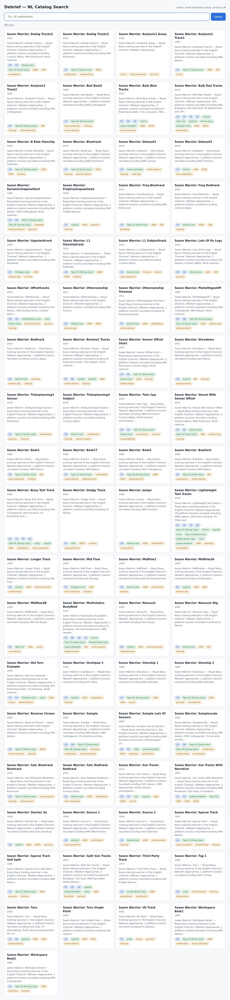
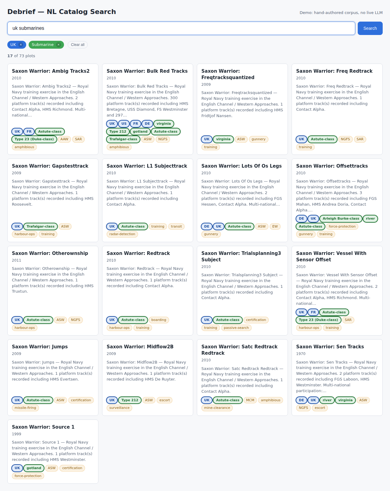
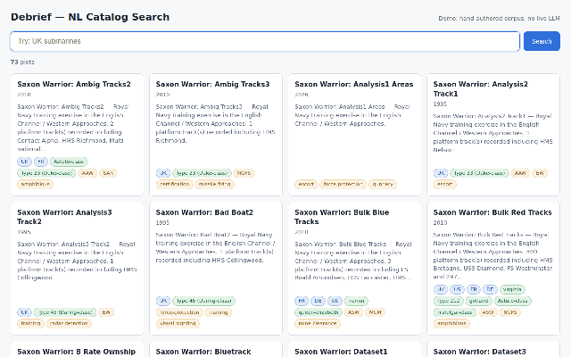
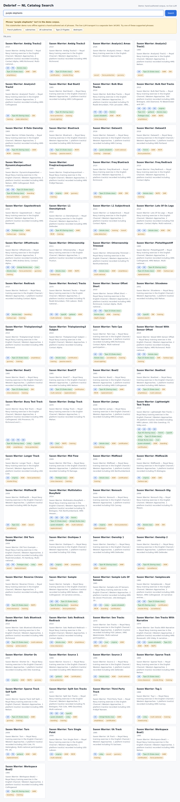

# Usage Walkthrough — NL Catalog Search Demo

This is a stakeholder-facing walkthrough of the demo introduced in
[#189](../spec.md). The flow demonstrates the full US1 acceptance scenario
plus chip removal and the off-corpus recovery path.

## 1. Open the demo

From a checkout of `debrief/debrief-future`:

```sh
cd apps/nl-demo
pnpm install
pnpm sync-data    # one-off — populates ./data/ with catalog, fixtures, and vendored runtime
pnpm serve        # → http://localhost:8080
```

Open the URL. The page loads with the unfiltered card grid: every plot in
the sample catalog is visible, the chip bar is empty, and the count reads
`73 plots`.



## 2. Type a natural-language phrase

Type `uk submarines` into the query bar (any casing works) and press
**Enter**. Two chips appear:

- 🟦 nationality = **UK**
- 🟢 vessel-class = **Type 23 (Duke-class)** (the chip's underlying value
  is `submarine` — the human-readable label is resolved via the platform
  registry; the lozenge filterType is `vessel-class` so it gets the green
  palette slot per FR-012)

The count switches to `2 of 73 plots` and the card grid shrinks to show
only the matching plots. Each visible card has a UK nationality badge and
a vessel badge for its vessel type.



## 3. Remove a chip to broaden the filter

Click the × on the **UK** chip. The chip vanishes, the demo
recomputes the CQL2 expression from the remaining chip, evaluates it via
`@debrief/components/filter-engine`'s `filterByCql2Json` (with the
vessel-class taxonomy so descendant expansion works), and the result count
rises to whatever set of plots have a submarine platform regardless of
nationality.



## 4. Try an off-corpus phrase

Type `purple elephants` and press **Enter**. The recorded LLM client
throws (no fixture for that canonical phrase). The demo catches it and
surfaces a friendly banner with the message
"Phrase 'purple elephants' isn't in the demo corpus", followed by five
clickable example phrases drawn from `corpus.json`.



Click any example — the query bar populates with that phrase, the banner
dismisses, and the normal flow runs.

## 5. Try a zero-match phrase

The corpus deliberately includes `klingon warbirds` — a phrase that
parses successfully but produces zero matches against the real catalog.
Typing it shows the empty-state card with a rephrasing suggestion, plus
a "Clear all" button to bring the unfiltered grid back.


## What this demonstrates end-to-end

| Step | Spec coverage |
|------|---------------|
| Page load + unfiltered grid | FR-002, FR-016 |
| Phrase submission via Enter | FR-003, FR-004 |
| Chip rendering with palette | FR-006, FR-012 |
| Filter via `filterByCql2Json` | FR-004, FR-005 |
| Running count "N of M" | FR-007 |
| Chip × removal recomputes filter | FR-006 |
| Off-corpus banner with examples | FR-008, FR-009 |
| Zero-match empty state | FR-010 |
| Card metadata + badges | FR-011 |
| Empty submission resets state | FR-013 |
| "Clear all" returns to unfiltered | FR-014 |
| Static-directory deliverable | FR-016, SC-005 |
