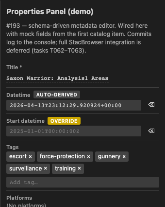
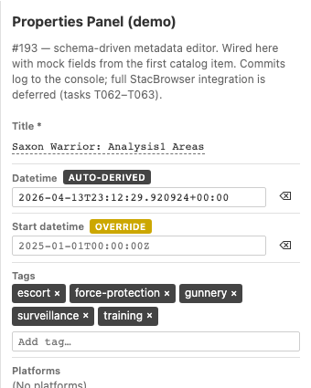
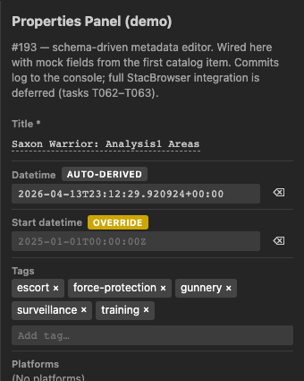
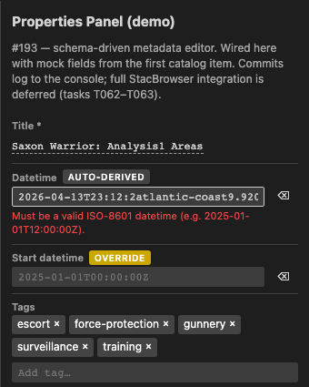

## What We Built

A schema-driven Properties Panel that edits STAC item metadata from two surfaces. When a plot is open, a 4th section appears in the ActivityPanel alongside TimeController, Tools, and Layers. When no plot is open and the analyst is triaging the catalog, a Properties area stacks under `ThumbnailPreview` in `StacBrowser`. Same form, same field set, same service path.

The form is generated from the LinkML-derived JSON Schema for the STAC item type. `PropertiesForm` in `shared/components/src/PropertiesPanel/` walks the schema and maps each property to either a `ParameterEditor` widget (scalars, enums) or one of four new sibling widgets: `ArrayWidget` for chip lists, `DateTimeWidget` for ISO-8601, `BboxWidget` for the four-quad, `PlatformArrayWidget` for platform records. Add a field in LinkML, run `make generate`, and a new input appears on the next build — confirmed by the round-trip test in `test_properties_panel_roundtrip.py`.

Writes go through a single gatekeeper: `stacService.updateItemMetadata`. Read, record mtime, merge patch into `item.properties`, append a provenance entry, re-stat to detect concurrent edits, atomic temp+rename onto `item.json`. No session-state staging, no parallel write path, no last-write-wins. The same method serves the ActivityPanel and the StacBrowser — the "which surface is editing?" question never becomes a "which writer wins?" question because there is only one writer.

Auto-derivation is now override-aware. `stacService.updateTemporalMetadata` reads `item.properties["debrief:overrides"]` and skips any field listed there. Edit `start_datetime` once, and subsequent derivation passes leave it alone. The Properties form renders those fields with an "override" chip so the analyst can see why derivation isn't running for them.

The provenance log is bounded. The active array on `item.properties["debrief:provenance_log"]` caps at 500 entries; the 501st commit rotates the oldest entry into a sibling `provenance_log_archive.jsonl` in the same item directory. Append-only JSONL, atomic rotation. Reads stay O(cap); the full audit trail is preserved on disk (Article III.3).

## Screenshots

The `PropertiesForm` rendering the metadata for a catalog item, captured from the web-shell preview against three VS Code theme variants. Two fields carry chips: `datetime` is `auto-derived` (computed from the plot's feature timestamps), `start_datetime` is `override` (the analyst overrode it once, so subsequent derivation passes skip it).

**Dark theme**

**Light theme**

**VS Code sidebar theme**

**Validation error**

The panel rejects schema-invalid input inline — no disk write, no provenance entry. Here an invalid ISO-8601 datetime surfaces an inline error next to the field (the original value stays on disk until a valid commit):

A short webm recording of the edit flow (add a tag → blur → chip appears) is checked in alongside the stills at `evidence/screenshots/interaction.webm`.

## By the Numbers

| | |
|---|---|
| Tests passing | 78 |
| Schema round-trip + structural | 13 |
| stacService (write path, rotation, overrides) | 12 |
| Widgets + form + schema resolver | 48 |
| StacBrowser selection context | 3 |
| Failures / skipped | 0 / 0 |
| Provenance log cap | 500 entries |
| Overflow destination | `provenance_log_archive.jsonl` |

## Lessons Learned

**Dropping the session-state staging layer made the write path much simpler.** The planning post described edits "staging into session-state and flushing when the plot is saved, piggy-backing on the existing unsaved-changes machinery." The review (Decision 2) rejected that. Session-state is UI-only in this codebase; data changes go through services. Adding a `PropertiesSlice` to flush-on-save would have introduced a parallel write path alongside `stacService`, and the two surfaces (ActivityPanel and StacBrowser) would have had different persistence models for the same form. Direct-write through `updateItemMetadata` on every commit collapsed all of that to a single method. Both surfaces behave identically. The "unsaved changes" machinery stays out of the Properties picture entirely.

**mtime-based stale-edit detection is enough.** No cross-platform file locks, no lease protocol, no lock files. Read, fingerprint the mtime, do the merge in memory, re-stat before rename. If the mtime changed, throw `StaleItemJsonError` and let the UI reload from disk. Last-write-wins is avoided without any of the portability cost that real locking would bring. The test that modifies `item.json` between read and write (T026) is short and unambiguous.

**Bounded log + JSONL archive is a pattern, not a one-off.** The rotation machinery for `debrief:provenance_log` is small, well-tested (T030, T031), and exactly what feature-level provenance will need when #192 lands. Keeping the active log O(cap) means the item.json stays lean even on long-lived plots; the archive is append-only JSONL so future tools can stream it without loading everything into memory. We'll re-use the same shape for feature-level provenance rather than inventing a second convention.

## What Landed vs. What's Deferred

**Landed (green, 78 tests):**
- `stacService.updateItemMetadata` with atomic temp+rename, mtime-based stale-edit detection, read-only filesystem handling
- `stacService.updateTemporalMetadata` extended to respect `debrief:overrides`, idempotent when derived values already match
- Provenance log append + rotation to `provenance_log_archive.jsonl` at the 500-entry cap
- `PropertiesForm` + four sibling widgets (`ArrayWidget`, `DateTimeWidget`, `BboxWidget`, `PlatformArrayWidget`)
- Schema resolver covering `["string","null"]` unions + fallback
- "auto-derived" / "override" chip rendering on derivation-sensitive fields
- `BrowserSelectionContext` for StacBrowser scope
- ActivityPanel Properties section integration
- Offline harness (fetch/XHR patched to throw) proving the whole form loop works without network

**Still on the list (tracked as T094–T098 in `tasks.md`):**
- Host-side hydration hook that computes `PropertiesFormField[]` from the live `item.json` (T094) — the `PropertiesForm` props are threaded through ActivityPanel, but the extension host doesn't yet feed them live values
- StacBrowser GoldenLayout integration (T062–T063) — `BrowserSelectionProvider` and `PropertiesSidePanel` are exported, but the GoldenLayout tree isn't yet wrapped by the provider
- Storybook stories (T046–T050, T067, T078)
- Playwright webview E2E (T051–T056, T058–T060, T072)

## What's Next

- **#192 — feature-level metadata.** The same form machinery extends to per-feature `debrief:feature_tags`. The `debrief:overrides` array grows a second dimension keyed by feature ID. Write path stays `stacService`, provenance pattern stays identical.
- **#193 — platform autocomplete.** `PlatformArrayWidget` wires the platform registry in so analysts pick from known platforms instead of retyping ids.
- **#194 — unified provenance rotation.** The per-item rotation policy generalises to per-feature provenance logs; one cap, one archive shape across item and feature surfaces.

→ [Spec (post-review revision)](https://github.com/debrief/debrief-future/blob/193-properties-panel/specs/193-properties-panel/spec.md)
→ [Evidence: test summary](https://github.com/debrief/debrief-future/blob/193-properties-panel/specs/193-properties-panel/evidence/test-summary.md)
→ [Evidence: usage example (before/after item.json)](https://github.com/debrief/debrief-future/blob/193-properties-panel/specs/193-properties-panel/evidence/usage-example.md)
