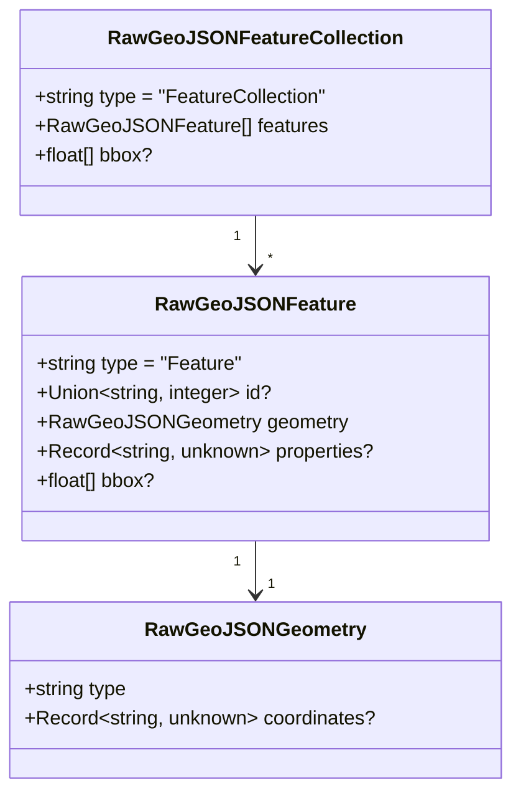

# Phase 1 Data Model: Raw GeoJSON Classes

**Feature**: 204-rawgeojsonfeature-linkml
**Date**: 2026-04-20
**Input**: [research.md](./research.md) — mechanism decisions are fixed.

## Overview

Three new LinkML classes are introduced in a new submodule
`shared/schemas/src/linkml/raw-geojson.yaml`. They represent the
**parse-boundary** shape of a GeoJSON Feature — the type that a caller
handles *before* narrowing to a domain-specific feature class
(`TrackFeature`, `ReferenceLocation`, `SystemState`, `MultiPointFeature`,
`MultiPolygonFeature`).

## RawGeoJSONGeometry

**Purpose**: the minimum shape every GeoJSON geometry satisfies (RFC 7946 §3.1).

| Slot | Range | Required | Notes |
|------|-------|----------|-------|
| `type` | string | ✅ | Enum-like discriminator: `Point`, `LineString`, `Polygon`, `MultiPoint`, `MultiLineString`, `MultiPolygon`, `GeometryCollection`. Not constrained to a LinkML enum at this boundary — narrowing happens after parse. |
| `coordinates` | Any (`linkml:Any`) | ❌ | Permissive at the boundary; narrowed by downstream geometry classes (`GeoJSONPoint`, `GeoJSONLineString`, …). `GeometryCollection` has no `coordinates` — hence not required. |

**Validation rules**:
- `type` is present and is a non-empty string (FR-005).
- When `type === "GeometryCollection"`, an additional `geometries: RawGeoJSONGeometry[]` member may be present; this is not modelled here because no current consumer requires `GeometryCollection`. Edge case #E7 in the spec.
- Shape of `coordinates` is verified by the downstream narrow class (e.g.
  `GeoJSONPoint.coordinates: number[]`).

## RawGeoJSONFeature

**Purpose**: the minimum shape every GeoJSON Feature satisfies, prior to
narrowing by `DebriefFeature` or tool-result handlers.

| Slot | Range | Required | Notes |
|------|-------|----------|-------|
| `type` | string | ✅ | Always the literal `"Feature"` — enforced via `equals_string: "Feature"`. |
| `id` | Union[string, integer] | ❌ | `any_of` union. Optional per RFC 7946 §3.2. When present, must be string or integer. (FR-002, FR-007) |
| `geometry` | RawGeoJSONGeometry | ✅ | Required; may be `null` per RFC 7946 §3.2, but the common case across the codebase uses a concrete geometry. `null` support tracked as edge case #E8. |
| `properties` | Record[string, Any] | ❌ | Permissive dictionary (see research §2). May be `null` (explicit) or absent. |
| `bbox` | float[] | ❌ | Optional bounding box, `[minLon, minLat, maxLon, maxLat]` or `[minLon, minLat, minAlt, maxLon, maxLat, maxAlt]`. Required cardinality 4 or 6. |

**Validation rules**:
- `type === "Feature"` (FR-003).
- If `id` is present, it is `string | integer` (FR-007).
- If `properties` is present, it is an object (dictionary) or `null`
  (FR-004).
- `geometry.type` is a known GeoJSON geometry type; the domain narrow
  classes (`GeoJSONPoint`, `GeoJSONLineString`, etc.) enforce the rest
  (FR-005).

**Invariants**:
- Byte-identical round-trip is preserved: Python `RawGeoJSONFeature` →
  `model_dump_json()` → TypeScript `JSON.parse()` → TypeScript
  `JSON.stringify()` → Python `.model_validate_json()` yields the same
  object (SC-008, FR-010).

## RawGeoJSONFeatureCollection

**Purpose**: the minimum shape of a GeoJSON FeatureCollection.

| Slot | Range | Required | Notes |
|------|-------|----------|-------|
| `type` | string | ✅ | Literal `"FeatureCollection"` — enforced via `equals_string: "FeatureCollection"`. |
| `features` | RawGeoJSONFeature[] | ✅ | `multivalued: true`, `inlined_as_list: true`. Empty list permitted (edge case #E3). |
| `bbox` | float[] | ❌ | Same shape as `RawGeoJSONFeature.bbox`. |

**Validation rules**:
- `type === "FeatureCollection"` (FR-006).
- `features` is an array (may be empty).

## Replaces

- `session-state.yaml` `GeoJSONFeature` (lines 270-286) — **deleted**.
- `session-state.yaml` `GeoJSONGeometry` (lines 262-268) — **deleted**.
- `shared/utils/src/types.ts` hand-typed `GeoJSONFeature` — **deleted**.
- `shared/utils/src/types.ts` hand-typed `GeoJSONFeatureCollection` — **deleted**.
- `services/session-state/src/types/results.ts` hand-typed
  `GeoJSONFeature` — **deleted**.
- `services/stac/src/debrief_stac/types.py` `GeoJSONFeature: TypeAlias =
  dict[str, Any]` — **deleted**.
- `services/stac/src/debrief_stac/types.py` `GeoJSONFeatureCollection:
  TypeAlias = dict[str, Any]` — **deleted**.

## References into the new classes

- `session-state.yaml` `ResultsSlice.result_layers` — updated from
  `range: GeoJSONFeature` to `range: RawGeoJSONFeature` (FR-016).
- All 22 TypeScript consumer files and 3 Python consumer files listed in
  `research.md §3` — updated to import from `@debrief/schemas` /
  `debrief_schemas`.

## Non-entities

- `RawGeoJSONProperties` — declared only to satisfy the LinkML `range:`
  requirement; rendered as `Record<string, unknown>` in TypeScript and
  `Dict[str, Any]` in Pydantic. Not a consumer-facing entity.
- `SafeFeature`/`SafeGeometry` — out of scope per spec; tracked in
  backlog #212.

## Fixture coverage plan

Fixtures live under `shared/schemas/fixtures/raw-geojson/` and are loaded
by the extended `test_golden.py`.

### `valid/`
- `feature-string-id.json` — `type: Feature`, `id: "track-001"`, Point geometry, empty properties.
- `feature-integer-id.json` — `type: Feature`, `id: 42`, LineString geometry, populated properties.
- `feature-no-id.json` — `type: Feature`, no `id`, Polygon geometry, `properties: null`.
- `collection-empty.json` — `type: FeatureCollection`, `features: []`.
- `collection-mixed-ids.json` — features with string, integer, and absent ids.

### `invalid/`
- `wrong-type.json` — `type: "NotAFeature"` → must fail `equals_string` check.
- `missing-geometry.json` — no `geometry` slot → must fail required check.
- `numeric-type.json` — `type: 42` → must fail range check.
- `id-boolean.json` — `id: true` → must fail `any_of[string,integer]`.

All fixtures exercised by round-trip and Pydantic ↔ JSON Schema comparison
tests (FR-018, SC-006, SC-008).
