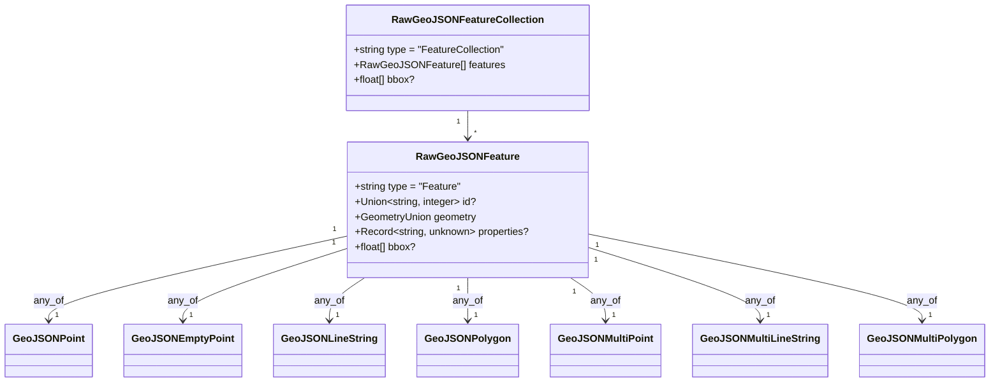

# Phase 1 Data Model: Raw GeoJSON Classes

**Feature**: 204-rawgeojsonfeature-linkml
**Date**: 2026-04-20
**Input**: [research.md](./research.md) — mechanism decisions are fixed.

## Overview

Two new LinkML classes are introduced in a new submodule
`shared/schemas/src/linkml/raw-geojson.yaml` — `RawGeoJSONFeature` and
`RawGeoJSONFeatureCollection`. They represent the **parse-boundary**
shape of a GeoJSON Feature — the type that a caller handles *before*
narrowing to a domain-specific feature class (`TrackFeature`,
`ReferenceLocation`, `SystemState`, `MultiPointFeature`,
`MultiPolygonFeature`).

**Geometry is not a new class.** Per review decision 11A, the `geometry`
slot is an `any_of` discriminated union over the seven existing geometry
classes defined in `shared/schemas/src/linkml/geojson.yaml`
(`GeoJSONPoint`, `GeoJSONEmptyPoint`, `GeoJSONLineString`, `GeoJSONPolygon`,
`GeoJSONMultiPoint`, `GeoJSONMultiLineString`, `GeoJSONMultiPolygon`). The
earlier draft of this data-model introduced a `RawGeoJSONGeometry` class
with loose `range: string` type and `range: Any` coordinates — that class
is **not** created.



## Geometry union (reuses `geojson.yaml` classes)

**Purpose**: cover every GeoJSON geometry kind RFC 7946 defines *except*
`GeometryCollection` — which Debrief does not consume and whose omission
is enforced by the invalid fixture `unknown-geometry-type.json`.

Review decision 13A adds `designates_type: true` to the `type` slot of
each of the seven classes. This extension is additive — it does not
change which payloads validate — but it tells Pydantic to treat the union
as discriminated on `type`, avoiding ~6× slowdown when validating large
collections.

| Geometry class | `type` discriminator | Coordinates shape |
|----------------|---------------------|-------------------|
| `GeoJSONPoint` | `"Point"` | 2-element `float[]` (lon, lat) |
| `GeoJSONEmptyPoint` | `"Point"` | empty `float[]` (used for null-geometry coercion) |
| `GeoJSONLineString` | `"LineString"` | `float[][]` (≥ 2 pairs) |
| `GeoJSONPolygon` | `"Polygon"` | `float[][][]` (rings of pairs) |
| `GeoJSONMultiPoint` | `"MultiPoint"` | `float[][]` |
| `GeoJSONMultiLineString` | `"MultiLineString"` | `float[][][]` |
| `GeoJSONMultiPolygon` | `"MultiPolygon"` | `float[][][][]` |

**Disambiguation of the shared `"Point"` discriminator**: `GeoJSONPoint`
and `GeoJSONEmptyPoint` both have `type: "Point"`. They are distinguished
by the `maximum_cardinality` constraint on `coordinates` —
`GeoJSONPoint` requires exactly 2, `GeoJSONEmptyPoint` requires exactly 0.
Pydantic tries each alternative and validates against the one whose
cardinality matches; at runtime the discriminator prunes the search to
"either of the two `Point` variants" and the cardinality check picks the
winner. This remains fast because it is O(1) — only 2 alternatives to
test, not 7.

**Null-geometry coercion**: `geometry: null` or `geometry: undefined`
MUST be converted to `GeoJSONEmptyPoint { type: "Point", coordinates: [] }`
at the two ingress sites (`services/io` REP importer,
`services/stac` catalog loader) — review decision 5-alt. The
`RawGeoJSONFeature.geometry` slot is required; no consumer past the
ingress boundary ever sees a null geometry. See `quickstart.md §2b` for
the exact conversion shim.

## RawGeoJSONFeature

**Purpose**: the minimum shape every GeoJSON Feature satisfies, prior to
narrowing by `DebriefFeature` or tool-result handlers.

| Slot | Range | Required | Notes |
|------|-------|----------|-------|
| `type` | string | ✅ | Always the literal `"Feature"` — enforced via `equals_string: "Feature"`. |
| `id` | Union[string, integer] | ❌ | `any_of` union. Optional per RFC 7946 §3.2. When present, must be string or integer. (FR-002, FR-007) |
| `geometry` | `any_of`: `GeoJSONPoint` \| `GeoJSONEmptyPoint` \| `GeoJSONLineString` \| `GeoJSONPolygon` \| `GeoJSONMultiPoint` \| `GeoJSONMultiLineString` \| `GeoJSONMultiPolygon` | ✅ | Discriminated on `type` via `designates_type: true` on each class's type slot (review 13A). **Required** — null/undefined geometries are coerced to `GeoJSONEmptyPoint` at ingress (review 5-alt), so consumers past the ingress boundary always see one of the seven classes. |
| `properties` | Record[string, Any] | ❌ | Permissive dictionary (see research §2). May be `null` (explicit) or absent. |
| `bbox` | float[] | ❌ | Optional bounding box, `[minLon, minLat, maxLon, maxLat]` or `[minLon, minLat, minAlt, maxLon, maxLat, maxAlt]`. Required cardinality 4 or 6. |

**Validation rules**:
- `type === "Feature"` (FR-003).
- If `id` is present, it is `string | integer` (FR-007).
- If `properties` is present, it is an object (dictionary) or `null`
  (FR-004).
- `geometry` is one of the seven known classes; the per-class
  `equals_string` constraint on `type` plus coordinate-cardinality checks
  provide the structural enforcement. An unknown `geometry.type`
  (e.g., `"GeometryCollection"`, `"NotAGeometry"`) fails validation.

**Invariants**:
- Byte-identical round-trip is preserved: Python `RawGeoJSONFeature` →
  `model_dump_json()` → TypeScript `JSON.parse()` → TypeScript
  `JSON.stringify()` → Python `.model_validate_json()` yields the same
  object (SC-008, FR-010).

## RawGeoJSONFeatureCollection

**Purpose**: the minimum shape of a GeoJSON FeatureCollection.

| Slot | Range | Required | Notes |
|------|-------|----------|-------|
| `type` | string | ✅ | Literal `"FeatureCollection"` — enforced via `equals_string: "FeatureCollection"`. |
| `features` | RawGeoJSONFeature[] | ✅ | `multivalued: true`, `inlined_as_list: true`. Empty list permitted (edge case #E3). |
| `bbox` | float[] | ❌ | Same shape as `RawGeoJSONFeature.bbox`. |

**Validation rules**:
- `type === "FeatureCollection"` (FR-006).
- `features` is an array (may be empty).

## Replaces

- `session-state.yaml` `GeoJSONFeature` (lines 270-286) — **deleted**.
- `session-state.yaml` `GeoJSONGeometry` (lines 262-268) — **deleted**.
- `shared/utils/src/types.ts` hand-typed `GeoJSONFeature` — **deleted**.
- `shared/utils/src/types.ts` hand-typed `GeoJSONFeatureCollection` — **deleted**.
- `services/session-state/src/types/results.ts` hand-typed
  `GeoJSONFeature` — **deleted**.
- `services/stac/src/debrief_stac/types.py` `GeoJSONFeature: TypeAlias =
  dict[str, Any]` — **deleted**.
- `services/stac/src/debrief_stac/types.py` `GeoJSONFeatureCollection:
  TypeAlias = dict[str, Any]` — **deleted**.

## References into the new classes

- `session-state.yaml` `ResultsSlice.result_layers` — updated from
  `range: GeoJSONFeature` to `range: RawGeoJSONFeature` (FR-016).
- All 22 TypeScript consumer files and 3 Python consumer files listed in
  `research.md §3` — updated to import from `@debrief/schemas` /
  `debrief_schemas`.

## Non-entities

- `RawGeoJSONProperties` — declared only to satisfy the LinkML `range:`
  requirement; rendered as `Record<string, unknown>` in TypeScript and
  `Dict[str, Any]` in Pydantic. Not a consumer-facing entity.
- `SafeFeature`/`SafeGeometry` — out of scope per spec; tracked in
  backlog #212.

## Fixture coverage plan

Fixtures live under `shared/schemas/fixtures/raw-geojson/` and are loaded
by the extended `test_golden.py` (`ENTITY_MAP` updated per review 12A).

### `valid/` — feature-level

- `feature-string-id.json` — `type: Feature`, `id: "track-001"`, Point geometry, empty properties.
- `feature-integer-id.json` — `type: Feature`, `id: 42`, LineString geometry, populated properties.
- `feature-no-id.json` — `type: Feature`, no `id`, Polygon geometry, `properties: null`.
- `collection-empty.json` — `type: FeatureCollection`, `features: []`.
- `collection-mixed-ids.json` — features with string, integer, and absent ids.

### `valid/geometry/` — one per geometry class (review 11A — 7 fixtures)

Each fixture wraps exactly one geometry kind inside a minimal
`type: Feature` envelope, to exercise discriminated-union routing.

- `point.json` — `GeoJSONPoint` with 2-pair coordinates.
- `empty-point.json` — `GeoJSONEmptyPoint` with `coordinates: []` (exercises the null-geometry coercion result shape).
- `linestring.json` — `GeoJSONLineString` with 3 pairs.
- `polygon.json` — `GeoJSONPolygon` with one closed ring.
- `multipoint.json` — `GeoJSONMultiPoint` with 3 pairs.
- `multilinestring.json` — `GeoJSONMultiLineString` with 2 line-strings.
- `multipolygon.json` — `GeoJSONMultiPolygon` with 2 polygons.

### `invalid/` — feature-level

- `wrong-type.json` — `type: "NotAFeature"` → must fail `equals_string` check.
- `missing-geometry.json` — no `geometry` slot → must fail required check (no ingress coercion at the schema level — coercion is a service-code concern).
- `numeric-type.json` — `type: 42` → must fail range check.
- `id-boolean.json` — `id: true` → must fail `any_of[string,integer]`.

### `invalid/` — geometry-level (review 11A — 1 fixture)

- `unknown-geometry-type.json` — `geometry: { type: "GeometryCollection", … }` → must fail the discriminated-union match. Proves that the `any_of` over seven classes rejects the one RFC 7946 type Debrief does not support.

All fixtures exercised by round-trip and Pydantic ↔ JSON Schema comparison
tests (FR-018, SC-006, SC-008). The `valid/geometry/*` set additionally
feeds the 10 000-feature micro-bench at
`shared/schemas/tests/test_designates_type_perf.py` (review 13A —
validation ≤ 500 ms on CI).

## `geojson.yaml` extension (review 13A)

Add `designates_type: true` to the `type` slot of each of the seven
geometry classes listed in the discriminator table above. This is the
only edit to `geojson.yaml`; payload acceptance is unchanged.

```yaml
# Example — applied identically to all 7 classes
GeoJSONPoint:
  attributes:
    type:
      description: Geometry type discriminator
      range: string
      required: true
      equals_string: "Point"
      designates_type: true      # ← ADD
    coordinates: { … }
```

**Observable effect**: `gen-pydantic` emits each geometry's `type` field as
`Literal["Point"]` (or equivalent) and adds a
`model_config = ConfigDict(discriminator="type")` to parent classes that
union them. This makes `RawGeoJSONFeature.geometry` validation O(1) per
feature instead of O(7).

**Observable non-effect**: The generated TypeScript and JSON Schema are
unchanged (both already emit the `type` as a literal via the existing
`equals_string` handling). Existing `DebriefFeature` subtypes
(`TrackFeature`, `ReferenceLocation`, etc.) that union a subset of the
geometry classes automatically benefit from the same discrimination.

## Ingress-validation convention (review 14A)

The runtime validation of `RawGeoJSONFeature` and
`RawGeoJSONFeatureCollection` happens exactly twice in the system:

1. **REP file import** — `services/io/src/debrief_io/parser.py` reads a
   REP file, converts any null-geometry rows to `GeoJSONEmptyPoint`
   (review 5-alt), and validates the result against
   `RawGeoJSONFeatureCollection` before returning the parsed payload.
2. **STAC catalog load** — `services/stac/src/debrief_stac/features.py`
   reads a STAC item's feature payload, applies the same null-geometry
   coercion, and validates against `RawGeoJSONFeatureCollection` before
   returning.

Past these two sites, consumers — `apps/vscode/src/webview/mapPanel.ts`,
`apps/vscode/src/services/stacService.ts`, `services/session-state`
`ResultsSlice`, IPC hand-offs inside `apps/loader`, web-shell tool calls,
etc. — **trust the static type** and do not re-validate. This removes
the silent-drop guard at `mapPanel.ts:1199`
(`if (!f.geometry) return []`) which was an Article I.3 (No silent
failures) violation.

This convention is enforced by:
- Deletion of the guard in `mapPanel.ts` as an explicit task
- The new Playwright spec `tests/e2e/test-null-geometry-no-drop.spec.ts`
  (review 10A) that imports a REP fixture containing a null-geometry row
  and asserts no layer is dropped
- The Python unit test
  `services/io/tests/test_parser_null_geometry.py` (review 10A) that
  asserts the coercion at the parser level
