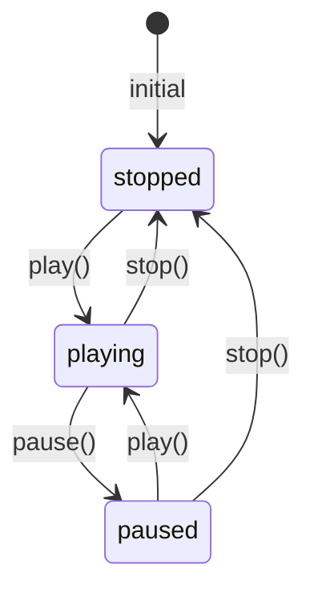
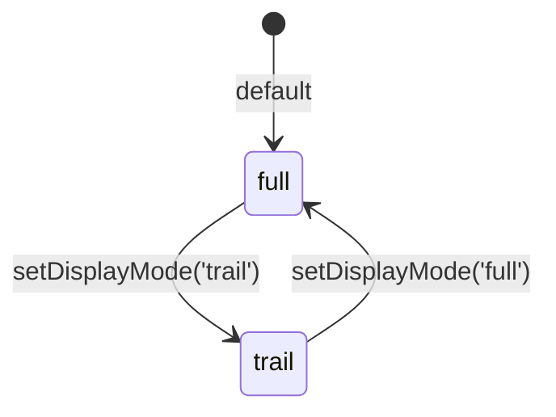

# Phase 1 Data Model: Temporal Enums

**Feature**: 205-displaymode-playbackstate-linkml
**Date**: 2026-04-21
**Input**: [research.md](./research.md) — mechanism decisions are fixed.

## Overview

This feature does not introduce new LinkML **classes**. The two subjects of the consolidation are **enums** that already exist in `shared/schemas/src/linkml/session-state.yaml:24-40`. The data model captured here is:

1. The canonical, schema-rooted shape of `PlaybackStateEnum` and `DisplayModeEnum` after the edit.
2. The relationship between those enums and the existing `TemporalSlice` class that references them.
3. The post-generator TypeScript surface (`PlaybackState` / `DisplayMode` template-literal types) that consumer code imports.

```mermaid
classDiagram
    class PlaybackStateEnum {
      <<enum>>
      stopped : "stopped"
      playing : "playing"
      paused : "paused"
    }
    class DisplayModeEnum {
      <<enum>>
      full : "full"
      trail : "trail"
    }
    class TemporalSlice {
      +number|null currentTime
      +TimeRange|null timeRange
      +TimeFilter|null timeFilter
      +TimeStep stepSize
      +number playbackRate
      +PlaybackStateEnum playbackState
      +DisplayModeEnum displayMode
    }
    class PlaybackState {
      <<type alias>>
      `${PlaybackStateEnum}`
    }
    class DisplayMode {
      <<type alias>>
      `${DisplayModeEnum}`
    }
    TemporalSlice --> PlaybackStateEnum : range
    TemporalSlice --> DisplayModeEnum : range
    PlaybackStateEnum <|.. PlaybackState : template-literal derivation (TS-only, post-generator)
    DisplayModeEnum <|.. DisplayMode : template-literal derivation (TS-only, post-generator)
```

## Enum specifications (LinkML source of truth)

### `PlaybackStateEnum`

**Definition** — `shared/schemas/src/linkml/session-state.yaml` (edit).

| Attribute | Value |
|-----------|-------|
| Name | `PlaybackStateEnum` |
| Description | *(see below — extended to embed the component-side rendering rule)* |
| Permissible values | `stopped`, `playing`, `paused` |
| Ranged by | `TemporalSlice.playbackState` (required: true) |

**Permissible values**:

| Value | Description | Component-side rendering rule |
|-------|-------------|-------------------------------|
| `stopped` | Playback is stopped | Rendered **identically to `paused`**: static playhead at `currentTime`, play button enabled, pause button disabled / no-op. No track-trail animation. |
| `playing` | Playback is running | Track-trail animation advances the playhead at `playbackRate`. Pause button enabled; play button shows the pause affordance. |
| `paused` | Playback is paused | Static playhead at `currentTime`. Play button enabled to resume. |

**Class-level description (LinkML)** — this text propagates to the generated Pydantic and TypeScript docstrings (FR-003 / review 7A). The schema description is deliberately short and UI-agnostic — it flags the consumer-side equivalence without naming UI elements (play button, pause button, playhead). Those belong in the ADR, which the description cites via the FR-032 convention:

> Current state of time playback. Component consumers treat `stopped` as equivalent to `paused`. See ADR-NN in docs/project_notes/decisions.md.

(`ADR-NN` is replaced at implementation time with the two-digit ADR number assigned during commit. The ADR body — not the schema — carries the UI-element-level rendering detail.)

**No value changes.** This enum already had the three canonical members before this feature; the edit is description-only.

### `DisplayModeEnum`

**Definition** — `shared/schemas/src/linkml/session-state.yaml` (edit).

| Attribute | Value |
|-----------|-------|
| Name | `DisplayModeEnum` |
| Description | *(see below — rewritten to match the new vocabulary)* |
| Permissible values | `full`, `trail` (**renamed** from `normal`, `snailTrail`) |
| Ranged by | `TemporalSlice.displayMode` (required: true) |

**Permissible values**:

| Value | Description |
|-------|-------------|
| `full` | Render the entire track regardless of current time (replaces the legacy `normal` value). |
| `trail` | Render a snail-trail from track start up to current time (replaces the legacy `snailTrail` value). |

**Class-level description (LinkML)**:

> Track visualization display mode. `full` renders the entire track regardless of current time; `trail` renders a snail-trail from track start up to current time.

**Breaking change note**: Both permissible-value strings are renamed. Article XIV (Pre-Release Freedom) permits this; there is no installed base of persisted session-state JSON carrying legacy values (verified by full-tree grep — see research.md §2).

## `TemporalSlice` slot references (unchanged)

`TemporalSlice` (`session-state.yaml:210-228`) references both enums as the `range` of two required slots. No edit is required to `TemporalSlice` itself — the slot declarations already read:

```yaml
playbackState:
  description: Current playback state - ephemeral (FR-010)
  range: PlaybackStateEnum
  required: true
displayMode:
  description: Track visualization mode (FR-011)
  range: DisplayModeEnum
  required: true
```

**Emission change only.** The LinkML `range: PlaybackStateEnum` / `range: DisplayModeEnum` is correct today, but `gen-typescript` emits these slots as `playbackState: string` / `displayMode: string` in `shared/schemas/src/generated/typescript/types.ts:1807, 1809`. The generator post-processor narrows the emission to the template-literal types defined below.

## Post-generator TypeScript surface

### Generated bare enums (unchanged)

```ts
// shared/schemas/src/generated/typescript/types.ts — emitted by gen-typescript, not post-processed
/**
 * Current state of time playback. Component consumers treat `stopped` as
 * equivalent to `paused`. See ADR-NN in docs/project_notes/decisions.md.
 */
export enum PlaybackStateEnum {
    /** Playback is stopped */
    stopped = "stopped",
    /** Playback is running */
    playing = "playing",
    /** Playback is paused */
    paused = "paused",
};

/**
 * Track visualization display mode. `full` renders the entire track regardless
 * of current time; `trail` renders a snail-trail from track start up to current time.
 */
export enum DisplayModeEnum {
    /** Render the entire track regardless of current time */
    full = "full",
    /** Render a snail-trail from track start up to current time */
    trail = "trail",
};
```

### Template-literal type aliases (post-processor, new)

```ts
// shared/schemas/src/generated/typescript/types.ts — INJECTED by generate.py post-processor
/**
 * Template-literal derivation of the permissible playback states from
 * PlaybackStateEnum. Narrows the `playbackState` field on TemporalSlice so
 * TypeScript rejects an unknown state at compile time (Feature 205 / FR-007).
 * Mirrors the PointShape pattern established in Feature 201 / FR-014.
 */
export type PlaybackState = `${PlaybackStateEnum}`;

/**
 * Template-literal derivation of the permissible display modes from
 * DisplayModeEnum. Narrows the `displayMode` field on TemporalSlice so
 * TypeScript rejects an unknown mode at compile time (Feature 205 / FR-007).
 */
export type DisplayMode = `${DisplayModeEnum}`;
```

### `TemporalSlice` field narrowing (post-processor, new)

```ts
// shared/schemas/src/generated/typescript/types.ts — MUTATED by generate.py post-processor
export interface TemporalSlice {
    currentTime?: TimeInstant,
    timeRange?: TimeRange,
    timeFilter?: TimeFilter,
    stepSize: TimeStep,
    playbackRate: number,
    /** Current playback state - ephemeral (FR-010) */
    playbackState: PlaybackState,    // was: string
    /** Track visualization mode (FR-011) */
    displayMode: DisplayMode,        // was: string
}
```

## Generated Pydantic surface (unchanged shape, new values)

`shared/schemas/src/generated/python/debrief_schemas/__init__.py` already emits:

```python
class PlaybackStateEnum(str, Enum):
    stopped = "stopped"
    playing = "playing"
    paused = "paused"

class DisplayModeEnum(str, Enum):
    # BEFORE: normal, snailTrail
    # AFTER:  full, trail
    full = "full"
    trail = "trail"

class TemporalSlice(ConfiguredBaseModel):
    # ... other fields ...
    playbackState: PlaybackStateEnum = Field(default=..., ...)
    displayMode: DisplayModeEnum = Field(default=..., ...)
```

The regenerated Pydantic file carries the same class structure as today; only the `DisplayModeEnum` member names change. No hand-typed Python consumers exist (verified via `grep -rE "class (DisplayMode|PlaybackState)" services/` — matches only the generated file).

## Generated JSON Schema surface (unchanged shape, new values)

`shared/schemas/src/generated/json-schema/debrief.schema.json`:

```json
{
  "PlaybackStateEnum": {
    "type": "string",
    "enum": ["stopped", "playing", "paused"]
  },
  "DisplayModeEnum": {
    "type": "string",
    "enum": ["full", "trail"]    // was: ["normal", "snailTrail"]
  }
}
```

## Deleted hand-typed surfaces

Four TypeScript declarations are deleted from the repo by this feature. None of them are replaced by a new hand-typed declaration; consumers import the schema-generated types instead.

| File | Line | Deleted declaration | Replacement |
|------|------|---------------------|-------------|
| `shared/components/src/utils/types.ts` | 80 | `export type DisplayMode = 'full' \| 'trail';` | `export type { DisplayMode } from '@debrief/schemas';` (re-export) |
| `shared/components/src/TimeController/types.ts` | 17 | `export type PlaybackState = 'playing' \| 'paused';` | `export type { PlaybackState } from '@debrief/schemas';` |
| `services/session-state/src/types/temporal.ts` | 105 | `export type PlaybackState = 'stopped' \| 'playing' \| 'paused';` | `export type { PlaybackState } from '@debrief/schemas';` |
| `services/session-state/src/types/temporal.ts` | 110 | `export type DisplayMode = 'normal' \| 'snailTrail';` | `export type { DisplayMode } from '@debrief/schemas';` |

## Default-value change

`services/session-state/src/types/temporal.ts:149`:

```diff
 export const DEFAULT_TEMPORAL_SLICE: TemporalSlice = {
   currentTime: null,
   timeRange: null,
   timeFilter: null,
   stepSize: { value: 1, unit: 'minute' },
   playbackRate: 1.0,
   playbackState: 'stopped',
-  displayMode: 'normal',
+  displayMode: 'full',
 };
```

The default semantic intent is preserved: `'normal'` was defined as "Standard track display" which — from the component-side comment on `DisplayModeToggle` — means "Shows entire track regardless of time position", i.e. identical semantics to the post-rename `'full'`.

## Validation rules

All schema-level validation rules are derived from the LinkML source and enforced by generated Pydantic models:

1. `playbackState` MUST be one of `{stopped, playing, paused}`. Any other value MUST cause Pydantic validation to fail with a clear message.
2. `displayMode` MUST be one of `{full, trail}`. Legacy values `{normal, snailTrail}` MUST be rejected — this is a regression-test assertion (FR-008 invalid-fixture set).
3. Both fields are `required: true` on `TemporalSlice`. Missing either field in a serialised slice MUST cause validation to fail.
4. No additional constraints (no cross-field validation, no conditional permissibility).

### Runtime load-boundary validation (review 1A + D2 / FR-023a + FR-023b)

A parallel runtime guard lives in `services/session-state/src/persistence/load.ts`:

1. Inbound `temporal.displayMode` MUST be checked against `Object.values(DisplayModeEnum)` before the store is mutated. An unknown value (including legacy `'normal'` or `'snailTrail'`) MUST cause `loadSessionState` to return the canonical `LoadResult` shape with `success: false` and an `error` string naming the field and observed value — matching the return-based error convention already used for version-compatibility checks at `load.ts:49, 56, 267` (R2-1A: no throwing error class is introduced).
2. Inbound `temporal.playbackState` (when present in the payload) MUST be checked against `Object.values(PlaybackStateEnum)` using the same helper.
3. The two `as never` casts at `load.ts:117` (`setStepSize(temporal.stepSize as never)`) and `:123` (`setDisplayMode(temporal.displayMode as never)`) MUST be replaced with typed setter calls once validation has narrowed the runtime value. No new `as` / `as any` / `as unknown` casts are introduced at these sites.
4. Other `as`-style coercions in `load.ts` — parse-boundary narrowing for `currentTime` (line 98), `TimeRange.start`/`.end` (lines 103–113), `featureCollectionUri` (line 138), `selection` (lines 140–141), and the `Coordinate` narrowing helpers (lines 194, 229–232) — remain untouched. Their narrowing semantics are tied to legacy-payload compatibility with SCHEMA_VERSION 1.0.0 and are out of scope.

### Test coverage for validation rules

- **FR-028 / review 9A** — `services/session-state/tests/unit/persistence.test.ts` gains at least two new cases covering the load-boundary validation: (a) legacy `'normal'` / `'snailTrail'` or a typo'd `'palying'` rejected with a clear error; (b) a payload covering every canonical permissible value accepted into the store.
- **FR-029 / review 10A** — `shared/components/src/TimeController/PlaybackControls.test.tsx` (new file) covers the `stopped ≡ paused` rendering rule with three test cases, one per `PlaybackState` value, asserting `aria-label`, icon glyph, and `onClick` behaviour.
- **FR-030 / review 11B** — `shared/schemas/tests/test_regen_idempotent.py` (new file) asserts that `generate.py all` run twice produces byte-identical output under `shared/schemas/src/generated/`.

## State transitions

### `PlaybackStateEnum`

The enum is a classification of an instantaneous state, not a workflow with allowed transitions. However, application code drives typical transitions through the session-state store:



No schema-level constraint enforces these transitions. They are a documentation aid; the schema simply validates each snapshot.

### `DisplayModeEnum`

Two-state toggle with no state-transition rules — either value is a valid target from the other.



## Relationships to other classes

- `TemporalSlice` (existing, unchanged shape) — consumes both enums as slot ranges.
- `SessionState` (existing, unchanged) — contains `TemporalSlice` as a sub-object; no direct enum reference.
- No other LinkML class references `PlaybackStateEnum` or `DisplayModeEnum` (verified via `grep -nE "PlaybackStateEnum|DisplayModeEnum" shared/schemas/src/linkml/*.yaml`).

## Schema fixtures (to add in Phase 2)

Per FR-008 the schema-adherence suite is extended with:

**Valid fixtures (one per permissible value, 5 total)** — each is a minimal `TemporalSlice` JSON payload with all required fields populated, varying only the field under test:

1. `playback-state-stopped.json` — `playbackState: "stopped"`
2. `playback-state-playing.json` — `playbackState: "playing"`
3. `playback-state-paused.json` — `playbackState: "paused"`
4. `display-mode-full.json` — `displayMode: "full"`
5. `display-mode-trail.json` — `displayMode: "trail"`

**Invalid fixtures (≥ 2 total)**:

1. `invalid-display-mode-legacy-snailtrail.json` — `displayMode: "snailTrail"` (regression guard for the rename; would have validated before this feature, must fail after)
2. `invalid-playback-state-typo.json` — `playbackState: "palying"` (typo; catches narrowing loss)

Optional third invalid fixture (plan-phase choice):

3. `invalid-display-mode-legacy-normal.json` — `displayMode: "normal"` (second regression guard, mirror of fixture 1)

These fixtures exercise the `test_golden.py` ENTITY_MAP path (one entry per enum), the `test_roundtrip.py` cycle (Python → JSON → TypeScript → JSON → Python), and `test_schema_compare.py` (JSON-Schema-derived enum matches LinkML-source enum) — the three pillars of Article II (Schema Integrity).
