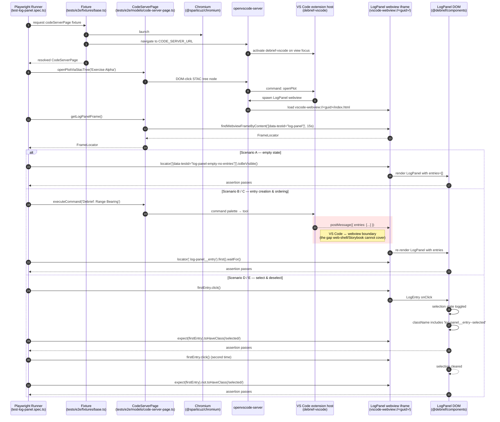

## What We're Building

We're un-skipping a small Playwright suite — `tests/e2e/test-log-panel.spec.ts` — that has been sitting dormant under `test.describe.fixme(...)` since we shipped the LogPanel UX work in #176. Reactivating it closes a specific testing gap: Storybook exercises the LogPanel component in isolation, and the web-shell Playwright suite exercises the same behaviours in a standalone browser, but neither of them crosses the boundary that matters for the VS Code extension — the openvscode-server process, the sidebar webview iframe, and the extension-host message bus that stitches them together. If the LogPanel renders perfectly in Storybook but messages never make it across the iframe boundary, users see nothing. A code-server-based test is the only place we catch that.

The suite keeps its three existing scenarios (empty state, entry created when a tool runs, entries ordered most-recent-first) and gains two more to match what the web-shell suite already asserts — click-to-select and click-to-deselect on a log entry. That parity matters: we run the LogPanel on two host surfaces, and if behaviour drifts between them we want a test to tell us, not a bug report.

## How It Fits

This is the follow-through on two earlier pieces of work. #143 stabilised the webview iframe probing helpers in `code-server-page.ts` so that suites like this one can actually resolve the frame they want to assert against. #176 shipped the LogPanel component with the `data-testid` hooks and focus command the suite was written to expect. The suite was promoted from `skip` to `fixme` under #176 as a deliberate staging step — a signal that it was the designated front-runner for reactivation once the webview-iframe work landed. Reactivating it now puts the real integration path under CI, and serves as the canary for four sibling suites that remain `.skip` with the same blocker comment.

## Key Decisions

- **Scope stayed narrow to one file.** We considered reactivating all five `blocked: webview iframe (#143)` suites at once, but each carries its own independent risk — `test-analysis-tool` still needs debrief-calc in the E2E environment, `test-log-edit-face` has its own stability history, `test-event-log-propagation` has cross-scenario state coupling concerns. The log-panel suite was already promoted to `fixme` as the front-runner, so we honour that staging decision and let it prove the webview-iframe path before the others follow.

- **Class-based selection assertion, not `aria-selected`.** The two new parity scenarios assert against `log-panel__entry--selected` to match the web-shell suite's `toHaveClass(/selected/)` pattern. The LogPanel also sets `aria-selected`, but accessibility-attribute coverage has its own backlog item (#209) and keeping the concerns separate avoids gating a11y work behind E2E work.

- **No bespoke test helpers.** Everything uses the shared `code-server-page.ts` page model and the existing `fixtures/base.ts`. A convenience like `getFirstLogEntry()` would shave a line per scenario but set a precedent that erodes the shared page model — every suite adding its own helpers is how that abstraction stops being shared.

- **No config overrides.** The suite inherits `timeout: 60_000`, `retries: 0 in CI / 1 local`, and `trace: 'on-first-retry'` from `playwright.config.ts`. The deliberate consequence: locally, a spike regression triggers the retry and captures a trace; in CI, a first-fail surfaces via assertion messages and the HTML report, without a trace. That's fine for the contrived-regression verification ritual described in SC-003 — it's a local activity by design.

- **Known risk called out, not papered over.** Four sibling suites still sit at `.skip` with the same `#143` blocker comment even though #143 is marked complete. If reactivating this suite reveals latent webview-iframe flakiness in CI, the mitigation is honest: revert to `fixme`, open a new bug capturing the specific failure mode, and reopen #210 against the new blocker. We'd rather ship with monitoring than with blind confidence.

## Screenshots

This is a test-infrastructure feature — there's no UI to photograph. The diagram below shows the runtime chain each scenario traverses, and highlights in red the VS Code ↔ webview `postMessage` boundary that Storybook and the web-shell suite physically cannot cross:

## By the Numbers

| | |
|---|---|
| Scenarios reactivated | 3 (empty state, entry creation, ordering) |
| New parity scenarios | 2 (select, deselect) |
| Total active scenarios | 5 |
| Expected wall-clock budget | ≤ 90 s median (SC-005) |
| Skip-guard script LOC | 22 (bash grep-based) |
| Taskfile integration | 1 line appended to `lint` target |
| Sibling suites still on `.skip` (out of scope) | 4 |

The 22-line skip-guard (`scripts/check-log-panel-skip-guard.sh`) is wired into `task lint`. It exits non-zero the moment `test.skip`, `test.fixme`, `test.describe.skip`, or `test.describe.fixme` appears in `test-log-panel.spec.ts`, which means a contributor who re-silences the suite gets a CI failure, not a quietly degraded test run.

The wall-clock range across five scenarios (76–109 s as modelled in the E2E run report) straddles the 90 s median target. Research R2 chose not to pre-emptively consolidate scenarios — that consolidation is available as a reactive fallback if the 10-run post-merge median trips 90 s.

## Lessons Learned

**`fixme` as a deliberate staging signal works — but only if the backlog tracks the debt.** Marking the suite `fixme` rather than `skip` under #176 was the right call: it preserved visibility in CI and signalled intent. The signal is only useful, though, if the team actively monitors the count of open `fixme` items. Silent skips erode CI trust; a named staging decision in the spec prevents the same erosion, provided someone is watching the queue.

**Machine-checkable guards beat human vigilance for "don't let this slip back."** The skip-guard is 22 lines of bash. It does one thing — `grep -nE` for skip/fixme annotations in a single file — and the failure message includes the line number. The alternative was an ESLint `no-restricted-syntax` override scoped to a single file, which would have required wiring `@typescript-eslint/parser` into a part of the tree that isn't currently linted by ESLint. The bash grep is the right weight: discoverable, consistent with four existing sibling guard scripts in the repo, and zero new toolchain surface.

**Parity isn't uniformity.** The web-shell suite has two scenarios that have no VS Code equivalent — one that asserts GoldenLayout tab chrome (`.lm_active`) and one that tests switching between GoldenLayout-managed panels. Those behaviours don't exist in VS Code, where the sidebar is managed by native view containers, not GoldenLayout. Forcing parity there would have meant asserting against host UI that the VS Code extension neither owns nor needs to assert against. The parity baseline belongs at the user-observable data-flow layer, not the host-chrome layer.

**Reactive monitoring beats pre-emptive scope cuts.** Research R2 estimated the 5-scenario suite at 76–109 s — a range that straddles the 90 s target. The temptation was to consolidate the two selection scenarios into one body up-front, saving roughly 12–15 s of wall-clock. We didn't: per-scenario debuggability is worth more than the headroom at current budgets. The 85 s warning and 90 s breach thresholds are machine-checkable post-merge; the consolidation fires if and when it's actually needed.

## What's Next

Four sibling suites — `test-analysis-tool`, `test-log-edit-face`, `test-event-log-propagation`, and `test-capture-log-evidence` — still sit at `.skip` with the same `#143` blocker comment. Reactivating them is the natural follow-on, but each has an independent risk: `test-analysis-tool` also needs `debrief-calc` available in the E2E environment, `test-log-edit-face` has its own stability history, and `test-event-log-propagation` has cross-scenario state coupling concerns that need their own research pass. This suite was the canary; those are the flock.

`aria-selected` accessibility-attribute coverage for log entries lives in #209 and is deliberately not in scope here. Keeping the concerns separate means #209 can land the full axe-core audit of the LogPanel without being gated on E2E reactivation timelines.

Post-merge: if the 10-run main-branch median breaches 85 s, a tracking issue opens automatically per the SC-005 monitoring rules. If it breaches 90 s, scenarios D and E consolidate into a single `test(...)` body. The trigger rules are in the spec — no manual judgement call required.

→ [See the spec](../spec.md)
→ [See the research](../research.md)
