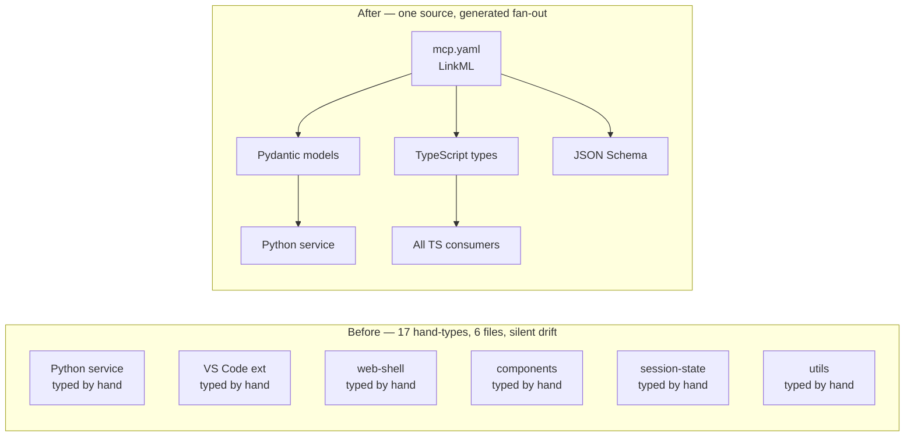

<!--
Cached opener for the feature post for #222 — Promote MCP transport envelopes to LinkML.
Written during /speckit.plan, read by /speckit.pr at ship time.
-->

## Hook

## What We're Building

The MCP transport envelopes — the request, response, discovery and replay shapes that flow between the Python service and every TypeScript consumer — have been hand-typed on both sides since the protocol landed. Seventeen declarations across six files, each claiming to describe the same wire format, with nothing connecting them. The two halves have been quietly free to drift; only a runtime crash would tell us they had.

This work promotes those envelopes to a single LinkML schema. After it lands, `MCPToolRequest`, `MCPToolResponse`, the discovery payloads and the replay log entries all live in one file, and Pydantic models, TypeScript types and JSON Schema are generated from it. Editing the wire format means editing one place, and CI fails loudly if any consumer is still reaching for a hand-typed shadow.

## How It Fits

This is the second slice of Epic E11 — Schema-First Boundary Typing — the programme that walks through every cross-language boundary in the repo and pulls its types back to a shared LinkML root. The first slice (#206) was the audit that found the drift; #222 closes the MCP cluster; siblings #223 (STAC), #224 (session-state), #225 (loader IPC), #226 (drift detection) and #227 (rollup) handle the rest. Verification reuses the audit scanner from #206 — success looks like zero rows attributed to #222 in the §3.1 envelope table and zero `ToolParameter` rows in §3.2.

## Key Decisions

- **`ToolName` becomes a LinkML enum, not a string.** The TS tool registry is retyped as `Record<SessionMCPToolName, ToolHandler>`, so adding a tool now requires touching both the schema and the registry — the compiler refuses to let one move without the other.
- **Function-type aliases stay in TypeScript.** `ToolExecutor` and `ToolVersionResolver` describe behaviour, not data on the wire, so LinkML is the wrong home for them. They move into a thin re-export module inside `@debrief/schemas` so the audit reclassifies them as schema-rooted without forcing them through a generator that has nothing useful to say about functions.
- **Two payload fields stay `Any` on purpose.** `MCPContentItem.structuredContent` and `MCPErrorResponse.data` are deliberate wildcards — the protocol promises nothing about their shape. We follow the precedent already set by `raw-geojson.yaml`'s `JsonObject` and document the gap as a known Constitution Article XV exception, not an oversight to be papered over later.
- **One file, three commits.** The schema lands as `mcp.yaml` with banner-separated sections — mirroring the `tool.yaml` convention — rather than being split per slice or appended to an existing file. The PR is one logical change but three bisect-safe commits: envelopes first, then discovery, then replay.
