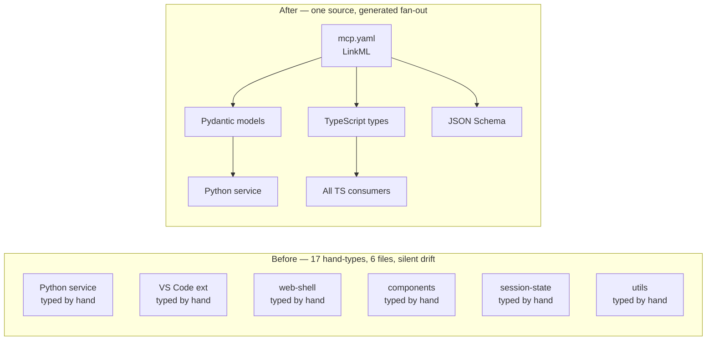

## What We're Building

The MCP transport envelopes — the request, response, discovery and replay shapes that flow between the Python service and every TypeScript consumer — have been hand-typed on both sides since the protocol landed. Seventeen declarations across six files, each claiming to describe the same wire format, with nothing connecting them. The two halves have been quietly free to drift; only a runtime crash would tell us they had.

This work promotes those envelopes to a single LinkML schema. After it lands, `MCPToolRequest`, `MCPToolResponse`, the discovery payloads and the replay log entries all live in one file, and Pydantic models, TypeScript types and JSON Schema are generated from it. Editing the wire format means editing one place, and CI fails loudly if any consumer is still reaching for a hand-typed shadow.

## How It Fits

This is the second slice of Epic E11 — Schema-First Boundary Typing — the programme that walks through every cross-language boundary in the repo and pulls its types back to a shared LinkML root. The first slice (#206) was the audit that found the drift; #222 closes the MCP cluster; siblings #223 (STAC), #224 (session-state), #225 (loader IPC), #226 (drift detection) and #227 (rollup) handle the rest. Verification reuses the audit scanner from #206 — success looks like zero rows attributed to #222 in the §3.1 envelope table and zero `ToolParameter` rows in §3.2.

## Key Decisions

- **`ToolName` becomes a LinkML enum, not a string.** The TS tool registry is retyped as `Record<SessionMCPToolName, ToolHandler>`, so adding a tool now requires touching both the schema and the registry — the compiler refuses to let one move without the other.
- **Function-type aliases stay in TypeScript.** `ToolExecutor` and `ToolVersionResolver` describe behaviour, not data on the wire, so LinkML is the wrong home for them. They move into a thin re-export module inside `@debrief/schemas` so the audit reclassifies them as schema-rooted without forcing them through a generator that has nothing useful to say about functions.
- **Two payload fields stay `Any` on purpose.** `MCPContentItem.structuredContent` and `MCPErrorResponse.data` are deliberate wildcards — the protocol promises nothing about their shape. We follow the precedent already set by `raw-geojson.yaml`'s `JsonObject` and document the gap as a known Constitution Article XV exception, not an oversight to be papered over later.
- **One file, three commits.** The schema lands as `mcp.yaml` with banner-separated sections — mirroring the `tool.yaml` convention — rather than being split per slice or appended to an existing file. The PR is one logical change but three bisect-safe commits: envelopes first, then discovery, then replay.

## By the Numbers

| | |
|---|---|
| Hand-typed cross-domain declarations removed | 17 |
| Drift-cluster members collapsed (`ToolParameter`) | 2 |
| New LinkML classes in `mcp.yaml` | 15 |
| New permissible-values enums in `mcp.yaml` | 4 |
| TS-only function-type aliases (schema-rooted) | 2 |
| Consumer files migrated to import-from-schemas | 7 |
| New MCP-cluster pytest tests | 54 |
| Python tests passing | 1941 |
| TypeScript (vitest) tests passing | 4160 |
| Calc-tool Playwright regression tests | 6 / 6 |
| New `as any` / `// @ts-expect-error` added | 0 |

The 54 new pytest tests cover round-trip (Python → JSON → Python) for all 15 classes, positive golden fixtures, negative fixtures (every class has at least one invalid case that produces a field-level `ValidationError`), and a forward-compatibility scanner for replay log fixtures that activates automatically once those fixtures land.

## Lessons Learned

The data-model spec was idealized. The actual TypeScript hand-types carried Debrief-specific extensions that hadn't been accounted for: `duration_ms` on tool responses, nested `error` objects in error payloads, `debrief:*` namespaced annotations on parameter schemas. Matching the live wire was strictly more useful than matching the spec, because the audit's goal is "no hand-typed cross-domain declarations" — not "perfect data-model compliance." Wherever the spec and the wire disagreed, the wire won.

`Omit<Base, X> & { X: tightened }` turned out to be the workhorse migration pattern. The schema base captures the wire format; the consumer narrows specific fields with TS-only literal unions or Debrief-specific payload types. The audit's R4 rule — any file importing from `@debrief/schemas` is reclassified as schema-rooted — makes this safe. Consumer narrowing doesn't constitute a hand-typed cross-domain declaration; it constitutes a consumer exercising the schema.

Free-form payloads are unavoidable when the protocol allows tools to return arbitrary JSON. The generator's `Any` → `unknown` post-processor lets the schema honestly say "this slot is open" without giving consumers an authored `Any`. That distinction matters: the schema documents the openness intentionally, rather than silently permitting it through type erasure. The two open slots are called out explicitly in the schema, not hidden.

The TS generator preserves slot names verbatim, which let us keep `duration_ms` (snake_case, from the live wire) and `mimeType` (camelCase, also from the live wire) inside the same generated interface without a naming convention fight. The convention is whatever the wire uses.

## What's Next

The sibling clusters from Epic E11 still need to land. #223 covers the STAC catalog hand-types; #224 covers session-state wire shapes (`StateSnapshot` and friends); #225 covers loader↔main IPC envelopes; #226 handles the residual drift clusters not owned by a domain phase; #227 is the Storybook and React-component Props rollup. Each follows the same pattern this one established — LinkML root, generated fan-out, R4 import-based audit classification. The type-audit scanner from #206 re-runs against each and reports zero attributed rows before the PR merges.

→ [See the code](https://github.com/debrief/debrief-future/pull/222)
