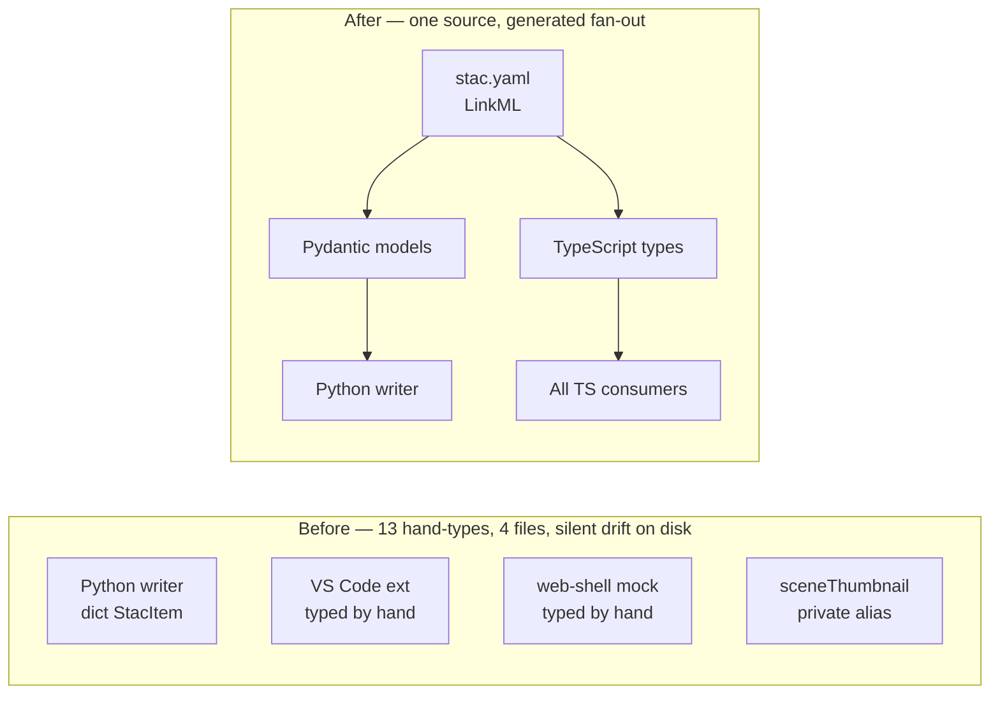

<!--
Cached opener for the feature post for #223 — Promote STAC catalog hand-types to LinkML.
Written during /speckit.plan, read by /speckit.pr at ship time.
-->

## Hook

## What We're Building

STAC catalog payloads — the `item.json`, `catalog.json` and `collection.json` files that record every plot in the local store — have been hand-typed on both sides of the Python ↔ TypeScript boundary since the catalog landed. Twelve interface declarations across four files, three separate copies of `StacItem`, and nothing connecting them. These files persist to disk between sessions: Python writes, TypeScript reads. A field added to one side and missed on the other doesn't crash — it silently drops on the next save.

This work promotes the cluster to a single LinkML source. After it lands, `StacItem`, `StacCatalog`, `StacCollection`, `StacLink`, `StacAsset`, `StacExtent`, `StacSummaries` and `StacProvider` all live in one file, and Pydantic models plus TypeScript types are generated from it. Every committed `item.json` under `preview/workspace/samples/local-store/` — 73 real files — has to load cleanly through the generated validators on both sides. That fixture-corpus test is the strongest evidence the schema captures the wire shape that actually ships, not a sanitised cartoon of it.

## How It Fits

This is the third slice of Epic E11 — Schema-First Boundary Typing — the same programme that #222 (MCP envelopes) closed last month. Same pattern, different cluster: the audit's drift table flags five sites in §3.1, seven more siblings are masked by the file-level R4 rule but still hand-written, and one inline alias rounds out the thirteen. All of them collapse onto one generated class per name. The audit's `cross-domain-hand-typed` count attributed to #223 drops from 5 to 0; the `StacItem` and `StacCatalog` drift clusters in §3.2 disappear entirely.

## Key Decisions

- **STAC 1.0 and 1.1 both accepted via additive optional fields.** The local stores currently ship 1.0; spec #241 (in flight) upgrades them to 1.1. Modelling `stac_version` as a string and making the new 1.1-only fields optional means #223 and #241 can land in either order — neither blocks the other.
- **`StacCatalog` and `StacCollection` are siblings, not parent and child.** Each declares its `type` slot with `equals_string`, which generates a TypeScript literal that makes `if (x.type === 'Collection')` narrow at the call site. Inheritance was tempting — Collection is structurally Catalog-plus-extras — but it captures the relationship wrong: a Collection's `type` is `"Collection"`, not `"Catalog"`.
- **Open-record extension slots, with eyes open.** `StacItem.properties`, `StacAsset` and `StacSummaries` all carry `additional_properties: true` so the `<namespace>:<key>` convention (`debrief:platforms`, `file:checksum`, `processing:datetime`, `proj:shape`) survives the boundary. Same Article XV.2 exception #222 used for `MCPContentItem.structuredContent`, applied where STAC's own spec is genuinely open.
- **Composition over re-declaration.** `StacItemProperties` mixes in the existing `StacExtensionProperties` from `stac-extension.yaml`; `StacItem.geometry` references the seven existing geometry classes from `geojson.yaml`. No re-declared shapes anywhere — the same rule that made #222 stick.
- **Python writes through Pydantic too.** `scripts/enrich-legacy-catalog.py` switches from `dict[str, Any]` constructions to Pydantic class constructions. Field-name typos now fail at write time, not three releases later when somebody finally notices the missing key in the tree view.
- **Out of scope, and named.** The camelCase `StacItemSummary` adapter (#214 follow-up) and the STAC 1.1 wire-format work (#241) both touch adjacent files, but neither is in this feature. Calling them out keeps the diff honest and the reviewer's job small.
