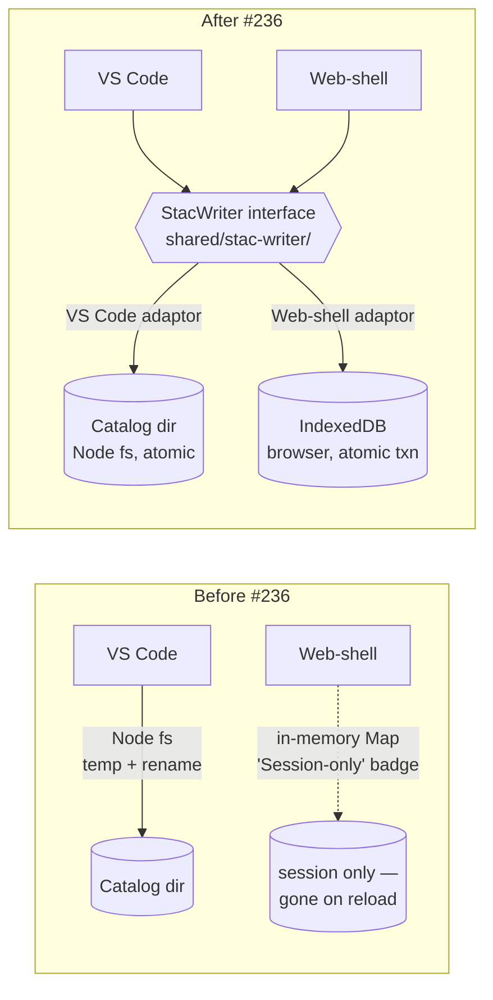

## Hook

## What We're Building

The web-shell has been carrying a yellow "Session-only" badge since #215 — a polite warning that anything you capture in a Storyboard, every metadata edit, every track you draw, vanishes when you reload the tab. Honest, but it meant the web-shell couldn't really be the primary preview surface we wanted. You can't run a Storyboarding demo on a host that forgets the demo halfway through.

This feature gives the web-shell a real write path, entirely inside the browser. Capture a scene, reload — the scene is still there, with its thumbnail, its viewport, its time. Edit a description in the Properties Panel, reload — the edit survives. Draw a new track, reload — it lands in the catalog as a new STAC item with its GeoJSON sibling asset, indistinguishable from one created in VS Code. The badge goes away in any browser with a healthy IndexedDB; it stays put — telling the truth, with a more specific message — in private mode, on quota exhaustion, or under a policy that blocks the store outright.

## How It Fits

The user-visible win is "captures persist", but the structural win is the bit I'm more pleased about. Both hosts now route writes through a single TypeScript `StacWriter` interface in a new `shared/stac-writer/` package. Today each host carries its own atomic-write code: `sceneThumbnailService.writeAtomic` in the extension, a temp+rename helper buried in `stacService.updateItemMetadataSync`, and a session-only `Map` in the web-shell that pretends to be persistence and isn't. After this work there's one interface, owning the operation surface, the error taxonomy, and the overlay-merge semantics; each host keeps a thin backend-specific adaptor — Node fs in VS Code, IndexedDB in the browser. The web-shell stays a pure static site; the persistence promise survives a deploy to GitHub Pages, with no server in the loop. It mirrors the host-adaptor pattern that's already pulling its weight in `services/session-state/`, and it pre-authorises whatever comes next — OPFS, mobile, a future server-backed host — as a new adaptor rather than a refactor.

## Key Decisions

The interface lives in `shared/stac-writer/` rather than inside either host. `shared/` is browser-safe by convention, which forces the interface to use `Uint8Array` for asset bytes and to keep Node-only types out of its surface — exactly the discipline a cross-host contract needs. The web-shell adaptor's IndexedDB schema runs to four object stores: small item records in one, asset blobs in another, GeoJSON payloads in a third, and a small key-value bag for capability flags and persistence-grant state. IndexedDB's per-transaction atomicity does the load-bearing work; a Storyboard capture (two PNGs plus an item-record patch) lands as a single transaction, so a failure mid-flight cannot leave the catalog with metadata pointing at a missing asset.

Conflict policy stays last-write-wins — the same model VS Code already uses, reused via mtime fingerprints — and cross-tab updates ride on a `BroadcastChannel` that carries notifications, not payloads, so the bus stays cheap and version-coupled to nothing. The bundled sample catalog is treated as read-only demo content: user edits land as shallow-merge overlays in IndexedDB, new items live entirely in IndexedDB, and the bundled bytes are never modified. When the bundled catalog is updated upstream, the user's overlay still applies — fields the user touched continue to win, fields they didn't pick up the upstream changes silently. It's the simplest mental model that doesn't lose information.

A constitutional amendment rides along. Article IV.2 — "frontends never persist" — has been quietly bent since #174, because a session-only `Map` *is* persistence within a session, and IndexedDB makes the bend explicit. The new IV.4 clause re-anchors the principle: the writer abstraction is the persistence boundary, not the host. Browser-native stores qualify as a persistence backend only when accessed through the unified interface. Drafting it once now, with the writer as Exhibit A, beats re-litigating the principle every time a new host shows up. Two new dependencies (`idb`, ~5 KB; `fake-indexeddb`, test-only) carry their Article IX justification with them — the cost of not taking them is more code, not less.

What's deferred is honest about the shape of the problem. Catalog zip export — "take your captures with you", round-trip back to VS Code — is the natural Phase 2 follow-up. OPFS, cross-device sync, and conflict resolution beyond LWW are separate problems, and naming them as separate keeps this spec's surface small enough to review.
