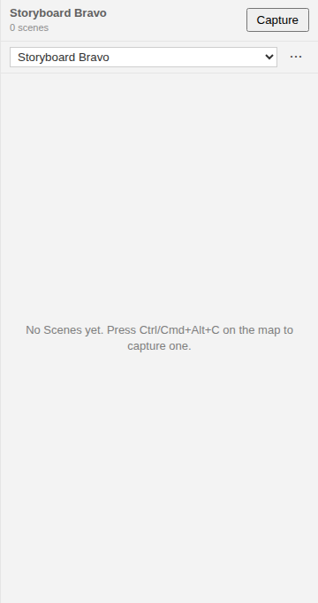
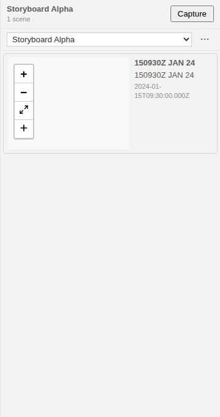

| Yesterday's behaviour | After #237 |
|---|---|
| Close a plot mid-analysis on Storyboard B. Reopen it tomorrow — you land on Storyboard C, because someone tweaked C ten minutes ago. | Reopen the plot — you land back on Storyboard B, the one you actually had open. |
| Every reopen pays a small re-orientation tax: scan the dropdown, find your Storyboard, click. | The dropdown still works the same. You just don't need it on open. |

## What We're Building

When you have a plot with several Storyboards and you close it halfway through working on one, reopening should put you back where you were — not on whichever Storyboard happened to be edited most recently. That's the whole feature. The dropdown in the side-rail header is unchanged; the only difference is which entry is selected when the plot first opens.

This is a follow-up to #235, which deliberately left active-Storyboard selection ephemeral and noted it "may be revisited if analysts complain about losing selection across sessions." We're acting on that deferral. It's a small change in lines of code and a small change visually — the kind of correctness improvement you only notice if it's missing.

## How It Fits

The selection lives **inside the plot file itself**, as a `SystemState` GeoJSON Feature in the FeatureCollection — the same LinkML pattern that already models `temporal`, `spatial`, and `selection` viewport state. We added one new permitted variant (`active_storyboard`) and one optional slot (`active_storyboard_id`) to the schema; both edits are strictly additive, so existing plot files validate unchanged. The shared `StoryboardPanel` React component stays untouched and host-agnostic. Persistence wiring lives in the host mount layers — `StoryboardPlaybackService` in the VS Code extension and `StoryboardPanelMount` in the web-shell — and routes writes through the existing `@debrief/stac-writer` plot-edit pipeline that #235 / #236 / #242 already use for every Storyboard / Scene CRUD operation. The plot file is the sync layer, so a pin set in VS Code is honoured the next time the file opens in web-shell, and vice versa.

## Key Decisions

- **In-plot SystemState over per-host config.** An earlier draft of this spec proposed per-host stores (`@debrief/config` for VS Code, `localStorage` for web-shell). On `/speckit.review` we pivoted: the existing `SystemState` LinkML pattern was already schema-defined for non-spatial state (and unconsumed by production code) — the active-Storyboard pin became its first runtime client. The plot file is the single source of truth, no per-host sync infrastructure needed, and pins follow the plot file when it's moved or copied.
- **No schema bump on `StoryboardFeature`.** The other backlog option was to add an `is_active` boolean slot to `StoryboardFeature` itself. Tempting — it lives with the data — but wrong: it would put UI-state on the data Feature, allow multiple Storyboards to be `is_active: true` simultaneously (no schema invariant prevents it), and miss the point of the existing `SystemState` pattern. We extended `SystemStateTypeEnum` and `SystemStateProperties` instead, which is purely additive.
- **Per-plot SHARED semantics, not per-user.** Two analysts opening the same plot file see the same pinned selection (last-writer-wins). Collaborative review is a first-class case for Debrief, and "what was the last analyst looking at?" is the answer the panel should restore. Per-user-within-shared-plot view memory is captured as a separate backlog item (#251) for separate evaluation if real workflows demand it.
- **Three pure helpers, no adapter abstraction.** `isActiveStoryboardSelection`, `getActiveStoryboardSelection`, and `setActiveStoryboardSelection` live in `@debrief/components/storyboard` next to the existing `isStoryboardFeature` / `getActiveStoryboardDefault` family. They're pure FeatureCollection transformations — no I/O, no React, no host coupling — so the host mount layers own the actual save through the existing plot-edit pipeline.
- **The shared panel stays unchanged.** All persistence is at the mount layer. `StoryboardPanel` keeps its current `activeStoryboardId` / `onActiveStoryboardChange` props and stays portable to other hosts (Jupyter, Loader, Storybook) without forcing them to bring a store along.
- **Silent on success and on failure.** No restoration banner — if a reader notices the new behaviour, the feature has failed at being invisible. Read failures fall back to today's default-selection rule; stale IDs (Storyboard deleted in another session) silently self-heal on the next plot open via an open-time write; write failures inherit the existing `@debrief/stac-writer` failure UX from #236 / #242.

## Screenshots

*Before — first open of a plot that's never been pinned. The panel shows `getActiveStoryboardDefault()`'s pick (the most-recently-modified Storyboard), exactly as today.*

*After — same plot, after the analyst pinned a different Storyboard, closed it, and reopened it. The header lands on the pinned entry; the Scene list reflects it. No banner, no "restored" affordance — silence is the success state.*

## By the Numbers

| | |
|---|---|
| Helper unit tests (V-1 through V-5 + US3 cross-plot independence) | 21 |
| VS Code service-level tests (`storyboardPlayback.persistence`) | 9 |
| Web-shell wiring tests (`activeStoryboardPersistence`) | 9 |
| Playwright E2E (US1 happy-path + US2 single-Storyboard guard) | 2 |
| New schema fixture (`system-state-active-storyboard-01.json`) | 1 |
| Existing schema fixtures regressed | 0 / 802 |
| New runtime dependencies | 0 |

The schema change is strictly additive — one enum value, one optional slot — so the existing 802 LinkML / Pydantic / round-trip / golden-fixture cases pass unchanged.

## Lessons Learned

**The `SystemState` LinkML pattern was already there, defined but unconsumed.** Our first sketch reached for the obvious tools — `@debrief/config` on VS Code, `localStorage` in the browser — and built a per-host adapter abstraction around them. Then `/speckit.review` pointed at `shared/schemas/src/linkml/geojson.yaml` and asked where `temporal` viewport state lives today. The `SystemState` class had been schema-defined since the earliest LinkML work, with permitted variants for `temporal`, `spatial`, and `selection`, and zero runtime clients in production code. The active-Storyboard pin became its first. Lesson: grep the schema source before designing a new persistence backend.

**Pure helpers + existing pipeline beats a new abstraction.** The previous draft proposed an `ActiveStoryboardSelectionStore` interface, two host adaptors, an ESLint exception for direct `localStorage` access, and a conformance suite to keep the implementations honest. Path D needed none of it — three pure functions on the FeatureCollection plus the `@debrief/stac-writer` pipeline that #236 / #242 already deliver. The writer-boundary invariant (Article IV.4) is satisfied by reuse, not by a new allowlist entry.

**State-pin acts don't belong in the provenance chain.** First instinct was to record a provenance entry on every pin write, since other Feature mutations do. FR-014 pulled it back: pinning a view is a state-pin act, not a content edit, and treating it like one would pollute plot diffs with UI-state churn. The `SystemState` feature has its own optional `provenance` slot in the schema; we leave it empty.

## What's Next

Two follow-ups already in the backlog:

- **#249 — unify session-state with the `SystemState` pattern.** Now there's a runtime consumer of `SystemState`, the `@debrief/session-state` store can fold its `temporal` / `spatial` / `selection` slices into the same in-plot persistence path. The Zustand-backed split was always a placeholder; the pattern was waiting for a proof point.
- **#251 — per-user-within-shared-plot view memory.** Path D is deliberately per-plot SHARED. If a workflow asks for "remember *my* last view of this plot, separately from the team's", that warrants a user-identity model the project doesn't yet have. Backlogged for separate evaluation rather than retrofitted here.

→ [See spec 237](https://github.com/debrief/debrief-future/tree/main/specs/237-active-storyboard-persistence)
