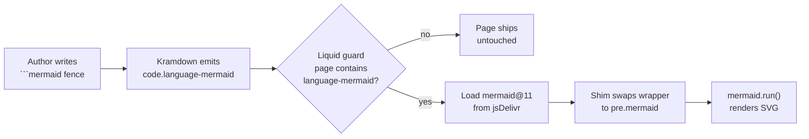

# Spec: Mermaid Diagram Rendering in Future Debrief Blog Posts

**Spec number:** 239
**Branch:** `claude/research-mermaid-diagrams-0gl5e`
**Created:** 2026-04-26
**Status:** Implementation pending merge of `debrief/debrief.github.io#90`. Decision recorded as ADR-026 in `docs/project_notes/decisions.md`.

## Problem

Future Debrief feature blog posts have, since at least the **Generate Courses and Speeds Tool** post in February 2026, been authoring Mermaid diagrams using ` ```mermaid ` fenced code blocks. Three shipped posts already contain such fences (specs `061`, `210`; `217` references one in evidence). On GitHub previews of the source markdown they render as proper diagrams; on the published site at `debrief.github.io` they shipped to readers as raw text.

The cause: `_layouts/future-post.html` on the Jekyll site had no Mermaid wiring. Kramdown emitted the fence as `<pre><code class="language-mermaid">…</code></pre>` and nothing further processed it. A user-supplied screenshot on 2026-04-26 confirmed the `2026-04-24` log-panel-E2E post was rendering the `sequenceDiagram` source as a wall of text.

## Decision

Render Mermaid client-side, in the layout, via the jsDelivr CDN, gated to only fire on posts that contain a `language-mermaid` code class. Authors continue to write standard ` ```mermaid ` fences in `specs/NNN/media/shipped-post.md` — no new authoring syntax. The `/publish` pipeline is unchanged. Full options analysis and rejected alternatives recorded in ADR-026 and the research spike at `docs/project_notes/mermaid-in-blog-posts.md`.

## How the Pipeline Now Works



## Implementation

A single Liquid-gated `<script type="module">` block, ~12 lines, appended to `_layouts/future-post.html`. Submitted as `debrief/debrief.github.io#90`. The block:

1. Imports `mermaid@11` from jsDelivr (pinned major).
2. Walks every `code.language-mermaid` element, builds a fresh `<pre class="mermaid">` from its text content, and replaces the outermost kramdown wrapper (`div.highlighter-rouge` → `pre` → fallback) with it.
3. Calls `mermaid.initialize({ startOnLoad: false, theme: 'default' })` and `await mermaid.run()`.

The Liquid `` guard ensures non-diagram posts (the majority) load zero extra bytes.

### Implementation note on layout structure

`_layouts/future-post.html` does **not** contain `</body>` — it sets `layout: future-default` in its front matter, and `_layouts/future-default.html` owns `<html>`, `<head>`, `<body>`. The script block was therefore appended at the end of `future-post.html` (after `</main>`), which lands inside `<body>` near the end of the rendered page. `type="module"` defers execution until DOM parse completes, so `mermaid.run()` still finds all the `<pre class="mermaid">` elements. This delegation pattern is now recorded in `docs/project_notes/key_facts.md` so future briefs don't repeat the assumption.

## Trade-offs and Rejected Alternatives

- **Vendoring `mermaid.min.js` into the website repo** (Option A2 in the spike). Originally preferred to satisfy the constitution's offline-by-default principle. Owner clarified the public marketing site is explicitly an online-only surface — that principle applies to *core platform functionality* (services, schemas, file IO), not the project's website. Vendoring would cost ~600 KB of git history per upgrade for no reader benefit.
- **Pre-rendering to SVG inside `/publish`** (Option B). Would add a Node + Puppeteer/Chromium dependency to the publish step and require backfill of three already-published posts. Worth revisiting only if diagrams later need to appear in non-HTML contexts (RSS feed, PDF export) or the site moves to a custom Actions Jekyll build.
- **Custom Liquid tag** (`…`). Rejected: would break GitHub's native preview of the source post and force the technical-specialist agent to learn a new syntax. The whole point of using Mermaid is that ` ```mermaid ` fences render everywhere they're seen.

## Consequences

- **Retroactive fix.** All three already-published posts that contain Mermaid fences (#061, #210, plus #217's evidence pages if linked) start rendering as soon as the website-repo PR merges. No backfill needed in this repo.
- **Per-page cost is gated.** The Liquid guard means non-diagram posts pay zero bytes for mermaid.js. Only diagram-bearing posts trigger the CDN fetch.
- **Authoring guideline updated.** `.claude/agents/media/technical.md` and `docs/CLAUDE-media-agents.md` now state that Mermaid renders both in GitHub previews and on the published site, removing the previous implicit "GitHub-preview-only" framing.
- **CDN is a soft external dependency.** If jsDelivr is blocked or down, diagrams degrade to the pre-existing raw-text fallback — non-fatal and consistent with current behaviour.

## Verification Plan

After `debrief/debrief.github.io#90` merges and Pages rebuilds:

1. Visit `https://debrief.github.io/future/2026/04/24/un-skipping-the-webview-log-panel-e2e-suite.html`. The `sequenceDiagram` in the body should render as a real diagram, replacing the raw text seen on 2026-04-26.
2. Open any post without a Mermaid fence; view source. There must be no `cdn.jsdelivr.net/npm/mermaid` script tag — the Liquid guard should keep that page untouched.
3. DevTools console must be clean on both pages.
4. On a narrow viewport, diagrams should be horizontally scrollable (Mermaid's default behaviour).

## Origin

Ad-hoc research spike triggered by an owner request on 2026-04-26 to investigate "how we can include Mermaid diagrams in the blog articles we post at the end of every spec/feature". Originally captured under sentinel spec number `999` to avoid consuming a real backlog slot; renumbered to `239` on 2026-05-01 (with a retroactive `BACKLOG.md` entry) so the speckit `NNN-slug` convention stays aligned with the live numbering sequence and the sentinel does not confuse future automation.

## Related

- Implementing PR: [`debrief/debrief.github.io#90`](https://github.com/debrief/debrief.github.io/pull/90)
- Decision record: ADR-026 in `docs/project_notes/decisions.md`
- Research spike: `docs/project_notes/mermaid-in-blog-posts.md`
- Layout-architecture key fact: `docs/project_notes/key_facts.md` § "Website Repo (debrief.github.io) — Layout Architecture"
- Staged patch (reference): `docs/project_notes/mermaid-website-patch/`
