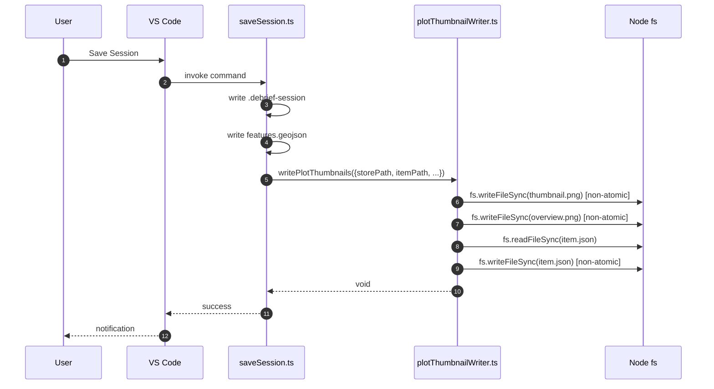
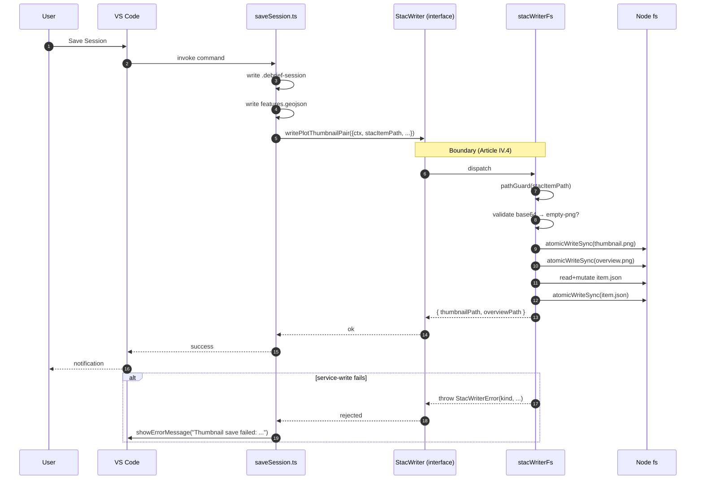

# Integration Flow: saveSession Thumbnail Persistence (#242)

## Before — Spec 241 half-step

The shim sits inside the extension process; even though it is typed,
the bytes hit disk via Node fs primitives that the writer interface is
supposed to be the only authorised callsite for. Any future host (web,
Electron) would need a parallel implementation.

## After — Spec 242 closure

Every byte that lands in the catalog now crosses the same writer
boundary as scene thumbnail writes, item patches, and asset writes.
Adding a new host means implementing the same interface once — no
divergent shim to keep in sync.

## Service-Boundary Audit Trail

| Concern | Before | After |
|---------|--------|-------|
| Persistence callsites in `apps/vscode` | 2 (writer + shim) | 1 (writer only) |
| Atomic writes | `fs.writeFileSync` (non-atomic) | `atomicWriteSync` (temp + rename) |
| Error taxonomy | `Error` swallowed by `console.warn` | `StacWriterError` with discriminated `kind`; surfaced to user (Article I.3) |
| Path traversal guard | none | `pathGuard()` at the boundary |
| Empty-payload guard | none (writes 0-byte PNGs) | `StacWriterError('empty-png')` |
| Future hosts (web, Electron) | would need a duplicate shim | implement `writePlotThumbnailPair` once |

## What did *not* change

- Catalog shape — `assets.thumbnail` / `assets.overview` produce identical
  fields (`title`, `proj:shape`, `file:size`, `file:checksum`, multihash
  `1220` + sha256 hex) as the deleted shim. Existing golden fixtures pass
  unchanged.
- `properties.created` preservation + `properties.updated` refresh policy.
- `features.geojson` and `.debrief-session` write paths (out of scope).
- Python `services/stac` MCP surface — still has its own
  `thumbnails.store_thumbnail()` for the eventual MCP-client path
  (deferred TODO #137).
