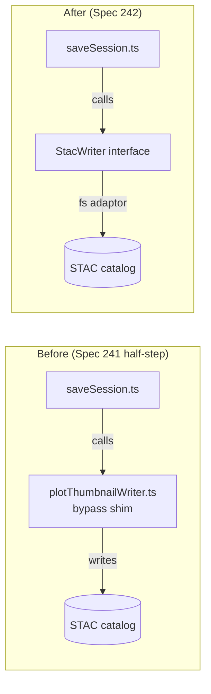

## Hook

## What We're Building

Spec 241 shipped STAC 1.1-compliant thumbnails but left a loose end: `plotThumbnailWriter.ts`, a shim that writes plot thumbnail assets directly to the filesystem from inside `saveSession.ts`, bypassing the `StacWriter` unified persistence boundary. The comment in the code was explicit — this was a deliberate half-step, intended to be removed in a follow-up.

This spec is that follow-up. We add `writePlotThumbnailPair()` to the `StacWriter` interface, move the shim's logic verbatim behind it in the VS Code filesystem adaptor, and delete the shim. The `saveSession` command receives the writer via constructor injection and calls the interface method. Observable behaviour of "Save Session" is unchanged; the catalog shape is byte-identical.

## How It Fits

`StacWriter` is the single authorised persistence boundary for all STAC item and asset writes (Constitution Article IV.4). Every host — VS Code today, Electron and a possible web client later — implements the interface once against its native backend; nothing else in the system owns a write code path. `plotThumbnailWriter.ts` violated that rule by giving the VS Code extension a second, divergent path. Closing it means thumbnail writes now flow through the same boundary as scene thumbnail writes, STAC item updates, and every other persistence operation — one place to audit, one place to swap out when the MCP client (TODO #137) eventually arrives.

## Key Decisions

- **`writePlotThumbnailPair()` is a new method, not an overload of `writeSceneThumbnailPair()`** — scene thumbnails carry a `sceneId` and write to a keyed asset slot; plot thumbnails use fixed asset keys (`thumbnail` / `overview`) and a different asset shape. Reusing the same method would conflate two distinct contracts.

- **Web-shell adaptor throws, not no-ops** — `stacWriterIdb.ts` throws `StacWriterError('validation-failed')` because plot thumbnail captures require a Leaflet `MapPanel` that only exists in the VS Code host. A silent no-op would hide bugs; a clear error surfaces them.

- **No Python changes** — the Python MCP server already has `thumbnails.py:store_thumbnail()`, fully tested. But the VS Code extension has no MCP client yet (TODO #137), so routing through Python is out of scope. The service boundary for Spec 242 is the TypeScript `StacWriter` interface, not the Python process. When #137 lands, the `stacWriterFs.ts` implementation can be replaced without touching any callers.

- **Catalog parity verified by existing tests, not new fixtures** — the implementation moves the shim's logic verbatim (same asset shape, same multihash SHA-256 checksum algorithm, same filenames). The existing `test_thumbnails.py` golden fixtures remain unchanged; passing them is sufficient evidence of parity.

- **Constructor injection, not a service locator** — `createSaveSessionCommand()` receives `stacWriter: StacWriter` alongside its existing params, following the injection pattern used throughout the extension.
