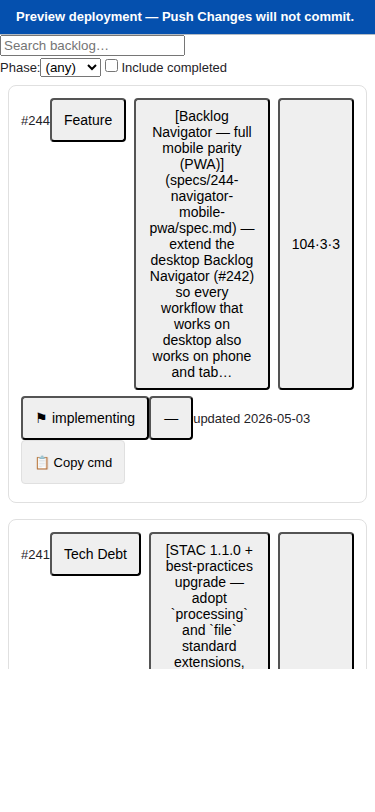
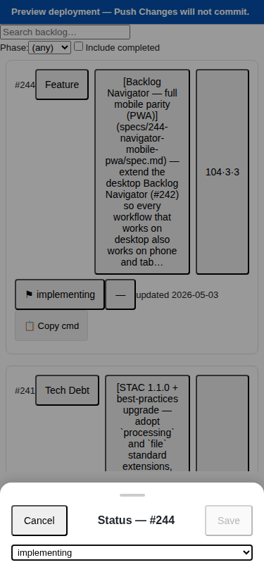
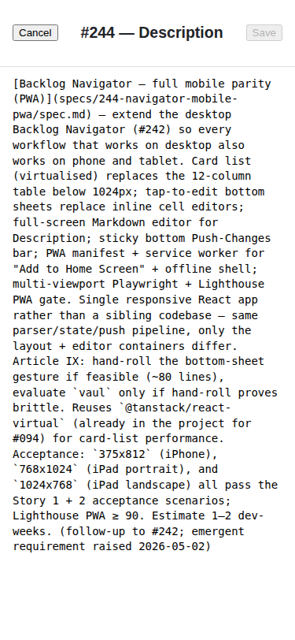
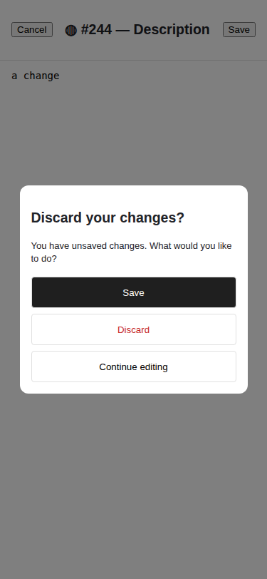
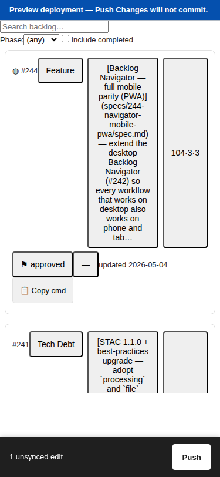
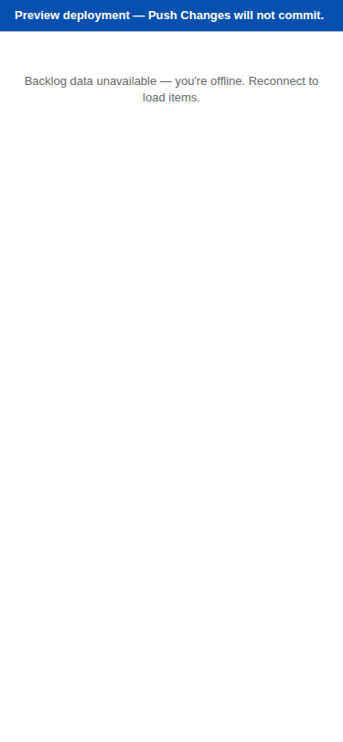

# Usage example — Backlog Navigator on a phone

This walks through the analyst flow that motivated #244: an analyst on
their phone during a stand-up needs to find a backlog row, change its
status, edit the description, and push to GitHub — without switching
apps or rotating to landscape.

All screenshots below are captured at iPhone 12 viewport (`375 × 812`)
by `e2e/mobile/screenshots.mobile.spec.ts` using Playwright + the
sparticuz Chromium build.

## 1 — Browse and find

The analyst opens the deployed navigator URL on their phone. The card
list renders with one card per row, virtualised so even 230+ items
scroll smoothly. Each card shows the ID + Category + Description +
Score (Total + V·M·A) + Status + Epic + Updated date — and (new in
#244) a status-sensitive **Copy cmd** button that puts the
appropriate `/speckit.<verb> <id>` into the clipboard.

To find row #244 quickly, type into the search field at the top.
Phase + Include-completed filters narrow the visible cards using the
same selector that powers desktop.

## 2 — Tap a chip to edit

Tapping the Status chip on any card opens a bottom sheet sliding up
from the bottom of the viewport. The sheet has a drag handle, a
header with Cancel / Save buttons, and the same editor controls
that desktop uses inside the sheet body.

Picking a new status flips the Save button on. Tapping Save commits
the edit and closes the sheet — the card now shows the new value and
a small ◍ dirty marker. (The same edit made via the desktop inline
editor produces byte-identical output to BACKLOG.md — proven by the 5
round-trip tests in `byteParityBottomSheet.test.tsx`.)

The sheet dismisses three ways:
- **Drag down** more than 80 px on the handle.
- **Tap outside** the sheet (on the backdrop).
- **Tap Cancel** in the sheet header.

If there's a pending change when the user dismisses, a discard-confirm
dialog appears asking Save / Discard / Continue editing — same dialog
that fires when the layout mode crosses the 1024 px breakpoint mid-edit
(Issue 1A regression guard).

## 3 — Edit the long Description in a full-screen editor

Tapping the Description region of a card opens a full-screen Markdown
editor. The textarea uses a monospace font so the raw Markdown
structure is obvious; embedded Markdown links, escaped pipes (`\|`),
and tables all round-trip cleanly through the parser.

Cancel with unsaved changes triggers the same discard-confirm dialog:

## 4 — Push from the phone

After one or more edits, a sticky bottom Push-Changes bar appears
showing the dirty count. The bar sits above the iPhone home bar via
`env(safe-area-inset-bottom)` — never gets clipped on iPhone X+. When
no edits are pending, the bar is unmounted entirely (FR-010) so it
doesn't take up viewport space.

Tapping Push opens the same PushDialog as desktop — commit message
prompt, conflict detection (HTTP 409), and PR opening flow are
inherited unchanged from #242 (FR-016).

## 5 — Quickly task Claude Code (emergent feature)

Each card has a status-sensitive **Copy cmd** chip. Tapping it copies
a slash command to the clipboard, ready to paste into a Claude Code
session:

| Status | Copies |
|--------|--------|
| `proposed`, `needs-interview` | `/speckit.start <id>` |
| `approved` | `/speckit.specify <id>` |
| `specified` | `/speckit.clarify <id>` |
| `clarified` | `/speckit.plan <id>` |
| `planned` | `/speckit.review <id>` |
| `tasked`, `implementing`, `blocked` | `/speckit.implement <id>` |
| `complete`, `parked`, `rejected` | (button hidden) |

The chip flashes "✓ Copied" for 1.5s after a tap. This was added
mid-implementation in response to a review comment ("from a phone I
want to fast-task Claude on a backlog item without typing the spec ID").

## 6 — Install as a PWA

The browser surfaces an "Add to Home Screen" affordance once the app
has been visited. Installed, the app launches in standalone mode (no
browser chrome) and the cached app shell loads even when the device
is offline.

When a new version is deployed, the next launch surfaces a top-of-
viewport "An updated Backlog Navigator is ready." banner with Reload
+ Dismiss. Reload calls Workbox's `skipWaiting` then reloads to the
new SW version (FR-020). Dismiss closes the banner for the session
only — the next page navigation re-fires the prompt so the user
isn't stranded on a stale build.

## What's identical to desktop

- Parser, state model, push pipeline — all reused unchanged.
- Round-trip output to `BACKLOG.md` is byte-identical for any
  equivalent edit (5 + 4 round-trip tests gate this).
- Conflict-detection wording on push failure.
- All edit semantics — only the edit container changes (bottom sheet
  vs. inline cell vs. full-screen modal).

## What's mobile-specific

- Card-list layout (replaces desktop table below 1024 px).
- Bottom-sheet editors with drag-down dismiss.
- Full-screen Markdown editor.
- Sticky bottom Push bar (replaces top-bar Push button on mobile).
- PWA manifest + service worker + update prompt.
- Mobile-only filter bar (Phase + Include-completed + free-text search).

## What's new across both layouts

- **`includeCompleted` view-state field** — exposed via a new
  checkbox in the desktop FilterBar so desktop users keep access to
  complete rows after the new "hide complete by default" behaviour.
- **`phase` view-state field** — Triage / Ready / Active / Done
  groupings (per FR-011, post-#243-aware). Today only the mobile
  filter bar exposes it; desktop will inherit when #243 ships.
- **Default sort: Updated descending** (was ID descending) — per
  FR-013.
- **Status-sensitive copy-speckit-command chip on mobile cards** —
  emergent requirement.
