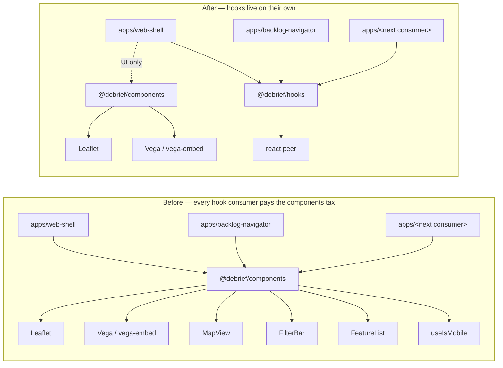

## Hook

## What We're Building

`@debrief/hooks` is a new pnpm workspace package that holds React hooks with no UI surface area. On day one it ships exactly one hook — `useIsMobile`, a thin `matchMedia` wrapper — lifted out of `@debrief/components`. React 18 is a peer dependency; there is no `react-dom` peer, no Storybook, no Vite, no Playwright. The build is plain `tsc`, the tests are Vitest with jsdom, and the dev-dep surface is deliberately small.

The story isn't "a new package exists". It's that any future app that wants to read a viewport breakpoint no longer has to import a barrel that transitively pulls Leaflet, Vega, `MapView`, `FilterBar`, and `FeatureList`. Today, two consumers (`web-shell` and `backlog-navigator`) get away with this on tree-shake. The trigger for the work is a third consumer arriving — spec-navigator going mobile, or `apps/loader` — at which point "tree-shake will sort it" stops being a defensible answer.

## How It Fits

The monorepo already has a precedent for tiny, dependency-light leaf packages: `@debrief/utils`. `@debrief/hooks` mirrors that model exactly — same build pipeline, same test runner, same shape of `package.json`. `pnpm-workspace.yaml`'s existing `shared/*` glob picks the package up with no config change. Three import sites get rewired, two consumer manifests gain a `workspace:*` line, and `@debrief/components` keeps a one-line `@deprecated` re-export so nothing breaks in flight. The durable artefact is the package boundary itself, documented in the new README and an ADR — that's where future contributors will look when they're deciding whether a hook belongs in `hooks` or in `components`.

## Key Decisions

- **Trigger-gated, not speculative.** Two consumers don't justify the move; three do. We're staging the work behind the next mobile-aware app landing, not extracting on principle.
- **One barrel export, no subpath gymnastics.** `import { useIsMobile } from '@debrief/hooks'` and nothing else. Keeps the public surface honest as more hooks arrive.
- **React 18 as peer only.** No `react-dom`, no DOM-only hooks. The package stays SSR-tolerant; `useIsMobile` already has a defined-window guard, and the tests now cover that path explicitly.
- **One-cycle deprecation re-export.** Article XIV would permit a clean break, but a `@deprecated` re-export from `@debrief/components` is cheap insurance against in-flight branches.
- **Other hooks stay put.** `useTheme` and `useSelection` are component-coupled — moving them would create the wrong kind of boundary. The rule the README codifies: a hook belongs in `@debrief/hooks` only if it has no UI dependencies and no coupling to component-internal state.
- **Net-positive on coverage.** `useIsMobile` had zero tests in its old home. The new package ships with SSR-fallback, initial-match, breakpoint-cross, custom-breakpoint, and listener-cleanup cases.
