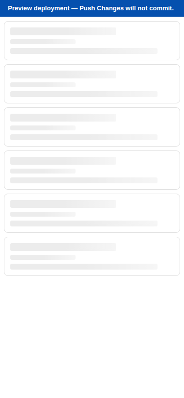
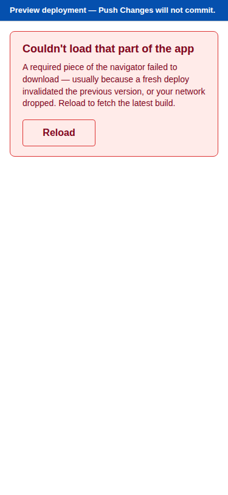

# Usage Example: Lazy-load mobile chunk (#247)

This walkthrough shows the lazy split in action — both the user-visible
side (skeleton → card list) and the developer-side bundle-guard contract.

## 1. The user view

### Cold mobile load

A first-time visitor opens the Backlog Navigator on a phone (viewport
< 1024 px). The browser fetches the entry chunk, which now contains
**none** of the `src/components/mobile/*` modules. While the mobile
chunk is still in flight, the navigator paints a skeleton card list:



A few hundred milliseconds later the chunk resolves and the skeleton is
swapped for the real card list — no full-page reload, no layout jump.

### Cold desktop load

A user on a desktop (≥ 1024 px) opens the navigator. The DevTools
network panel shows the entry chunk being fetched, but **no request is
ever made** for any chunk whose path matches `mobile-*.js` /
`CardList-*.js` / `MobileFilterBar-*.js` / `StickyPushBar-*.js` /
`BottomSheetEditor-*.js` / `DescriptionEditorScreen-*.js`. The desktop
visitor pays for nothing they don't render.

### Stale-deploy or network drop

If the mobile chunk URL embedded in the running session goes stale (a
fresh deploy invalidates it before the user has reloaded) or the
network drops mid-fetch, the lazy boundary surfaces a recovery panel
rather than a permanent skeleton:



The Reload button calls `window.location.reload()`, which fetches the
fresh entry chunk + fresh chunk URLs in one go.

## 2. The developer view — the bundle-guard contract

The bundle-budget guard introduced in #244 (which sums every JS file in
`dist/assets/`) is now manifest-aware. It identifies the desktop entry
chunk via `dist/.vite/manifest.json` and gzip-measures **only that file**
against the baseline:

```text
$ node scripts/check-bundle-size.mjs

Bundle-size guard for backlog-navigator
---------------------------------------
Entry chunk:             assets/index-CSnrj-tG.js
Baseline (gzipped):      126,009 B  (commit fddf210)
Current  (gzipped):      126,009 B
Delta:                   +0 B  (0.00%)
Budget (15% over):       144,910 B
Headroom:                +18,901 B

All chunks (informational):
  assets/BottomSheetEditor-zGyiYCU5.js     (lazy)        1,246 B
  assets/CardList-BgRlerGd.js              (lazy)        6,583 B
  assets/DescriptionEditorScreen-BPXBgj4v.js (lazy)        774 B
  assets/MobileFilterBar-DCkMST7d.js       (lazy)          738 B
  assets/StickyPushBar-Ch4XrnsJ.js         (lazy)          492 B
  assets/index-CSnrj-tG.js                 (entry)     126,009 B
  assets/virtual_pwa-register-VF3oMs-1.js  (lazy)          642 B
  assets/workbox-window.prod.es5-vqzQaGvo.js (lazy)        2,395 B

OK: entry chunk within budget.
```

Every chunk is printed for human review; the `(entry)` / `(lazy)`
annotation makes the split visible, and only the entry-chunk number
contributes to the budget verdict.

The CLI exit codes are unchanged from the pre-#247 contract:

- `0` — entry chunk within budget
- `1` — entry chunk exceeds budget
- `2` — configuration error (missing manifest, missing baseline,
  unexpected number of entry chunks, etc.)

CI's existing handling of "non-zero = fail" continues to work without
changes.

## 3. Re-running locally

```sh
# Build the navigator (writes dist/.vite/manifest.json automatically).
pnpm --filter @debrief/backlog-navigator build

# Run the bundle-size guard.
node scripts/check-bundle-size.mjs

# Run the unit tests for the new lazy boundary + chunk-error boundary.
pnpm --filter @debrief/backlog-navigator test

# Run the Playwright E2E for the lazy boundary (auto-provisions a bundled
# Chromium via @sparticuz/chromium for cloud / CI use).
cd apps/backlog-navigator && CLAUDE_CODE=1 node run-playwright.mjs lazy-mobile-chunk

# Or — locally with a host-installed Chromium:
pnpm --filter @debrief/backlog-navigator test:e2e lazy-mobile-chunk
```
