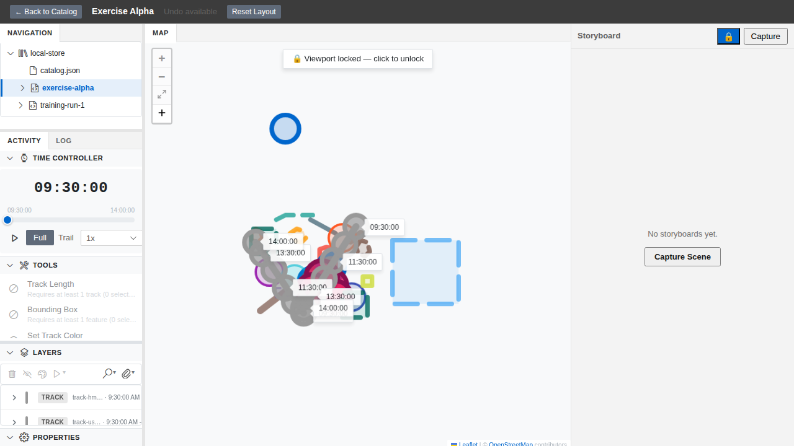
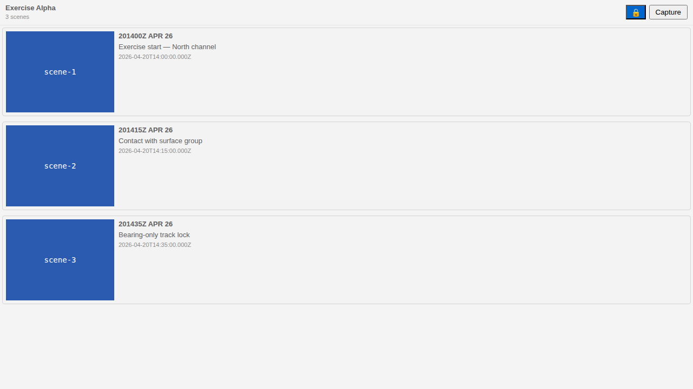
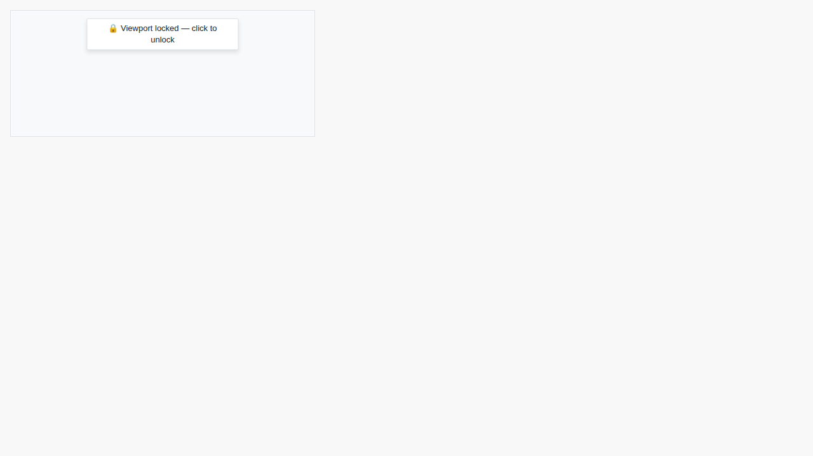

## What We're Building

A small padlock on the Storyboard panel that freezes the map's centre and zoom for the rest of the session. With it on, you can step time forward, switch display modes, toggle visibility, change the selection, capture a scene, repeat — and every thumbnail in the series comes out framed exactly the same. Scroll the wheel, double-click, hit the fit-to-window button, even ask an external tool to fly somewhere else: the map doesn't budge until you unlock it.

That's it. It's a single boolean, but it's the boolean that turns "capturing a story" from a careful-don't-touch-anything exercise into something you can do confidently while you concentrate on the analysis you're actually telling.

## How It Fits

The viewport lock sits at the seam between session state and the map. One new field — `viewportLocked` — on the `SpatialSlice` in `@debrief/session-state` is the source of truth; the `MapView`, the `LeafletToolbar`, the Storyboard panel header, and the MCP `setViewport` tool all read from it and react. It's runtime-only — deliberately excluded from the persisted session via a `Pick` over `SpatialSlice` so a reload always comes back unlocked, and force-cleared on plot load for the same reason. This is the third and final layer of viewport-stability work on the storyboarding track: PRs #623 and #625 stopped the map drifting *accidentally* (see `docs/project_notes/viewport-mutation-audit.md` for the receipts); this gives the analyst an *intentional* guarantee on top.

## Key Decisions

- **Snapshot-and-restore the Leaflet handlers, don't blanket-enable on unlock.** Lock-on records which of the six gesture handlers were enabled, disables all six, and unlock re-enables only the snapshotted set — so a host that had keyboard nav off for its own reasons doesn't get it turned back on as a side effect.
- **`VIEWPORT_LOCKED` as a typed error code on `setViewport`, not a thrown exception.** External MCP callers get a machine-detectable, additive signal; existing callers that never lock the viewport see no behaviour change at all.
- **A keyboard shortcut on the map div, not on Leaflet's keyboard handler.** Leaflet's keyboard handler is one of the six things lock disables — so the `L` shortcut to toggle lock lives on the React root instead, and stays reachable when everything Leaflet-driven is frozen.
- **Banner across the top of the map, padlock in the panel header, disabled tooltips on the toolbar buttons.** Three surfaces, one state — chosen so the lock is impossible to forget you turned on, and so every place that *would* have moved the map now tells you why it won't.

## Screenshots

The Storybook E2E and web-shell Playwright suites produce these into `evidence/screenshots/` as part of CI. A couple have landed already; the rest will appear when the E2E run completes against the merged branch.

**Locked map banner** — the `🔒 Viewport locked — click to unlock` bar that runs across the top of the `MapView`. The banner renders as a `role="status"` region with `aria-live="polite"`, so it announces itself to screen readers when it appears.

**Storyboard panel padlock** — the padlock toggle sitting immediately left of Capture in the panel header. `aria-pressed="true"` when locked, `aria-pressed="false"` when not; disabled when no plot is loaded.

**Banner in isolation (light theme)** — the standalone `ViewportLockBanner` component story, which the E2E suite exercises across light, dark, and VS Code themes.

**Multi-scene thumbnails** — the goal state: three scene thumbnails captured at different simulation times, all sharing one centre and one zoom level. This is the capture workflow the lock exists to support.

The interaction GIF (`evidence/screenshots/interaction.gif`) — lock → capture → advance time → capture → unlock — will land with the full E2E run.

## By the Numbers

| | |
|---|---|
| New / extended tests for this feature | 27 |
| Tests failed | 0 |
| Tests skipped | 0 |
| Total TypeScript tests passing | 3,582 |
| Total Python tests passing | 1,952 |
| New runtime dependencies | 0 |
| New LinkML schema fields | 0 |
| Source files touched | ~10 (3 in `session-state`, 4 in `shared/components`, 3 across the two apps) |
| Ephemeral spatial fields excluded from persistence | 3 (up from 2 hand-reset fields before this PR) |

## Lessons Learned

**The third layer of viewport stability.** PRs #623 and #625 stopped the map drifting accidentally — race conditions during Leaflet initialisation that only manifested under capture timing pressure. They needed two rounds and a careful site-by-site audit (now in `docs/project_notes/viewport-mutation-audit.md`) to close. But that work left an unresolved question: what stops the analyst themselves from accidentally nudging the frame mid-capture series? The answer turned out to be a separate concern requiring a separate mechanism. Stopping accidental drift is necessary; giving the user an explicit lever is the piece that makes the guarantee intentional.

**Snapshot-and-restore beats blanket-enable.** The naive unlock would call `.enable()` on all six Leaflet handlers — drag, scrollWheel, doubleClick, touch, box, keyboard. That would silently re-enable a handler a host had deliberately turned off for its own reasons (a measurement-tool mode, say, where keyboard scrolling is suppressed). The fix is one `useRef` that captures the pre-lock enabled state and one `for` loop that restores only what was on. It's a small amount of code, but it preserves an invariant that a blanket-enable would destroy quietly. When you toggle a flag, the inverse operation isn't always "set to true" — it might be "set to what it was."

**`Omit<>` at the persistence boundary beats hand-resetting fields.** Two pre-existing ephemeral spatial fields — `drawingMode` and `drawingPaletteIndex` — were hand-reset to `null` and `0` inside `extractPersistentState` before this PR. The pattern worked, but it meant that adding a third ephemeral field (as this PR does) meant remembering to add another manual reset. Applying Article IV.5 — boundary types derived, not rewritten — and widening the existing `Omit<>` to cover all three in one union changes the invariant from "remember to reset" to "the type system enforces exclusion." Adding a fourth ephemeral spatial field in the future is a one-line union edit, and a regression that re-introduces any of the three surfaces as a test failure.

**The `L` shortcut lives on the React root, not on Leaflet's keyboard handler.** This is a consequence of the locking mechanism itself. The Leaflet keyboard handler is one of the six things lock disables — so binding the escape shortcut to it would be self-defeating (pressing `L` to unlock would be silently ignored while locked). The shortcut needs to live above the layer it controls. That's a general principle: when you disable a subsystem, the controls that can escape that disable must live outside it.

## What's Next

The `L` key is the first single-letter binding on the map. The second one shouldn't re-litigate the same binding questions from scratch — backlog item #261 captures the convention work: a `useMapKeyboardShortcut(key, handler, opts)` hook in `@debrief/components` plus an ADR for reserved keys, so that future shortcuts accumulate against a coherent pattern rather than being decided case by case.

Backlog #262 is the cross-host viewport-mutation guard layer. The lock explicitly scopes out the host-internal mutation sites enumerated in `docs/project_notes/viewport-mutation-audit.md` Section E — the UI cannot reach those sites while locked, so it's a safe scope boundary for now. #262 formalises a thin `viewportGuard.ts` wrapper around the B1–B10 internal sites as a defence-in-depth measure for when a future feature exposes one of those paths to the UI mid-lock.

→ [Spec](../spec.md)
→ [Evidence](../evidence/)
