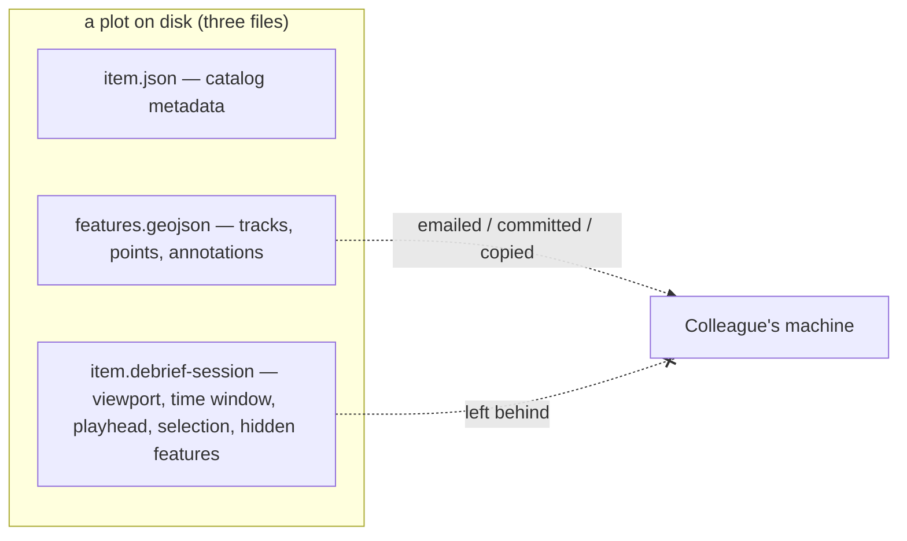
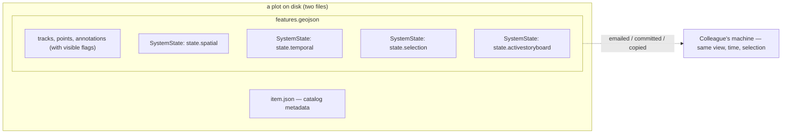

<!--
Hook form chosen: paired before/after mermaid flowcharts of the on-disk
layout. This is a backend/persistence feature with no UI surface, so the
architectural change IS the story. A topological diagram makes the whole
point land at a glance — three files collapsing to two, and the state that
used to be stranded in the sidecar now sitting inside the FeatureCollection
that actually travels. A before/after table was the runner-up but loses the
"the sidecar disappears" punch; capability bullets were rejected because the
payoff reads as a single thing ("the plot file finally carries its own
state"), not a list of separate wins. No screenshot exists or would help.
-->

## Hook

**Today** — a plot is three files on disk, and the one that holds your interactive state is the one that doesn't travel:

**After** — the sidecar is gone. A plot is two files, and the entire interactive view rebuilds from `features.geojson` alone:

## What We're Building

When you save a plot today, the part of it you were actually looking at gets left behind. The map viewport, the analytical time window, the playhead position, the feature selection, which features you'd hidden — all of it lives in a sibling file, the `item.debrief-session` sidecar, that gets stripped the moment the plot leaves your machine. Email a colleague the GeoJSON, pull it from a STAC catalogue, check it out of git, copy it to a USB stick, and they open it on the default global view, a default time window, and an empty selection. The portable artefact — `features.geojson` — carries none of the state that makes the plot *yours*.

This work deletes the sidecar entirely. Every field it held is given a proper home: plot state (viewport, time window, playhead, selection, active storyboard) becomes a handful of `SystemState` Features written directly into the FeatureCollection, addressed by deterministic ids like `state.spatial` and `state.temporal`; per-feature state — visibility — becomes a `visible` flag on the individual feature it describes, so hiding a track travels with that track; and genuinely ephemeral runtime — whether you're currently playing, transient drawing mode, a viewport lock — simply isn't persisted, and defaults cleanly on load. After this, a plot is exactly two files, `item.json` and `features.geojson`, and the whole interactive state is reconstructable from the GeoJSON alone. Hand a colleague a single file and they open it exactly where you left it.

## How It Fits

This is the payoff of two principles the project has held from the start: schema-first single source of truth, and the plot file as the one portable, canonical artefact. Until now those principles were quietly contradicted by the sidecar — a second persistence path that split plot state across two files, only one of which travelled. The fix generalises a pattern that already shipped for a single case: #237 introduced the `SystemState` Feature for the active-storyboard pin, and this work makes that the general home for *all* non-spatial plot state. The same shape on disk, the same deterministic addressing, now covering spatial, temporal, and selection too. It also substantially narrows a separate planned piece of work — web-shell session persistence — because the VS Code extension and the browser web-shell now read and write the same FeatureCollection through one shared helper, rather than each carrying its own persistence path.

## Key Decisions

- **Everything that looked like "session state" is actually plot state.** The earlier assumption that playback speed, step size, the time filter, and display mode were *per-user* preferences turned out to be wrong: they describe the data being replayed, not the person replaying it, so they belong to the plot. Once that lands, the design collapses — there is no residual per-user bucket left for the sidecar to hold, which is precisely why the sidecar can be deleted outright rather than merely shrunk. No replacement store.

- **One shared read/write helper, not one per host.** Both frontends — the VS Code extension and the web-shell — go through a single helper that owns reading and writing every `SystemState` variant. #237's host-private writer is folded into it. Plot-load and plot-save become the only two places this state is touched, so the two hosts can never drift into divergent persistence behaviour.

- **Exploration never marks the plot dirty.** Panning, zooming, scrubbing the time cursor, changing the selection — none of these flag unsaved changes. Merely *looking* at a plot should never nag you to save. An explicit Save still commits the current view; only substantive content edits drive the unsaved-changes prompt. The state is captured in memory as you explore and persisted only when you choose to save.

- **Visibility lives on the feature, not in a separate list.** Hiding a track sets `visible: false` on that track and records it in the track's own provenance log. We accept that the provenance grows a little as the price of visibility travelling *with* the feature it describes — a hidden track stays hidden when the plot moves, with no separate hidden-list to keep in sync.

- **Strict on import.** A malformed or self-contradictory saved state — a playhead sitting outside its own time window, say — fails loudly with a clear error that names the offending feature. Never a silent default, never a quiet clamp. If the plot file claims something impossible, you find out immediately and you find out where.
