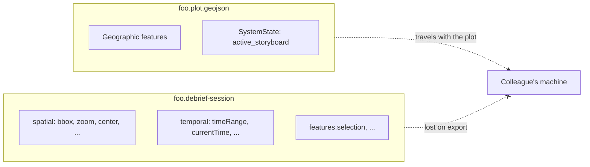
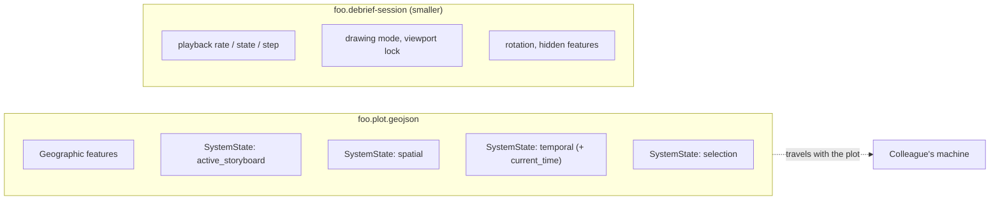

<!--
Hook form chosen: paired mermaid flowcharts (before/after) showing where
plot state lives today vs. after this work. The feature has no UI surface
and no screenshot worth showing — the architectural change IS the story,
and a topological diagram makes "fragmented across two files" vs. "lives
in the plot" visible at a glance in a way prose can't. A before/after
table was the runner-up but loses the spatial intuition of "things move
into the plot file"; capability bullets were rejected because the user-
visible payoff (a colleague's bbox/playhead/selection restoring on your
machine) reads as one thing, not many.
-->

## Hook

**Today** — plot state is split across two files, and three of the four schema-defined SystemState variants have no runtime producer at all:

**After** — three of the four variants the schema already models start being written. Colleagues' bbox, time window, playhead, and selection ride inside the plot file itself:

## What We're Building

When you save a plot today, three things you'd expect to travel with it don't. The map view your colleague was looking at, the time window they had scoped, and the features they had selected all live in a sibling file — the `.debrief-session` sidecar — that gets stripped on email export, on publication to a STAC catalog, on `git add`, on a USB hand-off. Open the same plot on another machine and you land at the default global view, a default time window, and an empty selection. The plot file itself carries none of this, even though the schema has had a place for it since #215.

This work moves those three things — spatial viewport, temporal viewport, and selection — out of the sidecar and into the plot file as `SystemState` Features, using the same shape that #237 introduced for the active Storyboard pin. The schema gains exactly one new field along the way (`current_time`, so the playhead position rides too), and the sidecar shrinks to just the per-machine concerns it should always have been about: playback rate, drawing mode, viewport lock, and so on. The user-visible payoff is small but pointed: a colleague hands you a plot file and you open it on the bbox, the time window, the playhead, and the selection they were last looking at — no second file required.

## How It Fits

#237 was the first time a non-spatial bit of state was deliberately persisted *inside* a plot file rather than alongside it — the active Storyboard pin became a `SystemState` Feature, web-shell wrote it, and the precedent was set. The LinkML schema had already modelled four variants of `SystemState` (`active_storyboard`, `spatial`, `temporal`, `selection`) since #215, but only the first one had a runtime producer. This work activates the other three: same pattern, same shape on disk, both hosts (VS Code and web-shell) producing and consuming, and #237's host-private writer in web-shell folded into a single shared helper that owns all four variants. Constitution Article II.1 (single source of truth) gets tighter — the schema is finally telling the truth about what lives where.

It also narrows the scope of #250 (web-shell session-state parity) as a side effect: once the plot-shared half of session state lives in the plot file, web-shell already has the read/write surface for it via the existing plot file pipeline, and #250 collapses to "what per-user state, if any, does a browser tab need to remember?" #251 — the per-user-within-a-shared-plot question, where the strongest candidate is selection — remains on the horizon as a future override layer that would sit *on top of* this migration, not replace it.

## Key Decisions

- **Selection migrates as plot-shared, now.** The approval question on selection (Q1) resolved to Option B — ship it as plot-shared rather than defer behind #251. If #251 later commissions a per-user override, it will layer on top of this migration, not revert it. Maximises the single-source-of-truth payoff today.
- **The schema grows by exactly one field — `current_time` on the temporal variant.** The approval question on temporal (Q2) resolved to Option B — the playhead position rides with the plot, so a colleague opening the plot lands at the moment you were scrubbed to. The new field is optional, so older fixtures and #237's already-shipped `active_storyboard` plots stay valid against the bumped schema.
- **Scrubbing the playhead does NOT mark the plot dirty.** The conservative read of "save vs. modified" is preserved (FR-017). `current_time` is captured in memory as you explore, but only persisted into the plot file when you take an explicit save action — same as every other plot-level change. No "every drag of the slider marks the file modified" pathology.
- **The sidecar is not being retired.** Per-machine concerns — playback rate, drawing mode, viewport lock, map rotation, the hidden-features set — have no schema home and stay in the sidecar. Sidecar retirement is a separate decision that depends on resolving every remaining per-user-vs-shared question, and this work deliberately doesn't try to land both at once.
- **One shared SystemState helper, not one per host.** #237's writer lived inside `apps/web-shell/`, which was fine when only one host produced one variant. With four variants × two hosts, that shape would have meant either duplicated code or unmaintainable drift. The shared helper lives in `services/session-state/` (the package both hosts already depend on for the in-memory store), and #237's host-private writer is folded into it as part of this work. Plot-load and plot-save become the only two places SystemState reads and writes happen, regardless of which host you're in.
