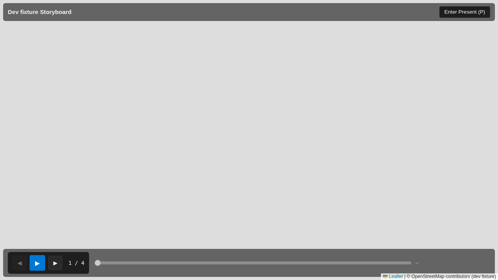
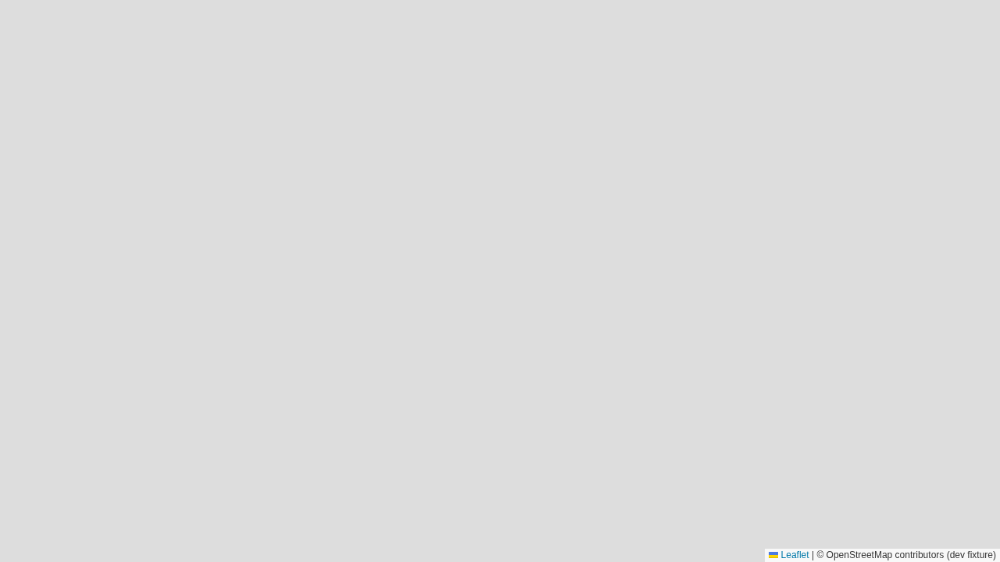
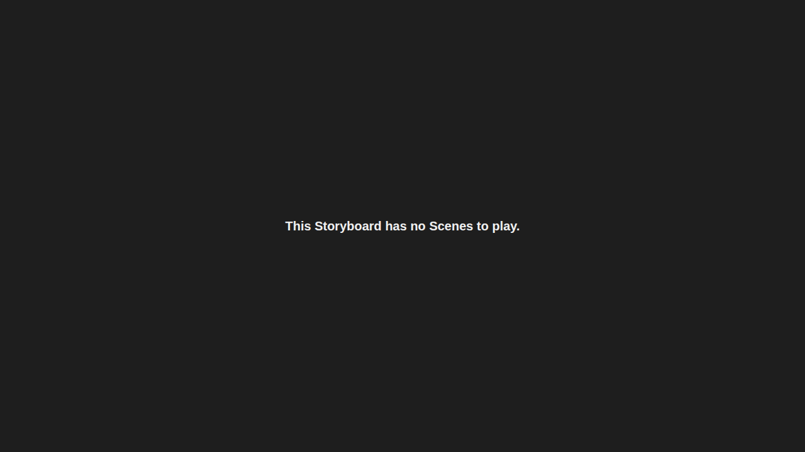
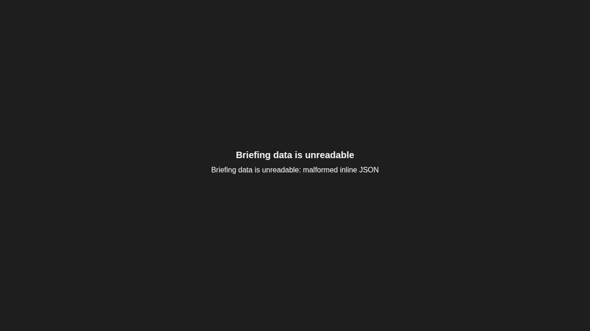
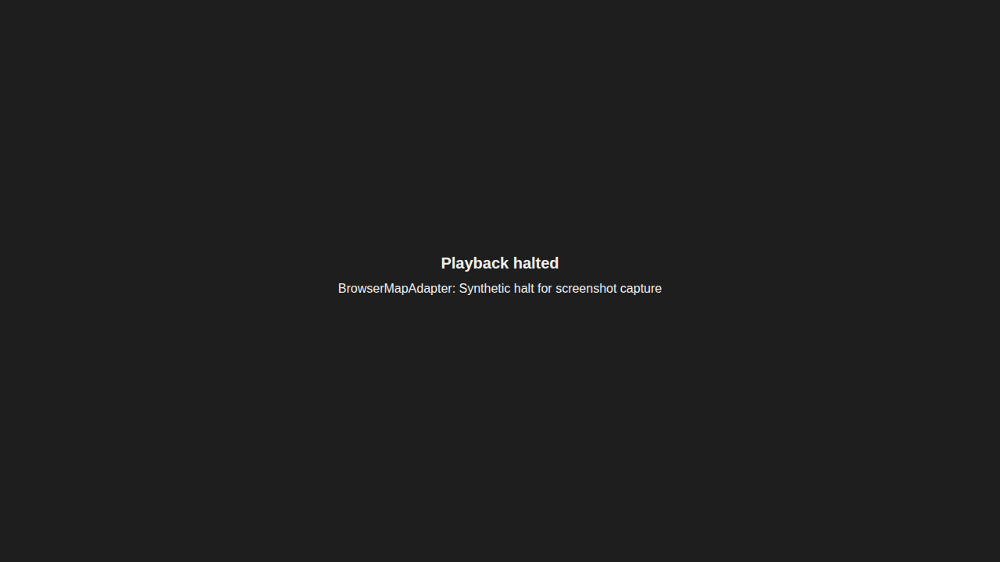

## What We're Building

A briefing leaves Debrief as a single `.zip` file. The recipient unzips it on any machine with a modern browser — a classified workstation, a stakeholder's laptop, a training-room PC with the network cable out — double-clicks `index.html`, and the Storyboard plays. Same Scene order, same viewport tweens, same time-slider scrub through every time-range Scene from #263, same per-frame track motion. No install, no extension host, no server, no network call. The zip carries its own basemap tiles, its own Scene thumbnails, its own GeoJSON, its own SPA.

Two viewing modes live behind a hover-revealed toggle. Minimal shows a transport bar (play, pause, next/previous Scene) and a scrubber, for an interactive walkthrough where the audience wants to stop on a moment. Present hides every control and lets the map fill the screen, for the room where the briefer is talking and the screen should just be the picture. Mode survives the toggle; playback position survives the toggle; nothing about the rendering changes between them — only what chrome is on top.

## How It Fits

The briefing renderer is the second consumer of the Storyboard playback engine that #217 and #258 built and #263 extended for time-range Scenes. The new SPA at `apps/briefing-renderer/` (sibling to `apps/backlog-navigator/` and `apps/spec-navigator/`) composes a small SPA-local playback driver around the host-agnostic `runTimeRangeTween` primitive that #263 already placed in `shared/components/`, and adds four browser-side port adapters: Map, SessionStore, PanelView, TimeRangeView.

The VS Code extension still owns the full `StoryboardPlaybackService` it has always owned — promoting it into `shared/components/` is queued as a follow-up refactor once the briefing driver settles. The export command lives in the extension as `debrief.storyboard.exportAsBriefingZip`, and the pre-built SPA bundle ships as a static resource inside the extension so every export is reproducible from the version of the tool that produced it.

## Key Decisions

- **Inline the data, don't `fetch()` it.** Browsers restrict `fetch()` from `file://` origins by design. The export injects `features.geojson` and `item.json` into `index.html` as `<script type="application/json">` blocks, and binary assets (Scene thumbnails, basemap tiles) load through ordinary relative `` and Leaflet `TileLayer` paths — which `file://` allows. This is the pattern that lets the zip work on a totally cold machine.
- **Pre-fetch tiles per Scene at export time, including the interpolation path.** Each Scene's captured viewport and zoom give a tile set; for time-range Scenes we sample the viewport tween between `viewport_start` and `viewport_end` and union the coverage so mid-scrub pans never hit a missing tile. The bytes go in `tiles/{z}/{x}/{y}.png`. The zip is the basemap server.
- **Boundary types derived, not re-listed.** `BriefingFeatureCollection = StoryboardPlot`; `BriefingItemJson` is a strict subset of the source plot's STAC item.json. Constitution Article IV.5 — boundary types derived, never rewritten — applies; future fields on the source flow through automatically rather than disappearing silently into a recipient's briefing.
- **One new dependency: `jszip`.** Pure JS, MIT-licensed, no native binaries, used only at export time inside the VS Code extension. Considered shelling out to `zip(1)` and rejected on cross-platform grounds (Windows hosts).
- **Export per Storyboard, not per plot.** The command lives on the Storyboard's own overflow menu — there is no ambiguity about which one you exported, even when a plot accumulates several over an exercise's iteration. The scoping pass walks the chosen Storyboard's `SceneFeature` references and includes only the features they actually touch.
- **Browser scope narrowed to current Chrome and Edge on desktop.** The original four-browser matrix (add Firefox + Safari) doubled the loader work for a marginal audience gain. The supported pair shares the same `file://`-origin loading rules; the SPA's boot-time browser probe surfaces a banner naming the supported browsers when opened in Firefox / Safari / mobile — Article I.3, no silent failure. Captured as ADR-NEW (2026-05-20).
- **A SPA-local playback driver instead of a full service hoist.** The 983-line `StoryboardPlaybackService` is tightly bound to `vscode.Event` and `vscode.workspace.fs`. Rather than do the lift right now and risk breaking the authoring extension, the briefing renderer ships a ~150-line driver that composes the host-agnostic `runTimeRangeTween` primitive directly. The driver wraps every adapter call in a try/catch that surfaces a visible "playback halted" state on a throw (Article I.3). When the full hoist lands as a follow-up the briefing renderer can swap in the shared service and delete the local driver.

## Screenshots

> Captured by the briefing-renderer's own Playwright suite at
> `apps/briefing-renderer/playwright/tests/briefing-zip-screenshots.spec.ts`.

| Minimal mode (default) | Present mode |
|:-:|:-:|
|  |  |

| Empty state | Error state | Playback halted |
|:-:|:-:|:-:|
|  |  |  |

## By the Numbers

- **One new SPA workspace** at `apps/briefing-renderer/` — Vite + React 18 + Zustand + react-leaflet 4.2 — ~1 200 LOC TS including tests.
- **New VS Code command surface**: `debrief.storyboard.exportAsBriefingZip` + a 6-step orchestrator (`scopeStoryboard`, `buildItemJson`, `computeTileCoverage`, `fetchTiles`, `injectInlineData`, `assembleZip`).
- **42 vitest cases** for the briefing SPA (loader, probes, adapters, driver, failure-mode wrappers, TransportBar) + **40 vitest cases** for the VS Code export pipeline (scope, item.json, tile coverage, inline-data injection, zip assembly, fetcher, orchestrator integration, multi-Storyboard scenarios) + **9 new MapView vitest cases** for the four `file://`-friendly props (`errorTileUrl`, `maxZoom`, `noWrap`, `tileLayerCrossOrigin`).
- **Playwright spec coverage** for the SPA: `file://`-origin boot, zero external requests across load → play → toggle → replay (SC-002), instant + time-range Scene transport, 10 consecutive Present ↔ Minimal toggles (SC-005), failure-mode surfaces, plus the evidence-screenshot producers.
- **One new runtime dependency** (`jszip ^3.10.1`) in the VS Code extension; no new dependencies in the SPA beyond React, Leaflet, react-leaflet, and Zustand.

## What's Next

- **Hoist the full `StoryboardPlaybackService`** out of `apps/vscode/` so both the authoring environment and the briefing renderer share one engine end-to-end. The SPA-local driver becomes a deletion at that point.
- **PMTiles basemap** (#272) when zip size becomes a real transport problem — the integer-zoom-only policy in #264's research caps typical zips around 50 MB but very large Storyboards may exceed that.
- **MP4 / GIF export** (#265 — research spike) for the audience that wants a recorded playback rather than an interactive one.
- **Bidirectional time-range scrubbing** in the briefing SPA's time slider — the slider currently reads the engine's frame-by-frame writes; letting the user *drag* it backwards through a tween is the next polish step.
