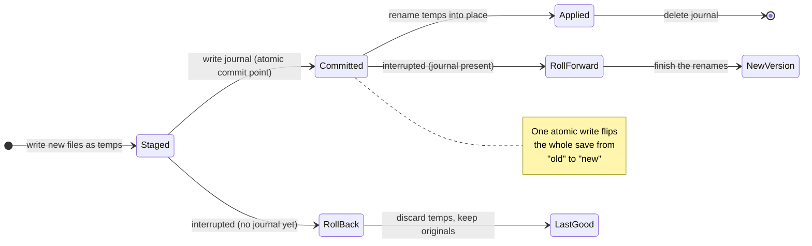

## Hook

## What We're Building

Saving a plot looks like a single action, but under the hood it is several separate writes — the feature collection that holds your tracks, the STAC metadata that describes them, and the thumbnail images that preview the plot. Today those land one at a time, and the app says "Plot saved" before the last of them is on disk. So if anything goes wrong partway through — the disk fills up, a permission is denied, the browser's storage quota is hit, or the machine simply dies mid-write — you can be left with a plot that is quietly broken: new tracks paired with last week's thumbnail, a feature file torn off mid-sentence, or a plot you believe is safe that never fully wrote. You wouldn't find out until you reopened it, and by then the good version might be gone.

We are making a save all-or-nothing. After any save attempt, the plot on disk is observable as *either* the complete new version *or* the complete previous version — never a half-and-half. "Plot saved" appears only once the whole thing has committed; if it can't, you're told plainly, your in-editor changes are kept so you can retry, and the version already on disk is left untouched. And if a save is ever cut short by something you can't catch — a crash, an out-of-memory kill, a power loss — the next time you open the plot it quietly restores itself to the last good version and tells you, in a notice you can ignore, that it cleaned up an interrupted save. No dialog, no decision to make. The plot of record is simply never left corrupt.

## How It Fits

Every write in the platform already flows through one place: the host-agnostic persistence boundary that lets thick Python-style services and thin frontends agree on how data reaches storage. Both the VS Code desktop app and the in-browser web-shell route their saves through it. This work hardens that boundary so a guarantee we make once holds everywhere — instead of each frontend stitching several writes together and hoping they all land, the boundary itself accepts the whole save as one unit and commits it atomically. It also pulls the feature-collection write back *onto* the boundary; it had been slipping past it with a raw, non-atomic file write. The result is a single rule, enforced in one spot, that neither host can quietly regress — and a concrete answer to a principle the project holds as non-negotiable: no silent failures, an operation succeeds fully or fails explicitly, and you always know the true state of your data.

## Key Decisions

- **Make the boundary the only place atomicity can live.** We added one operation, `commitPlotSave`, that takes the entire save unit — feature collection plus thumbnails — and a companion `reconcilePlotSave` that runs when a plot is opened. A caller orchestrating several separate writes could never promise all-or-nothing across them; only the boundary, sitting on the native storage, can. Each host implements it once.

- **On the desktop, a tiny write-ahead journal is the moment of commit.** The filesystem has no single syscall that swaps several files at once, so we stage every new file as a temp, then atomically write a small journal listing the renames still to apply — and *that one atomic write is the commit*. Then we apply the renames and delete the journal. On open, reconcile reads the situation: no journal means the save never committed, so the stray temps are discarded and the originals kept (the last good version); a journal present means it did commit, so the renames are finished (the new version). Every point you could be interrupted at resolves to a coherent plot — rolled back before the journal exists, rolled forward after.

- **In the browser, the storage engine already does the hard part.** IndexedDB transactions are atomic: a killed tab simply throws away an uncommitted one. So we group the save's writes into a single multi-store transaction and get all-or-nothing for free — no journal needed. The only gap was that two of those writes had been running in separate transactions; now they share one.

- **Aim for coherence, not power-loss durability of the newest save — on purpose.** If the power cuts at the wrong instant, you may get the last good version back rather than the in-flight one. What you will *never* get is a torn or mismatched plot. That is a deliberately simpler, sharper target than guaranteeing the very latest keystroke survives a crash, and it is the one that actually protects the plot of record.

- **No new dependencies.** It reuses the temp-then-rename primitive the desktop adaptor already had and the IndexedDB transactions the browser already used — the safety comes from how they're sequenced, not from new machinery.
