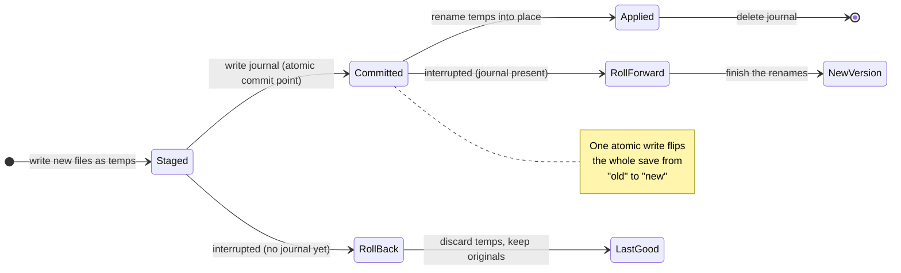

## What We're Building

Saving a plot looks like a single action, but under the hood it is several separate writes — the feature collection that holds your tracks, the STAC metadata that describes them, and the thumbnail images that preview the plot. Today those land one at a time, and the app says "Plot saved" before the last of them is on disk. So if anything goes wrong partway through — the disk fills up, a permission is denied, the browser's storage quota is hit, or the machine simply dies mid-write — you can be left with a plot that is quietly broken: new tracks paired with last week's thumbnail, a feature file torn off mid-sentence, or a plot you believe is safe that never fully wrote. You wouldn't find out until you reopened it, and by then the good version might be gone.

We are making a save all-or-nothing. After any save attempt, the plot on disk is observable as *either* the complete new version *or* the complete previous version — never a half-and-half. "Plot saved" appears only once the whole thing has committed; if it can't, you're told plainly, your in-editor changes are kept so you can retry, and the version already on disk is left untouched. And if a save is ever cut short by something you can't catch — a crash, an out-of-memory kill, a power loss — the next time you open the plot it quietly restores itself to the last good version and tells you, in a notice you can ignore, that it cleaned up an interrupted save. No dialog, no decision to make. The plot of record is simply never left corrupt.

## How It Fits

Every write in the platform already flows through one place: the host-agnostic persistence boundary that lets thick Python-style services and thin frontends agree on how data reaches storage. Both the VS Code desktop app and the in-browser web-shell route their saves through it. This work hardens that boundary so a guarantee we make once holds everywhere — instead of each frontend stitching several writes together and hoping they all land, the boundary itself accepts the whole save as one unit and commits it atomically. It also pulls the feature-collection write back *onto* the boundary; it had been slipping past it with a raw, non-atomic file write. The result is a single rule, enforced in one spot, that neither host can quietly regress — and a concrete answer to a principle the project holds as non-negotiable: no silent failures, an operation succeeds fully or fails explicitly, and you always know the true state of your data.

## Key Decisions

- **Make the boundary the only place atomicity can live.** We added one operation, `commitPlotSave`, that takes the entire save unit — feature collection plus thumbnails — and a companion `reconcilePlotSave` that runs when a plot is opened. A caller orchestrating several separate writes could never promise all-or-nothing across them; only the boundary, sitting on the native storage, can. Each host implements it once.

- **On the desktop, a tiny write-ahead journal is the moment of commit.** The filesystem has no single syscall that swaps several files at once, so we stage every new file as a temp, then atomically write a small journal listing the renames still to apply — and *that one atomic write is the commit*. Then we apply the renames and delete the journal. On open, reconcile reads the situation: no journal means the save never committed, so the stray temps are discarded and the originals kept (the last good version); a journal present means it did commit, so the renames are finished (the new version). Every point you could be interrupted at resolves to a coherent plot — rolled back before the journal exists, rolled forward after.

- **In the browser, the storage engine already does the hard part.** IndexedDB transactions are atomic: a killed tab simply throws away an uncommitted one. So we group the save's writes into a single multi-store transaction and get all-or-nothing for free — no journal needed. The only gap was that two of those writes had been running in separate transactions; now they share one.

- **Aim for coherence, not power-loss durability of the newest save — on purpose.** If the power cuts at the wrong instant, you may get the last good version back rather than the in-flight one. What you will *never* get is a torn or mismatched plot. That is a deliberately simpler, sharper target than guaranteeing the very latest keystroke survives a crash, and it is the one that actually protects the plot of record.

- **No new dependencies.** It reuses the temp-then-rename primitive the desktop adaptor already had and the IndexedDB transactions the browser already used — the safety comes from how they're sequenced, not from new machinery.

## By the Numbers

A reliability feature is only as good as its proof, and for this one the proof is a **fault-injection matrix**: every distinct write step of a save, on both hosts, is driven to failure or interruption, and the plot is asserted to resolve to exactly one coherent version. The matrix drives **8** interruption points on the filesystem host and **4** on the IndexedDB host — staging failures, journal-write failures, mid-apply kills, partial-apply kills, malformed journals, aborted transactions — and each row lands on either the complete previous version or the complete new one. None lands in between.

| | |
|---|---|
| New tests passing | 32 |
| ├ Vitest unit / integration | 31 |
| └ Web-shell Playwright smoke | 1 |
| Compile-time type guard (mutation-verified) | 1 |
| Filesystem interruption points covered `[credibility]` | 8 / 8 coherent |
| IndexedDB interruption points covered `[credibility]` | 4 / 4 coherent |
| IndexedDB transactions per save `[credibility]` | exactly 1 |
| "Plot saved" shown for a save that didn't fully commit `[credibility]` | 0% |

Three of those figures are worth spot-checking, because they are the whole point of the feature. The browser save uses **exactly one** `readwrite` transaction spanning both the `items` and `payloads` stores — a test spies on `IDBDatabase.prototype.transaction` and counts, so the item record and its GeoJSON payload genuinely land together or not at all. The success path is held strictly honest: a separate test asserts via mock call-order that `markClean()` and the "Plot saved" message fire *after* `commitPlotSave` resolves, and that a rejected commit shows a failure, keeps the plot dirty, and shows no success — so the success indication appears for **0%** of saves that did not fully commit. And the boundary's save-unit type is structurally derived with `Pick<>`, guarded by a compile-time test that `tsc --noEmit` enforces and that mutation testing confirms actually fails when the derivation is broken.

The change stayed inside its blast radius. The full suites at the same SHA came back green: `@debrief/stac-writer` (22 Vitest), `debrief-vscode` (841 Vitest, 1 pre-existing unrelated skip), `@debrief/web-shell` (135 Vitest), with `pnpm -r typecheck`, the VS Code `tsc --noEmit` gate, ESLint, ruff and pyright all clean. No Python changed.

## Lessons Learned

**The commit point has to be a single atomic act, or none of the reasoning holds.** The entire design rests on being able to say "before this instant, roll back; after it, roll forward." That sentence is only crisp if there is exactly one instant. On the filesystem we get it by anchoring "committed" to one atomic journal write — the moment that file exists, the save is, by definition, done; before it, the save never happened. Every one of the eight interruption points then resolves trivially, because each one is unambiguously on one side of that line. The hard part wasn't the staging or the renames; it was choosing the one write that *means* committed.

**Atomicity is not durability, and conflating the two would have bloated the design.** It's tempting to also promise that your very latest save survives a power cut. We deliberately didn't. Reconcile never repairs a torn version — it only ever *chooses* which already-coherent version to present. That restraint is what keeps it small: there is no fsync dance, no partial-write repair, no torn-record detective work, because a torn record is, by construction, something that can never be observed. Picking the narrower guarantee made the implementation both simpler and more obviously correct.

**The two hosts needed opposite amounts of machinery.** The filesystem has no transaction, so we built one — a hand-rolled write-ahead journal with stage, commit, apply, clear and a reconcile pass. IndexedDB already *is* transactional; a killed tab discards uncommitted work for free. There the "fix" was almost embarrassingly small: two writes had been running in separate transactions, and all we had to do was collapse them into one. Same guarantee, wildly different effort — a useful reminder that "make it atomic" is a property of the substrate, not a fixed amount of code.

**Deriving the boundary type structurally paid for itself immediately.** The save unit mirrors a subset of existing typed sources, so it's built with `Pick<>` rather than re-listed fields, with a compile-time exhaustiveness guard. It would have been faster in the moment to just type out the fields. The guard exists precisely because re-listing is the known root cause of silently-dropped data when a source type later grows — and a save that silently drops a field is exactly the kind of quiet corruption this whole feature set out to abolish.

## What's Next

Two threads stay open. Scene-capture still performs an eager, best-effort write of `features.geojson` outside the new commit path — a deliberate, documented deferral, since that single-file write is superseded by Save Session and isn't part of the save unit. Folding it under the same atomic-commit discipline would close the last raw write that bypasses the boundary. And the web-shell's standalone create path could grow a richer-metadata atomic create once it regains UI callers; today the committed create case is covered, but the fuller metadata story waits on a consumer that needs it.

→ [See the code](https://github.com/debrief/debrief-future/pull/658)
→ ADR-039 in `docs/project_notes/decisions.md` records the decision.
