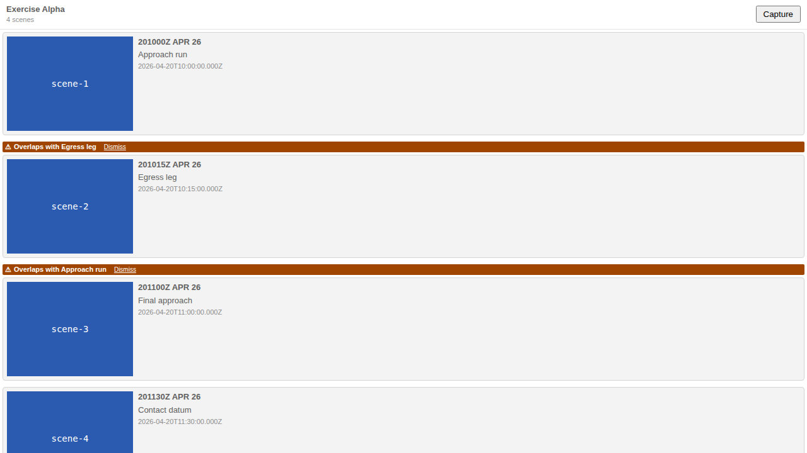

## Hook

## What We're Building

When you assemble a Storyboard, each time-range Scene claims a window of the exercise — a stretch of `[start, end]` you want replayed. Most of the time those windows sit end to end: Scene A hands off to Scene B, B to C, and the story walks forward through time. But sometimes two Scenes quietly cover the *same* stretch — you nudged a window while editing, or duplicated a Scene and forgot to move it, and now the same minutes get replayed twice without you meaning them to. Nothing breaks, so nothing tells you.

This adds a quiet tell. When two time-range Scenes overlap, each offending row in the Storyboard panel grows a small warning that names its partner — "Overlaps with Scene B" — so the accidental double-cover is visible at a glance instead of waiting to be noticed on playback. It is deliberately a nudge, not a rule. The platform never reorders, merges, rejects, or blocks a thing. If the overlap is intentional — a deliberate re-play to land an emphasis — you dismiss the warning and it stays gone for the session. The aim is to catch authoring drift without putting the platform in the business of policing a legitimate creative choice.

## How It Fits

This is a follow-up to #263, which shipped time-range Scenes but left overlap detection to authoring discipline. It is the lightweight safety net that closes that gap — TypeScript-only, frontend-only, no schema change and no service call. Detection lives in one pure, synchronous helper in the shared component library, consumed verbatim by both the VS Code extension and the web-shell so the two surfaces can't drift in what they consider an overlap. The warning itself reuses the per-row badge pattern already established for stale indicators, and the whole thing is a read-only derivation over data already in the plot — offline by default, like everything else.

## Key Decisions

- **Strict interior overlap, not touching endpoints.** The rule is `aStart < bEnd && bStart < aEnd` on epoch milliseconds. Scenes that merely meet at an edge — A ends exactly where B starts — are a normal contiguous handoff and produce no warning. Well-formed sequential Storyboards stay completely clean, which is what keeps the signal worth trusting.
- **Time-range Scenes only.** Instant, single-timestamp Scenes are excluded; their timestamp collisions are a separate existing flow, and folding them in here would muddy the meaning of the badge.
- **One shared helper, two hosts.** `detectSceneOverlaps()` is a single pure function in `shared/components`. Putting the rule in one place — rather than implementing it twice — means the VS Code panel and the web-shell can never disagree about what overlaps.
- **Dismissal is session-scoped, keyed by the unordered Scene pair, and not persisted.** Dismissing clears the warning on both rows; pull the windows apart and re-overlap them and it warns afresh. We deliberately kept this out of plot state — no new persisted field — to hold the feature at the 1–2 dev-day aid it was scoped to be. A deliberate overlap you re-open in a new session warns again, and that felt like the right default: better to re-confirm intent than to silently carry a stale "I meant this" forever.
- **Passive and non-blocking, by design.** No reorder, no merge, no rejection. Accidental overlaps are a mistake worth surfacing; intentional ones are a creative decision the platform has no business overruling. The badge respects that line.
