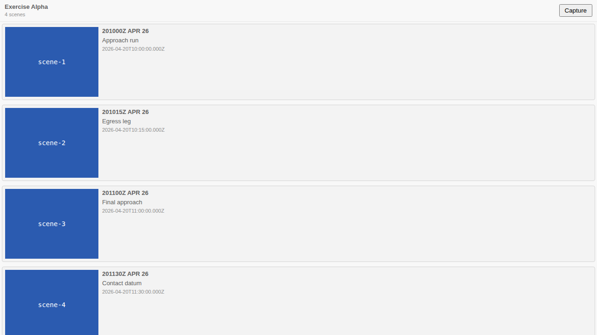

# Usage Example: Overlap Warning for Time-Range Scenes

## The capability

When two or more **time-range Scenes** in the same Storyboard cover overlapping
`[start, end]` windows, each offending Scene row in the Storyboard panel grows a
passive warning naming the conflicting Scene. It never blocks anything; an author
who meant the overlap can dismiss it.

## Detection (shared, pure)

Both the VS Code extension and the web-shell call the one shared helper, so they
can never disagree about what counts as an overlap:

```ts
import { detectSceneOverlaps, overlapPairKey } from '@debrief/components';

// `plot` is the FeatureCollection; `storyboardId` the active Storyboard.
// `dismissedPairs` (optional) is a Set of overlapPairKey(a, b) values.
const overlaps = detectSceneOverlaps(plot, storyboardId, dismissedPairs);

// overlaps: ReadonlyMap<sceneId, readonly { sceneId; title }[]>
//   "scene-1" → [{ sceneId: "scene-2", title: "Egress leg" }]
//   "scene-2" → [{ sceneId: "scene-1", title: "Approach run" }]
//   (non-overlapping + instant Scenes are absent)
```

The overlap rule is **strict interior overlap** on epoch-ms instants:
`aStart < bEnd && bStart < aEnd`. Windows that merely touch at an endpoint
(`A.end === B.start`) are a contiguous handoff and do **not** warn.

## What the analyst sees

Given a Storyboard with:

| Scene | Window | Warning |
|-------|--------|---------|
| Approach run | 10:00–10:30 | ⚠ Overlaps with Egress leg |
| Egress leg | 10:15–10:45 | ⚠ Overlaps with Approach run |
| Final approach | 11:00–11:10 | *(none)* |
| Contact datum | *(instant)* | *(none)* |


## Dismissing an intentional overlap

Clicking **Dismiss** on either badge clears the warning on both rows. Nothing in
the plot changes — dismissal is session-scoped, host-local, and never persisted.
If the analyst later pulls the windows apart and re-overlaps the same pair, the
warning returns (the stale dismissal key is pruned on each recompute).

**Before** (`overlap-light.png`) → **after dismiss** (`overlap-after-dismiss.png`):
the two warning bars disappear and the Scene rows are untouched.



## Host wiring

Each host computes overlaps from the active-Storyboard Scene set it already has,
merges the result into the per-row `SceneEditViewModel.overlapsWith`, and owns the
dismissed-pairs set:

- **VS Code** — `apps/vscode/src/views/storyboardPanelView.ts` (`refresh()` +
  `scene-overlap-dismiss` message).
- **Web-shell** — `apps/web-shell/src/StoryboardPanelMount.tsx` (`useMemo` over the
  feature collection + `useState` dismissed set).

The presentational `OverlapBadge` (mirroring `StaleBadge`) renders whenever a
row's `overlapsWith` is non-empty.
</content>
